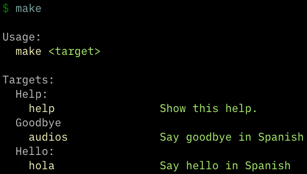

+++
title = "A Fancy Makefile"
date = 2021-07-28
+++

Once in a while, I need to create a Makefile to shorten some tasks running. Makefiles have weird syntax, and don't usually have help generated, but I found [this one](https://betterprogramming.pub/my-ultimate-makefile-for-golang-projects-fcc8ca20c9bb), shortened it, and added some comments to remind me how it works.

The following Makefile produced this help:



## The Makefile

```make
GREEN  := $(shell tput -Txterm setaf 2)
YELLOW := $(shell tput -Txterm setaf 3)
WHITE  := $(shell tput -Txterm setaf 7)
RESET  := $(shell tput -Txterm sgr0)

.DEFAULT_GOAL := help

## Help:
.PHONY: help
help: ## Show this help.
	@echo ''
	@echo 'Usage:'
	@echo '  ${YELLOW}make${RESET} ${GREEN}<target>${RESET}'
	@echo ''
	@echo 'Targets:'
	@awk 'BEGIN {FS = ":.*?## "} { \
		if (/^[a-zA-Z_-]+:.*?##.*$$/) {printf "    ${YELLOW}%-20s${GREEN}%s${RESET}\n", $$1, $$2} \
		else if (/^## .*$$/) {printf "  ${CYAN}%s${RESET}\n", substr($$1,4)} \
		}' $(MAKEFILE_LIST)

# put my stuff under here

name := Ben

## Goodbye
# .PHONY means no files are created
.PHONY: audios
# audios depends on hola
audios: hola ## Say goodbye in Spanish
	echo "¡audios! $(name)"


## Hello:
.PHONY: hola
hola: ## Say hello in Spanish
	@# the @ means the command won't be printed
	@echo "hola $(name)"
```
