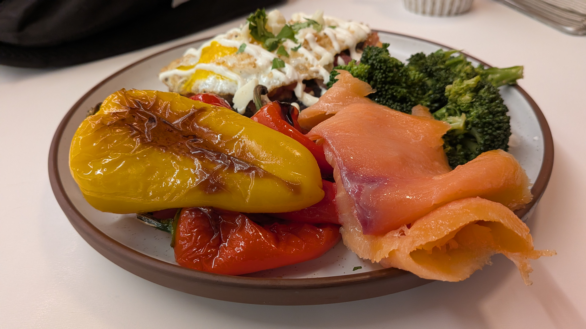
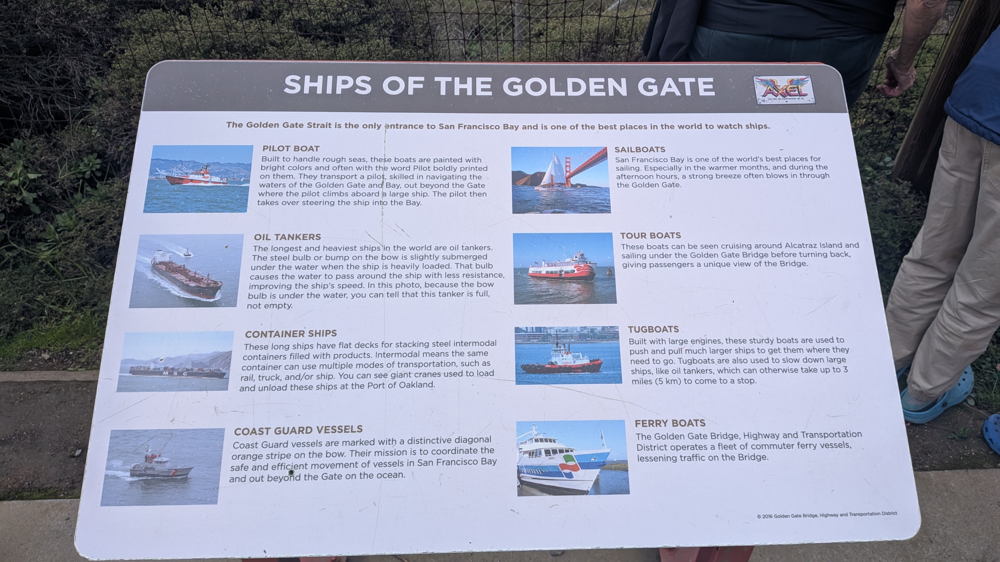
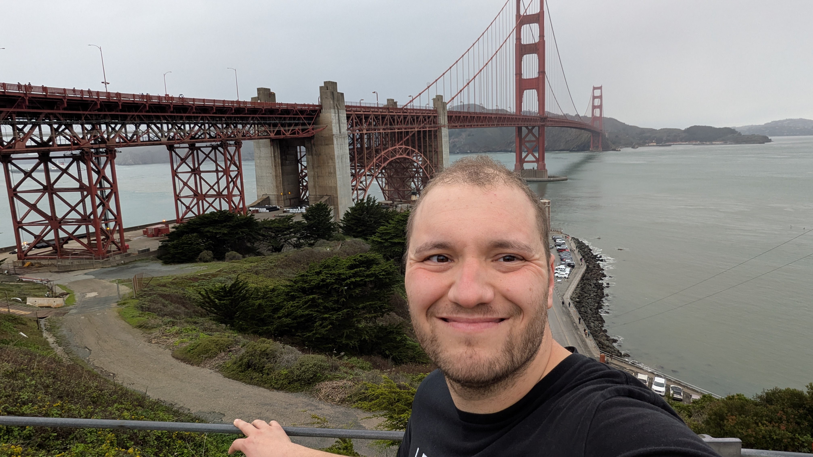
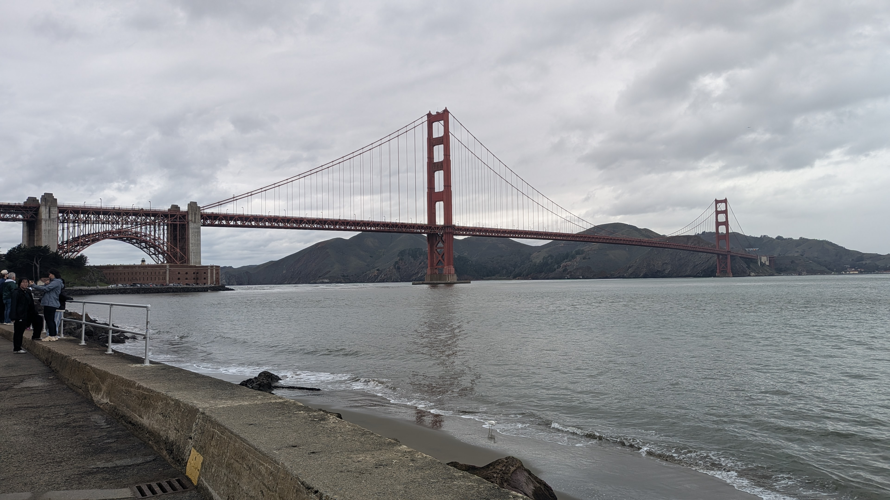
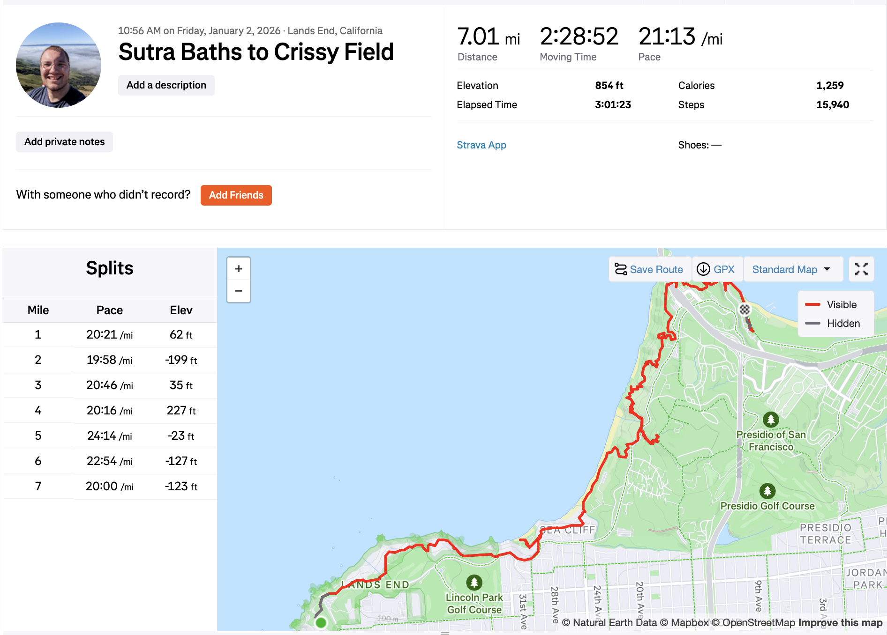

+++
title = "A Lovely Day Off"
date = 2026-01-11

+++

I recently took a really nice day off, so thought I'd post about it!

# The Breakfast

It started with a lovely breakfast

# The Hike

Then I drove to Sutra Baths. I don't have any photos there, but I started hiking the cliff side trail to the side of it. I saw some shockingly green plants:

Kept going after the trail ended to China Cove and then to Baker Beach, where someone was preparing for a proposal:

I took a panorama photo at the beautiful immigrant point (and the photo doesn't do it justice)

I went down and up this really steep trail:

I wandered around some graffitied bunkers by the Golden Gate Bridge:

I went under the Golden Gate Bridge (it's a really good place to watch ships)

I made it to the other side of the bridge

And finally hiked to Chrissy Fields!

# The Hike On Strava

# The Waymo

I took a Waymo back to Sutra Baths - first time trying that so it was unnerving at first (though I hammed it up for this photo :D)

# The Burrito

Finally, I stopped at a Super Taqueria for a burrito before showering and spending my evening with my family.

# Conclusion

I'm really thankful for this day and being able to take it - both in terms of scheduling (my manager let me swap days at work and my wife watched my son that Saturday) and that everything is so close to me.

