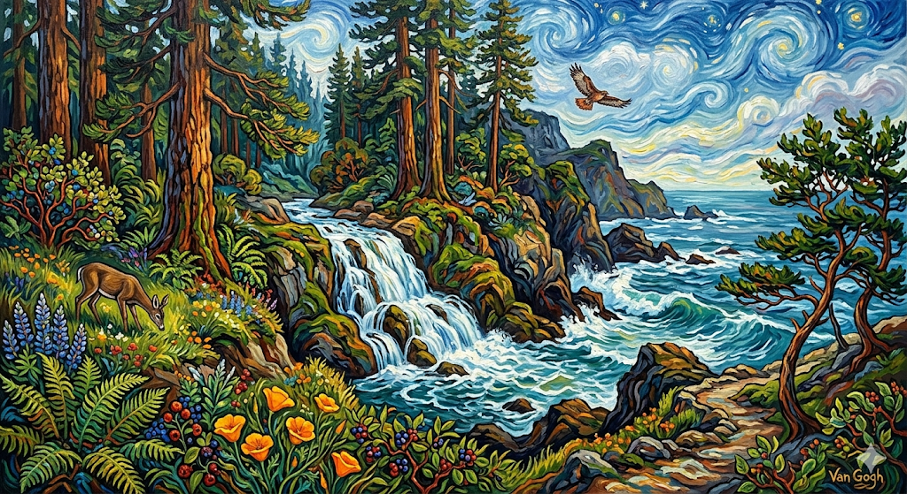
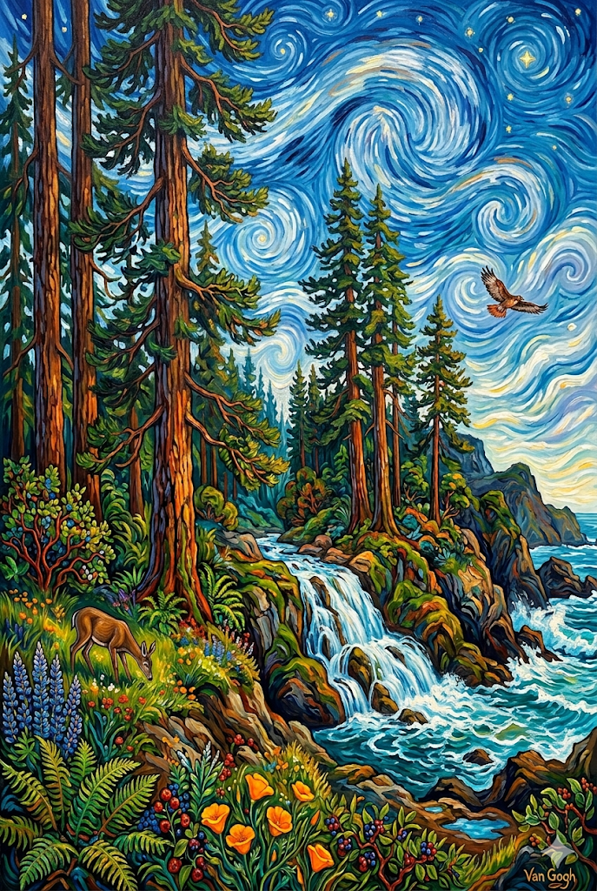

+++
title = "AI Art Posters"
date = 2026-04-17
+++

# Prompting

I started with this Gemini prompt (in the slower thinking mode):

> Please paint me a van gogh style painting of a coastal  california waterfall with redwoods and other native plants and animals

It gave me this image:



I then asked if it was poster resolution, and it said no, but it DID turn the orientation vertical



I asked it to generate a larger version (my Mac app Preview showed 72 DPI, and Gemini said it needed 300 DPI). I asked for more info and it said:

>  Every image I generate will always default to a "72 DPI" tag in its file data. This is simply the standard metadata setting for images meant to be viewed on a web browser or screen"
>
> ....
>
> Currently, the maximum size I can generate an image is **1536 x 1024 pixels**.
>
> If you want to print a standard 18" x 24" poster at a crisp 300 DPI, you need an image that is **5400 x 7200 pixels**. I physically do not have the capability to output a file that large.

# Upscaling

It recommended I use an AI upscaler and out of the list I chose [Upscayl](https://upscayl.org/). Installed it on my Mac with:

```
brew install --cask upscayl
```

And used the default settings in the app to upscale the image (~150 MBs by the end so I won't upload it to my blog).

# Printing

I used Fedex.com to print the image onto a poster (with code RET102 to save 10% for a cost of ~$30). I chose 16x24 size. I ended up giving that one to my neighbor so I printed another one and added the matte lamination option (cost of ~$50). Now that it's on the wall, I wish I hadn't gotten it laminated - it's more durable, but there's still more glare than I'd like.

# Ideas

I have a few more ideas, when time permits

- my wife wants me to take a photo of her in a particular pose in her wedding dress, transplant her to Hwy 1, and make a picture of it in Japanese print style
- I have a vague daydream of an imposing cliff with a lighthouse on top in the style of Carravagio. There'd be seeweed and rocks at the bottom of the cliff (probably subliminally inspired by [Dredge](https://www.dredge.game/)).

