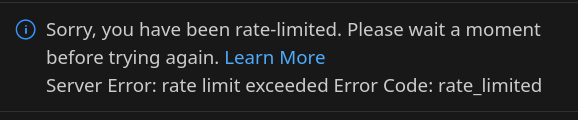

+++
title = "AI Notes"
date = 2025-05-01
+++

I want to keep some scattered AI notes here...

# 2025-05-01 VS Code Agent Mode

[VS Code Agent Mode Just Changed Everything - YouTube](https://www.youtube.com/watch?v=dutyOc_cAEU)

Use agent mode in the chat

Use `#fetch` and ask it to follow instructions

Hit keep all when it does stuff

8m - `.github/copilot-instructions.md` for custom copilot instructions  + project requirements

10m - MCP server to talk to Postgres

13m30s - edit suggestions

burkeholland.github.io

### My turn

Made `vscode-agent-01`

Asked it to create the project; it had trouble installing Go dependencies, so I did that and told it to continue.

It wrote some stuff and I had it generate a test and that was wrong

It seems to get stuck if a command fails, like installing dependencies and fixing test errors.

But I'm still able to fix things manually and tell it to keep going

# Fri 2025-05-16 Coercing Copilot

Ok, I'm trying to get Copilot to update warg for all my apps.

I tried asking it to fetch from Github but that didn't work. Tyring the `githubRepo` tool with a custom prompt.

https://code.visualstudio.com/updates/v1_100#_search-code-of-a-github-repository-with-the-githubrepo-tool

Ok, in agent mode, I can now run /update_warg to do this.

TODO: back up prompts!

Maybe it's my shell, but it's still having issues continuing after a command has finished. So run these manually:
```
go mod edit -go=1.24
go get -u ./...
```

hahaha hit the rate limit:



Ok, stopped at shovel. I need to check the version subcommand and color flag on earlier migrated ones. But the fact I was able to have copilot update so many of these with the prompt file is awesome!

Prompt ( `/home/bbkane/.config/Code/User/prompts/update_warg.prompt.md`):

```markdown
---
mode: 'agent'
tools: ['githubRepo', 'codebase']
description: 'Update this repo to latest warg API'
---

Please update all files in this repo using the new warg APIs.

For reference, see #githubRepo bbkane/warg , especially the CHANGELOG.md, README.md files and the files in the examples directory.

If needed, also update the Go version in this project to go 1.24

Make sure to use `section.CommandMap(warg.VersionCommandMap()),` to add a version command and `warg.GlobalFlagMap(warg.ColorFlagMap()),` to add a `--color` flag.
```

