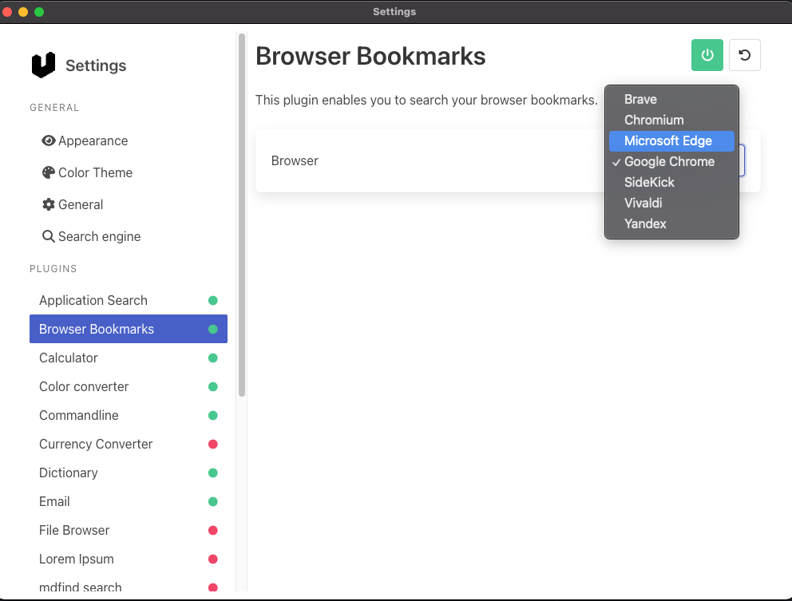
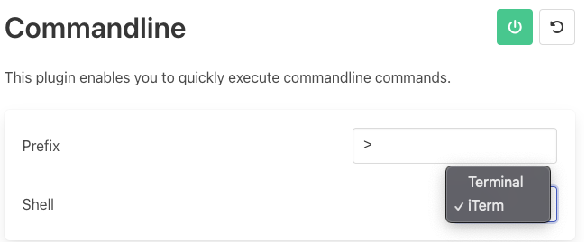

+++
title = "App Launcher Showdown"
date = 2024-02-19
+++

# Background

I currently use Spotlight search to open apps. Clifford suggested I use RayCast. I really just want something 

## Requirements

- Settings that are easily version controllable
- launch apps
- run ticket_typora from a search bar instead of launching a terminal
  - It would be nice if the args for this had frecency stuff
- grep my notes from a search bar
- go links support
- [glean](https://www.glean.com/) search
- find operating system settings

## Ideas I might want

- Clipboard history?
- chatgpt chat?
- Calculator
- Browser Bookmark search

## Nice to haves

- cross platform
- open source - almost a requirement - I will be using this app daily and putting a lot of work extending it
- efficient?

# Contenders

https://news.ycombinator.com/item?id=32402631

## Alfred - MAYBE

https://www.alfredapp.com/shop/

- macOS only
- not open source
- 59 lbs for free lifetime upgrades

## HammerSpoon - NO

- macOS only
- I'd have to build a launcher on top...

## Loungy - NO

https://news.ycombinator.com/item?id=39296505

- MacOS only
- not ready for production yet

## QuickSilver - MAYBE

https://qsapp.com/

- Open source
- mac specific
- hard to version control scripts - https://docs.qsapp.com/documentation/faq#how-do-i-clear-quicksilvers-cache
- looks like you can run commands: https://qsapp.com/manual/plugins/terminal/ , https://github.com/quicksilver/Quicksilver/issues/2411

## Raycast - MAYBE

- MacOS only
- monthly pricing for non-free version
- uses AI features?
- Recommended by Clifford

## Sol - NO

https://github.com/ospfranco/sol

- macOS only
- open source
- Doesn't look like you can write plugins for it

The repo looks odd like the author doesn't care about repo hygiene

## Spotlight Search - NO

- MacOS 

## ueli - TRYING

https://ueli.app/#/features

- open source
- cross platform
- Electron
- doesn't seem to have custom plugins, but can run scripts.
- Linux support [coming](https://github.com/oliverschwendener/ueli/issues/94#issuecomment-1948404447)

---

Can't search Firefox bookmarks?

---

Can't choose Wezterm for shell:

---

Trying to do ticket_typora makes me wish for my shell's frecency stuff

## Wox - MAYBE

https://github.com/Wox-launcher/Wox

- cross platform
- looks promising
- no homebrew installation
