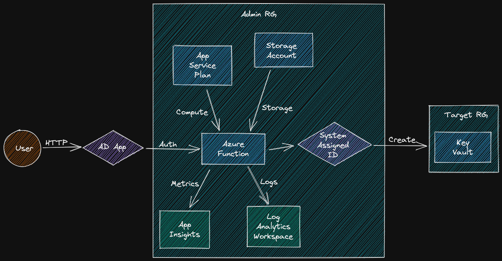
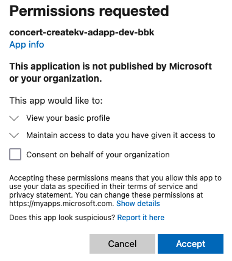
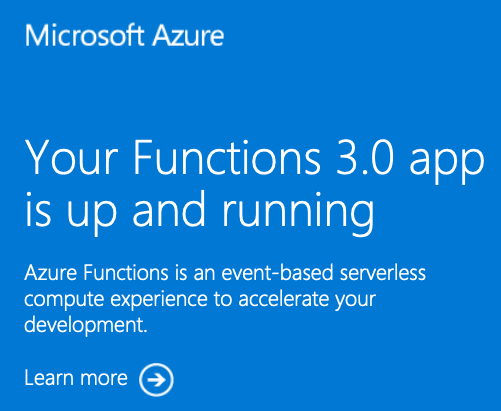
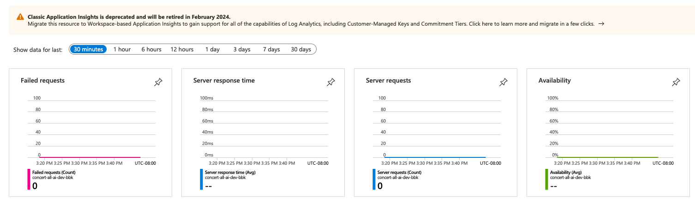
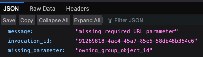
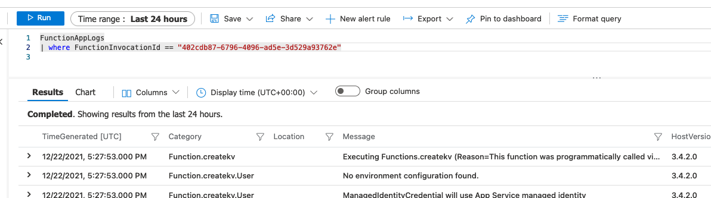
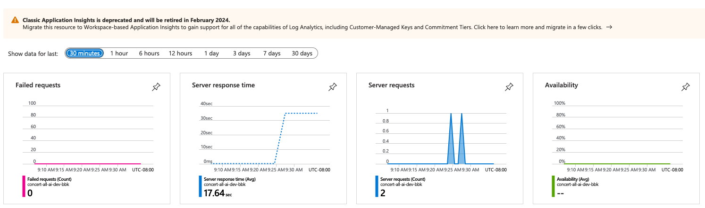
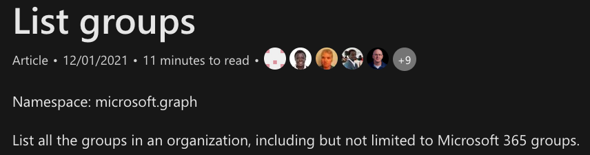

+++
title = "Azure Functions With Terraform"
date = 2021-12-13
+++

Over the last several months, I've been prototyping with Azure Functions and Terraform when I have time. Ideally, I see Azure Functions as a great way to manipulate Azure resources in response to events. Azure Functions are just plain code, so they are familiar to write and can use the Azure SDK, but they're also native Azure resources, so they can use managed identities and hook up to Azure monitoring solutions. In practice, I've run into several papercuts that impede this vision, but I think I've found solutions or workarounds to most problems.

Disclaimer: I'm a Microsoft employee (through my employment at LinkedIn). This post contains my personal opinions, not those of my employer.

I want to thank my manager Tom for allowing me to post what I've learned doing this work for LinkedIn on my personal blog, and everyone who's helped me along the way - blog post authors (especially [Max Ivanov](https://www.maxivanov.io/deploy-azure-functions-with-terraform/)), the Azure team (especially on the public [microsoft-python discord](https://discord.com/invite/b8YJQPx)), and Microsoft documentation authors.

## Goal

My goal here is to create an Azure Function that creates an Azure Key Vault when a member of my organization clicks a link. This Azure Function should be:

- easy to develop (IDE support) and run locally
- defined by code so I can reproduce it easily in dev/test/prod environments
- have authorization carefully set up so it can only access the resources it needs to access to do its job.
- monitored with logs and metrics
- amenable to CI/CD (I haven't yet set this up, so I can't blog on it yet)

Unfortunately, these requirements rule out the beginner-friendly ways to create an Azure Function - clicking "create" in VS Code creates a bunch of resources behind the scenes and I can't be confident that those will be the same 6 months from now when I need to make a change, or what permissions those resources have.

Ultimately, our Azure Function will look like this:



## Project Setup

The setup I've landed on is a Git repository with a top level `terraform/` directory, a top level directory to hold the function app's code  named for the  function app - `concert-createkv-fa-dev-bbk/`, and an `experiments` directory to hold tests.

```
.
├── concert-createkv-fa-dev-bbk/  # a lot of this will be generated
│   ├── createkv/
│   ├── gen_local_settings.py*
│   ├── host.json
│   ├── local.settings.json
│   ├── requirements.txt
│   └── venv/
├── experiments/
└── terraform/
    ├── main.tf # I'm going to start here
    ├── terraform.tfstate
```

## Installations

I use [`terraform`](https://learn.hashicorp.com/tutorials/terraform/install-cli) to create my resources, [`azure-cli`](https://docs.microsoft.com/en-us/cli/azure/install-azure-cli) to authenticate locally, and [`func`](https://docs.microsoft.com/en-us/azure/azure-functions/functions-run-local?tabs=v4%2Cmacos%2Ccsharp%2Cportal%2Cbash%2Ckeda#install-the-azure-functions-core-tools) to push code. On MacOS, [HomeBrew](https://brew.sh) helps tremendously to install these:

```bash
brew install terraform

brew install azure-cli

brew tap azure/functions
brew install azure-functions-core-tools@4
```

## Azure Resources

### Providers and Variables

I'm going to start in the `terraform/` directory with a single `main.tf` file. As the project grows it can be helpful to split these files up, but for now I find it least confusing to have all needed parts in one directory.

Let's start with the providers we're going to need. I have the `version` parts commented out because I want to use the latest versions while developing. Once this code is in prod, it's important to lock down versions so things don't break behind your back.

I'm also directly putting my subscription ID directly in the code. A potentially better option is to put this information in your environment and let Terraform read from that. Then, if a colleage wants to use your code, they only need to set an environment variable instead of change the code. Similarly, Terraform provides lots of ways to [set variables](https://www.terraform.io/language/values/variables#assigning-values-to-root-module-variables) and most of them are more appropriate (but a tad less simple) then embedding the values directly in the code.

```
export ARM_SUBSCRIPTION_ID=<your subscription id>
```

```terraform
terraform {
  required_providers {
    azuread = {
      source = "hashicorp/azuread"
      # version = ??
    }
    azurerm = {
      source = "hashicorp/azurerm"
      # version = ??
    }
  }
  # required_version = ">= 1.0.1"
}

# https://registry.terraform.io/providers/hashicorp/azurerm/latest/docs
provider "azurerm" {
  # export ARM_SUBSCRIPTION_ID=...
  # subscription_id = "<My subscription ID>"
  features {}
}

variable "azure_ad_tenant_id" {
  type    = string
  # export TF_VAR_tenant_id=...
  default = "<My tenant ID>"
}
```

Next step is to add some variables I use in all my projects so I get [consistent naming](https://www.bbkane.com/blog/azure-resource-naming/). Once again, see [the docs](https://www.terraform.io/language/values/variables#assigning-values-to-root-module-variables) for other ways to set variables.

```terraform
variable "env" {
  type    = string
  default = "dev"
}

variable "proj" {
  type    = string
  default = "concert"
}

variable "owner" {
  type    = string
  default = "bbk"
}

variable "location" {
  type    = string
  default = "West US 2"
}
```

Finally, let's add some variables to configure my function:

```terraform
# TODO: should probably create a resource group to put KVs in instead of hardcoding like this :)
variable "createkv_azure_subscription_id" {
  description = "Where should we create these KVs?"
  type        = string
  default     = "<My subscription id>"
}

variable "createkv_azure_tenant_id" {
  description = "Where should we create these KVs?"
  type        = string
  default     = "<My tenant id>"
}

variable "createkv_resource_group_name" {
  description = "Where should we create these KVs?"
  type        = string
  default     = "concert-all-rg-dev-bbk"
}

variable "createkv_location" {
  description = "Where should we create these KVs?"
  type        = string
  default     = "westus2"
}
```

My word that's a lot of variables. Let's move on to actually creating resources:

### Resources

When working with Terraform, I like keep all terraform-managed resources in their own resource group so I can call `terraform destroy` with wild abandon. When a resource group is destroyed, it destroys everything inside the resource group, regardless of whether those contained resources are managed by Terraform.

```terraform
resource "azurerm_resource_group" "all_rg" {
  name     = "${var.proj}-all-rg-${var.env}-${var.owner}"
  location = var.location
  tags     = {}
}
```

In the naming, the `all` signifies that this resource group is not function specific - it's possible put multiple functions in here (NOTE: I haven't actually added another function yet to verify this).

This is a good time to ensure my Terraform workflow is working and can access Azure.

```bash
az login
az account show  # ensure we're in the right subscription
terraform init
terraform plan
terraform apply
```

After this works, it's time to add some more shared resources to `main.tf`:

A storage account to hold our functions 'state' ( code, logs, etc.). I've marked this 'all', but see [this link](https://docs.microsoft.com/en-us/azure/azure-functions/storage-considerations#shared-storage-accounts)  for performance considerations.

```terraform
# Hold our function's code - functions can share storage accounts, but it's not always a good idea:
# https://docs.microsoft.com/en-us/azure/azure-functions/storage-considerations#shared-storage-accounts
resource "azurerm_storage_account" "all_sa" {
  name                     = "${var.proj}allsa${var.env}${var.owner}"
  location                 = var.location
  account_replication_type = "LRS"
  account_tier             = "Standard"
  resource_group_name      = azurerm_resource_group.all_rg.name
  tags                     = {}
}
```

An application insights to look at metrics:

```terraform
# I *think* this can be shared between functions
# https://registry.terraform.io/providers/hashicorp/azurerm/latest/docs/resources/application_insights
resource "azurerm_application_insights" "all_ai" {
  name                = "${var.proj}-all-ai-${var.env}-${var.owner}"
  location            = var.location
  resource_group_name = azurerm_resource_group.all_rg.name
  application_type    = "other"
  tags                = {}
}
```

A Service Plan to provide compute for our Function App. The documention for this is horrid, but the `Y1` size is mentioned in the [terraform docs](https://registry.terraform.io/providers/hashicorp/azurerm/latest/docs/resources/app_service_plan) , even though it's not in the [Azure product details page](https://azure.microsoft.com/en-us/pricing/details/app-service/linux/).

```terraform
# It looks like this can be shared between function apps: https://stackoverflow.com/a/66201960/2958070
# https://registry.terraform.io/providers/hashicorp/azurerm/latest/docs/resources/app_service_plan
resource "azurerm_app_service_plan" "all_spl" {
  name                         = "${var.proj}-all-spl-${var.env}-${var.owner}"
  is_xenon                     = false
  maximum_elastic_worker_count = 1
  location                     = var.location
  per_site_scaling             = false
  resource_group_name          = azurerm_resource_group.all_rg.name
  kind                         = "functionapp"
  reserved                     = true

  sku {
    capacity = 0
    size     = "Y1"
    tier     = "Dynamic"
  }
  tags = {}
}
```

A Log Analytics Workspace for log storage and querying:

```terraform
resource "azurerm_log_analytics_workspace" "all_law" {
  name                = "${var.proj}-all-law-${var.env}-${var.owner}"
  location            = var.location
  resource_group_name = azurerm_resource_group.all_rg.name
  sku                 = "pergb2018"
  retention_in_days   = 30
}
```

### Azure AD Resources

Next, let's assign the correct identities permissions for the app.

First, we need a way to limit who can trigger our function.  For that, our app needs access to user infomation. This terraform config registers an app that users will authenticate to. We have to hardcode the `redirect_uri` here because the functon app we create will need to refer to this resource. If we also have this ad app resource refer to the function app resource, it'll create a reference cyle and Terraform will understandably refuse to work.

Unfortunately, these app permission ids are stored as random looking UUIDS that are best uncovered by making a resource with Terraform, making a change in the portal, running `terraform plan` to see what changed, and then backporting those changes to the Terraform code. To be honest, we're lucky Terraform offers an interface into creating these. ARM/Bicep templates don't seem to (NOTE: I would be very happy to be wrong about this). It's a very odd rough edge to Azure considering Auth is a difficult topic in general and used for every Azure resource - you'd think they'd put a lot of effort into making good tools to manage that complexity. Anyhoo..

```terraform
# https://registry.terraform.io/providers/hashicorp/azuread/latest/docs/resources/application
# This is so users can log into our app
resource "azuread_application" "createkv_ad_app" {
  display_name = "${var.proj}-createkv-adapp-${var.env}-${var.owner}"

  required_resource_access {
    # Microsoft Graph App ID
    # az ad sp list --display-name "Microsoft Graph" --query '[].{appDisplayName:appDisplayName, appId:appId}'
    # this is stable across tenants
    resource_app_id = "00000003-0000-0000-c000-000000000000"

    resource_access {
      # Sign in and read user profile
      # Source: googling :/
      id   = "e1fe6dd8-ba31-4d61-89e7-88639da4683d"
      type = "Scope"
    }
  }

  web {
    # We can't use azurerm_function_app.fa.default_hostname because it creates a cycle in Terraform
    redirect_uris = ["https://${var.proj}-createkv-fa-${var.env}-${var.owner}.azurewebsites.net/.auth/login/aad/callback"]
    implicit_grant {
      access_token_issuance_enabled = true
      id_token_issuance_enabled     = true
    }
  }
}
```

Let's also create a password for it for our function app to use.

```terraform
# https://registry.terraform.io/providers/hashicorp/azuread/latest/docs/resources/application_password
resource "azuread_application_password" "createkv_ad_app_pass" {
  application_object_id = azuread_application.createkv_ad_app.object_id
}
```

### The Function App

The first lines are pretty self-explanatory - we give it a name, location, blah blah blah.

The `app_settings` block is interesting. In the top part, we're setting up some settings for the function worker runtime to look at - where to send app insights, the code we'll be using, and the authentication secret for our ad app we just created. the `WEBSITE_RUN_FROM_PACKAGE` variable is changed every time we upload new code, so we set it to an empty string, and, in the bottom `lifecycle` block ignore it. Afterward, we set some settings for our code to look at - essentially the information we need to create a Key Vault.

I don't completely understand the `auth_settings` block, but it lets users in our tenant log into the our app.

Interestingly, we're also assigning *another* identity to this function in the `identity` block - a system assigned one. This is the identity our function app will use to create Key Vaults. A reasonable question you might ask is "why can't our app just have one identity?". The answer is least privilege - we have to manage the state of the registered app we created. The password might leak or expire. We want to use that identity as little as possible. The System Assigned Identity, however is managed by Azure and tied to the lifecycle of our function resource. We don't even know its password, and we certainly can't lose it. However, users can't authenticate to a System Assigned Identity, and we need that. So we have to use the less secure registered app for users to authenticate to, then pivot to the System Assigned Identity to do as much of the real work as we can.

We're using a `"linux"` os because its the only one that supports Python apps for some reason.

The main other important setting is `version`. The default is `1` and God help you if you forget to set that to `3`. You'll get an incomprehensible error message when you push code that I unfortunately didn't write down in my notes.

```terraform
# https://registry.terraform.io/providers/hashicorp/azurerm/latest/docs/resources/function_app
resource "azurerm_function_app" "createkv_fa" {
  name                = "${var.proj}-createkv-fa-${var.env}-${var.owner}"
  resource_group_name = azurerm_resource_group.all_rg.name
  location            = var.location
  app_service_plan_id = azurerm_app_service_plan.all_spl.id
  app_settings = {
    "APPINSIGHTS_INSTRUMENTATIONKEY"           = azurerm_application_insights.all_ai.instrumentation_key,
    "FUNCTIONS_WORKER_RUNTIME"                 = "python",
    "MICROSOFT_PROVIDER_AUTHENTICATION_SECRET" = azuread_application_password.createkv_ad_app_pass.value
    "WEBSITE_RUN_FROM_PACKAGE"                 = "",

    # app specific variables
    "CREATEKV_AZURE_SUBSCRIPTION_ID" = var.createkv_azure_subscription_id
    "CREATEKV_AZURE_TENANT_ID"       = var.createkv_azure_tenant_id
    "CREATEKV_LOCATION"              = var.createkv_location
    "CREATEKV_RESOURCE_GROUP_NAME"   = var.createkv_resource_group_name
  }
  auth_settings {
    enabled                       = true
    issuer                        = "https://sts.windows.net/${var.azure_ad_tenant_id}/v2.0"
    token_refresh_extension_hours = 0
    token_store_enabled           = true
    unauthenticated_client_action = "RedirectToLoginPage"
    active_directory {
      allowed_audiences = [
        "api://${azuread_application.createkv_ad_app.application_id}"
      ]
      client_id = azuread_application.createkv_ad_app.application_id
    }
  }

  identity {
    type = "SystemAssigned"
  }

  os_type = "linux"
  site_config {
    linux_fx_version          = "python|3.9"
    use_32_bit_worker_process = false
  }
  storage_account_name       = azurerm_storage_account.all_sa.name
  storage_account_access_key = azurerm_storage_account.all_sa.primary_access_key
  lifecycle {
    ignore_changes = [
      app_settings["WEBSITE_RUN_FROM_PACKAGE"],
    ]
  }
  tags    = {}
  version = "~3"
}
```

### Tying Things Together

Let's give that System Assigned Identity permission to create Key Vaults. As you can see, I've assigned it the `Key Vault Contributor` role. This role can create/read/update/delete Key Vaults. One of my TODOs is to create a custom role that can only create Key Vaults since that's all this identity needs to do.

```terraform
# https://registry.terraform.io/providers/hashicorp/azurerm/latest/docs/resources/role_assignment
# This is so our app can create KVs
resource "azurerm_role_assignment" "createkv_fa_ra" {
  principal_id         = azurerm_function_app.createkv_fa.identity.0.principal_id
  # TODO: use separate RGs for function infra and KV creation
  scope                = azurerm_resource_group.all_rg.id
  # TODO: create a custom role to limit this identity to KV creation only
  role_definition_name = "Key Vault Contributor"
}
```

Let's also flip the switch to send logs/metrics to our Log Analytics Workspace:

```terraform
# https://registry.terraform.io/providers/hashicorp/azurerm/latest/docs/resources/monitor_diagnostic_setting
# Tell our azure function that it needs to log to the log analytics workspace
resource "azurerm_monitor_diagnostic_setting" "createkv_mds" {
  name               = "${var.proj}-createkv-law-${var.env}-${var.owner}"
  target_resource_id = azurerm_function_app.createkv_fa.id
  log_analytics_workspace_id = azurerm_log_analytics_workspace.all_law.id

  log {
    category = "FunctionAppLogs"
    enabled  = true

    retention_policy {
      enabled = false
    }
  }
  metric {
    category = "AllMetrics"
    enabled  = false

    retention_policy {
      days    = 0
      enabled = false
    }
  }
}
```

### Output

Finally, let's output the name of our app, and the hostname of our app:

```terraform
output "createkv_function_app_name" {
  value       = azurerm_function_app.createkv_fa.name
  description = "Deployed function app name"
}

output "createkv_function_app_hostname" {
  value       = azurerm_function_app.createkv_fa.default_hostname
  description = "Deployed function app hostname"
}
```

### Resource Creation and Testing

Ok, let's go!

```bash
$ terraform apply
...  # stuff here
Apply complete! Resources: 10 added, 0 changed, 0 destroyed.

Outputs:

createkv_function_app_hostname = "concert-createkv-fa-dev-bbk.azurewebsites.net"
createkv_function_app_name = "concert-createkv-fa-dev-bbk"
```

When we head to the hostname in a browser ( https://concert-createkv-fa-dev-bbk.azurewebsites.net ), it makes me log in and then shows me the hello world screen:





Hooray! Let's check the monitoring we laboriously set up.



Fun times - we're not seeing any hits, and it's been deprecated! Let's check it after we upload some code. I didn't realize this resource has been deprecated, which is annoying, but that's life when you depend on a cloud provider for your infrastructure ([see this hilarious and sad Google Cloud article](https://steve-yegge.medium.com/dear-google-cloud-your-deprecation-policy-is-killing-you-ee7525dc05dc)). I'm running into a similar deprecation issue with Azure AD (see "Open Questions" at the end of this post).

## Generate Hello World Python Code

### Generate Code with `func`

Ok - let's generate and deploy some code to this thing. From the top level directory (right above `terraform`), I ran:

```
$ func init concert-createkv-fa-dev-bbk --python
Found Python version 3.9.9 (python3.9).
Writing requirements.txt
Writing getting_started.md
Writing .gitignore
Writing host.json
Writing local.settings.json
Writing /Users/bkane/tmp/concert-createkv-fa-dev-bbk/.vscode/extensions.json
```

Install dependencies:

```
$ cd concert-createkv-fa-dev-bbk
$ python3 -m venv venv
$ source ./venv/bin/activate
$ pip install -r requirements.txt

Collecting azure-functions
  Downloading azure_functions-1.8.0-py3-none-any.whl (137 kB)
     |████████████████████████████████| 137 kB 5.4 MB/s
Installing collected packages: azure-functions
Successfully installed azure-functions-1.8.0
```

### VS Code IDE Support

To get nice autocomplete and static analysis in VS Code, make sure to have the venv activated and open the function app folder (with local.settings.json in it) with VS Code.

### Run Locally

```
$ func start
Found Python version 3.9.9 (python).

Azure Functions Core Tools
Core Tools Version:       4.0.3971 Commit hash: d0775d487c93ebd49e9c1166d5c3c01f3c76eaaf  (64-bit)
Function Runtime Version: 4.0.1.16815

[2021-12-21T17:19:46.148Z] No job functions found. Try making your job classes and methods public. If you're using binding extensions (e.g. Azure Storage, ServiceBus, Timers, etc.) make sure you've called the registration method for the extension(s) in your startup code (e.g. builder.AddAzureStorage(), builder.AddServiceBus(), builder.AddTimers(), etc.).
For detailed output, run func with --verbose flag.
^C%
```

It failed because, while we created the code to run the function app, we didn't create a function with the app. Let's do that:

```
$ func new --name createkv --template "HTTP trigger" --authlevel "anonymous"
Select a number for template:HTTP trigger
Function name: [HttpTrigger] Writing /Users/bkane/tmp/concert-createkv-fa-dev-bbk/createkv/__init__.py
Writing /Users/bkane/tmp/concert-createkv-fa-dev-bbk/createkv/function.json
The function "createkv" was created successfully from the "HTTP trigger" template.
```

Now, running the function locally works:

```
$ func start
Found Python version 3.9.9 (python3).

Azure Functions Core Tools
Core Tools Version:       4.0.3971 Commit hash: d0775d487c93ebd49e9c1166d5c3c01f3c76eaaf  (64-bit)
Function Runtime Version: 4.0.1.16815


Functions:

    createkv: [GET,POST] http://localhost:7071/api/createkv
    ... SNIP ...
```

And we can curl our endpoint in a new terminal.

```
$ curl http://localhost:7071/api/createkv
This HTTP triggered function executed successfully. Pass a name in the query string or in the request body for a personalized response.%
```

### Bug: ImportError

One bug before we continue - if you save this code to a Git repo, and then clone it to a new computer and try to run it, you'll get the following error:

```
[2021-11-23T22:41:37.240Z] ImportError: cannot import name 'cygrpc' from 'grpc._cython' (/usr/local/Cellar/azure-functions-core-tools@4/4.0.3971/workers/python/3.8/OSX/X64/grpc/_cython/__init__.py)
```

This is due to [a known bug](https://github.com/Azure/azure-functions-core-tools/issues/2050#issuecomment-977228097) and the workaround is to create a `local.settings.json` file with (at least) the following content:

```json
{
  "IsEncrypted": false,
  "Values": {
    "FUNCTIONS_WORKER_RUNTIME": "python"
  }
}
```

This file is created automatically with `func init`, but that command also creates a `.gitignore` to ignore `local.settings.json` since sensitive information is also supposed to be stored there.

### Bug: Non-platform specific line endings

Creating a function with this tool always creates files with `\r\n` line endings (the default on Windows). I work primarily on Mac and Linux, so I use `\n` line endings wherever I can. I opened [this issue](https://github.com/Azure/azure-functions-core-tools/issues/2673) and maybe someday it'll be fixed.

Here's a [manual fix](https://stackoverflow.com/a/54759625/2958070) to change the files tracked by `git` (which excludes binary files and things in the `.git/` directory):

```
$ git ls-files -z | xargs -0 dos2unix
dos2unix: converting file .gitignore to Unix format...
dos2unix: converting file .vscode/extensions.json to Unix format...
dos2unix: converting file createkv/__init__.py to Unix format...
dos2unix: converting file createkv/function.json to Unix format...
dos2unix: converting file getting_started.md to Unix format...
dos2unix: converting file host.json to Unix format...
dos2unix: converting file requirements.txt to Unix format...
```

### Run Hello World in Azure

Ok! Let's run this in Azure!

Make sure to log in your account with `az login` before running this. The last argument ( `concert-createkv-fa-dev-bbk`) must be the `createkv_function_app_name` we printed as an output to our Terraform code.

```
$ func azure functionapp publish concert-createkv-fa-dev-bbk
Getting site publishing info...
... SNIP ...
Deployment successful.
Remote build succeeded!
Syncing triggers...
Functions in concert-createkv-fa-dev-bbk:
    createkv - [httpTrigger]
        Invoke url: https://concert-createkv-fa-dev-bbk.azurewebsites.net/api/createkv
```

Because we put so much work into our Terraform setup, only an authenticated member of our AD tenant can use our API. If we try to `curl` it, we'll get an `Unauthorized` error:

```
$ curl -D- https://concert-createkv-fa-dev-bbk.azurewebsites.net/api/createkv
HTTP/1.1 401 Unauthorized
Server: Kestrel
WWW-Authenticate: Bearer realm="concert-createkv-fa-dev-bbk.azurewebsites.net" authorization_uri="https://login.windows.net/2cd5e3a0-2bb9-425a-9c0f-72b0aa481be2/oauth2/v2.0/authorize" resource_id="2856dc47-ae02-4b9d-8d9c-65791a4fef4b"
Request-Context: appId=cid-v1:42fc8f74-9106-4c42-b899-5ce114a4f6c5
Strict-Transport-Security: max-age=31536000
Date: Tue, 21 Dec 2021 18:22:09 GMT
Content-Length: 0
```

However, opening the URL in the browser (after logging in) will show:

```
This HTTP triggered function executed successfully. Pass a name in the query string or in the request body for a personalized response.
```

## CreateKV Python Code!

Ok, we're making real progress now! Let's write the code to allow our org to create Key Vaults, confirm it works locally, push it, and confirm it works globally.

The first thing to do is to add some more libraries to `requirements.txt`:

Replace the current contents of `requirements.txt` with:

```ini
# Do not include azure-functions-worker as it may conflict with the Azure Functions platform

azure-functions==1.8.0
azure-identity==1.6.0
azure-mgmt-keyvault==9.0.0
azure-mgmt-resource==19.0.0
```

```
$ pip install -r requirements.txt
```

Next, replicate the function settings we added to Terraform to `local.settings.json`:

```json
{
  "IsEncrypted": false,
  "Values": {
    "CREATEKV_AZURE_SUBSCRIPTION_ID": "...",
    "CREATEKV_AZURE_TENANT_ID": "...",
    "CREATEKV_LOCATION": "...",
    "CREATEKV_RESOURCE_GROUP_NAME": "...",
    "FUNCTIONS_WORKER_RUNTIME": "python"
  }
}
```

Finally, add the following code to `__init__.py`. We'll walk through it in more detail soon. If I were writing this code again, I wouldn't use `ConcertAzureFuncError` to handle control flow, but this works and it's not too bad :). See below the code dump for explanations of each piece.

```python
import json
import itertools
import logging
import os
import random
import string
import sys
import traceback
import typing as ty

from azure.identity import DefaultAzureCredential
from azure.identity import ManagedIdentityCredential
from azure.mgmt.keyvault import KeyVaultManagementClient
from azure.mgmt.keyvault.models import VaultCreateOrUpdateParameters
from azure.mgmt.keyvault.models import VaultProperties
from azure.mgmt.keyvault.models import Vault
from azure.mgmt.keyvault.models import Sku
from azure.mgmt.keyvault.models import Permissions
from azure.mgmt.keyvault.models import AccessPolicyEntry

import azure.functions as func

Numeric = ty.Union[int, float]

logging.basicConfig(level=logging.DEBUG)
logger = logging.getLogger(__name__)


class ConcertAzureFuncError(Exception):
    """Used to map errors onto log messages and HTTP results

    - ``message`` - explanation of the error
    - ``status_code`` - HTTP status code this should map onto
    - ``data`` -- other fields to be mapped into a JSON log message as well as an HTTP response. Let's try to keep it one level, so a simple dict
    - ``debug_data`` -- fields not shown to the user but logged. Keys should not conflict with data
    """

    def __init__(
        self,
        *,
        message: str,
        status_code: int,
        data: ty.Dict[str, ty.Union[str, Numeric]] = None,
        debug_data: ty.Union[str, Numeric] = None,
    ):
        self.message = message
        self.status_code = status_code
        self.data = data or dict()
        self.debug_data = debug_data or dict()


def create_keyvault(
    *,
    credential: ty.Union[ManagedIdentityCredential, DefaultAzureCredential],
    subscription_id: str,
    tenant_id: str,
    resource_group_name: str,
    location: str,
    keyvault_name: str,
    owning_group_object_id: str,
) -> Vault:
    keyvault_client = KeyVaultManagementClient(
        credential,
        subscription_id,
        logging_enable=False,
    )

    # https://github.com/MicrosoftDocs/python-sdk-docs-examples/blob/main/key_vault/provision_key_vault.py

    # KV name restrictions: https://docs.microsoft.com/en-us/azure/key-vault/secrets/quick-create-cli#create-a-key-vault
    invalid_chars = tuple(
        c
        for c in keyvault_name
        if c not in itertools.chain(string.digits, string.ascii_lowercase, ("-",))
    )
    if len(invalid_chars) != 0:
        raise ConcertAzureFuncError(
            message="keyvault_name contains invalid chars",
            status_code=422,  # HTTP Unprocessable Entity : https://stackoverflow.com/a/9132152/2958070
            data={"keyvault_name": keyvault_name, "invalid_chars": repr(invalid_chars)},
        )

    if len(keyvault_name) < 3 or len(keyvault_name) > 24:
        raise ConcertAzureFuncError(
            message="keyvault_name should be between 3 and 24 characters",
            status_code=422,
            data={"keyvault_name": keyvault_name, "length": len(keyvault_name)},
        )

    availability_result = keyvault_client.vaults.check_name_availability(
        {"name": keyvault_name}
    )
    if not availability_result.name_available:
        raise ConcertAzureFuncError(
            message="keyvault name not available (maybe previously claimed?)",
            status_code=409,
            data={"keyvault_name": keyvault_name},
            debug_data=dict(),
        )

    # https://docs.microsoft.com/en-us/python/api/azure-mgmt-keyvault/azure.mgmt.keyvault.v2021_04_01_preview.operations.vaultsoperations?view=azure-python#begin-create-or-update-resource-group-name--vault-name--parameters----kwargs-
    poller = keyvault_client.vaults.begin_create_or_update(
        resource_group_name,
        keyvault_name,
        VaultCreateOrUpdateParameters(
            location=location,
            properties=VaultProperties(
                tenant_id=tenant_id,
                sku=Sku(
                    name="standard",
                    family="A",
                ),
                access_policies=[
                    # let's leave this until we're actually adding users
                    AccessPolicyEntry(
                        tenant_id=tenant_id,
                        # https://portal.azure.com/#blade/Microsoft_AAD_IAM/GroupDetailsMenuBlade/Overview/groupId/5779e176-8600-472f-b067-620c2ab92d15
                        # concert-user01-sgp
                        # object_id="5779e176-8600-472f-b067-620c2ab92d15",
                        object_id=owning_group_object_id,
                        permissions=Permissions(
                            keys=["all"],
                            secrets=["all"],
                        ),
                    ),
                ],
            ),
        ),
    )

    # https://docs.microsoft.com/en-us/python/api/azure-core/azure.core.polling.lropoller?view=azure-python#result-timeout-none-
    keyvault = poller.result()
    return keyvault


def main(req: func.HttpRequest, context: func.Context) -> func.HttpResponse:

    # We need the invocation ID in any case, so assume it won't fail
    # https://stackoverflow.com/a/64523180/2958070
    invocation_id = context.invocation_id

    try:

        # https://docs.microsoft.com/en-us/azure/azure-functions/functions-how-to-use-azure-function-app-settings?tabs=portal
        # Where do we want to create these key vaults
        CREATEKV_AZURE_SUBSCRIPTION_ID = os.environ["CREATEKV_AZURE_SUBSCRIPTION_ID"]
        CREATEKV_AZURE_TENANT_ID = os.environ["CREATEKV_AZURE_TENANT_ID"]
        CREATEKV_RESOURCE_GROUP_NAME = os.environ["CREATEKV_RESOURCE_GROUP_NAME"]
        CREATEKV_LOCATION = os.environ["CREATEKV_LOCATION"]

        owning_group_object_id = req.params.get("owning_group_object_id", None)
        if owning_group_object_id is None:
            raise ConcertAzureFuncError(
                message="missing required URL parameter",
                status_code=422,
                data={"missing_parameter": "owning_group_object_id"},
            )

        keyvault_name = req.params.get("keyvault_name", None)
        if keyvault_name is None:
            raise ConcertAzureFuncError(
                message="missing required URL parameter",
                status_code=422,
                data={"missing_parameter": "keyvault_name"},
            )

        # https://docs.microsoft.com/en-us/python/api/azure-identity/azure.identity.defaultazurecredential?view=azure-python
        # I really just wanna log in via managed service or, failing that, the CLI
        credential = DefaultAzureCredential(
            exclude_shared_token_cache_credential=True,
            exclude_visual_studio_code_credential=True,
        )

        # https://docs.microsoft.com/en-us/python/api/azure-identity/azure.identity.managedidentitycredential?view=azure-python
        # credential = ManagedIdentityCredential(logging_enable=True)
        logger.info(f"credential = {credential!r}")

        # keyvault_name = f"cncrt-{random.randint(0,10000):05}-kv"
        keyvault = create_keyvault(
            credential=credential,
            subscription_id=CREATEKV_AZURE_SUBSCRIPTION_ID,
            tenant_id=CREATEKV_AZURE_TENANT_ID,
            resource_group_name=CREATEKV_RESOURCE_GROUP_NAME,
            location=CREATEKV_LOCATION,
            keyvault_name=keyvault_name,
            owning_group_object_id=owning_group_object_id,
        )

        debug_data = {
            "message": "keyvault created",
            "keyvault_name": keyvault_name,
            "keyvault": repr(keyvault),
        }
        logger.info(json.dumps(debug_data))
        ret_data = {
            "invocation_id": invocation_id,
            "message": "keyvault created",
            "keyvault_name": keyvault_name,
            "keyvault": keyvault.as_dict(),
        }
        return func.HttpResponse(
            body=json.dumps(ret_data),
            status_code=201,
            mimetype="application/json",
        )

    except ConcertAzureFuncError as e:

        log_data = {
            "message": e.message,
            "status_code": e.status_code,
            **e.data,
            **e.debug_data,
        }
        logger.error(json.dumps(log_data))
        ret_data = {"message": e.message, "invocation_id": invocation_id, **e.data}
        return func.HttpResponse(
            body=json.dumps(ret_data),
            status_code=e.status_code,
            mimetype="application/json",
        )
    except Exception:
        # I'm in a bit of quandery because I need all this information
        # It's nicely formatted to the logs if this exception isn't handled
        # but I also need to `return` something to the user and give them
        # the invocation_id so I can find this again
        # So here we go manually formatting exceptions...
        exc_type, exc_value, exc_traceback = sys.exc_info()
        debug_data = {
            # TODO: use e.message in log?
            "exc_type": repr(exc_type),
            "exc_value": repr(exc_value),
            "exc_traceback": "".join(
                traceback.format_exception(exc_type, exc_value, exc_traceback)
            ),
        }
        logger.error(json.dumps(debug_data))
        ret_data = {"message": "unexpected error", "invocation_id": invocation_id}
        return func.HttpResponse(
            body=json.dumps(ret_data),
            status_code=500,
            mimetype="application/json",
        )
```

Ok, let's go through what this code does:

### Setup Code

At the top, we import a bunch of libraries we'll use. Pretty standard. Importantly, we also set up logging. This needs to be a the top level or else logging will silently break in my experience. There also doesn't appear to be a way to set up structured logging (though I would be very happy if someone proved me wrong), which is quite a shame because Microsoft has [excellent ways](https://docs.microsoft.com/en-us/azure/data-explorer/kusto/query/) to analyze structured logs. Also note that **DEBUG level logs get silently dropped**.

```python
logging.basicConfig(level=logging.DEBUG)
logger = logging.getLogger(__name__)
```

Next, we define `ConcertAzureFuncError` to map errors to HTTP exceptions.

### `create_keyvault`

Now for the meat of this code, creating a Key Vault with `create_keyvault`:

We start off requiring some parameters. Most of these are self-explanatory, but the `credential` is interesting:

```python
credential: ty.Union[ManagedIdentityCredential, DefaultAzureCredential],
```

When we run locally, we'll be authenticating with a `DefaultAzureCredential` provided by `az login` to authorize the function to  create a Key Vault on our behalf. When this function runs in Azure, it'll use a  `ManagedIdentityCredential` to  do this. It gets this credential from the System Assigned Identity we set up in our Terraform code.

We next set up a management client, and do some name checks on the Key Vault name passed by the user to provide good error messages. We could use a regex for this, but the errors would be less clear.

Finally, we start the operation to create the KV (which would also update it if we hadn't just checked whether it existed), wait for it to finish, and return the result.

### `main`

The `main` function is the entry point for our user. It's job is to receive the request, set up logging, grab all information needed, validated it, call `create_keyvault`, and log any errors.

The first step is to get the `invocation_id` so we can find logs for a particular run of the function - users can send us that if they run into errors.

```python
def main(req: func.HttpRequest, context: func.Context) -> func.HttpResponse:

    # We need the invocation ID in any case, so assume it won't fail
    # https://stackoverflow.com/a/64523180/2958070
    invocation_id = context.invocation_id
```

Next, because Python code can throw an exception anywhere, we wrap the rest of our code within a `try/catch` block so we can log any errors and exit.

Withing that block, we first retrieve the function settings. When run locally, these settings will come from `local.settings.json`. When run in Azure, these settings will come from the stored settings we made in Terraform

```python
        # https://docs.microsoft.com/en-us/azure/azure-functions/functions-how-to-use-azure-function-app-settings?tabs=portal
        # Where do we want to create these key vaults
        CREATEKV_AZURE_SUBSCRIPTION_ID = os.environ["CREATEKV_AZURE_SUBSCRIPTION_ID"]
        CREATEKV_AZURE_TENANT_ID = os.environ["CREATEKV_AZURE_TENANT_ID"]
        CREATEKV_RESOURCE_GROUP_NAME = os.environ["CREATEKV_RESOURCE_GROUP_NAME"]
        CREATEKV_LOCATION = os.environ["CREATEKV_LOCATION"]
```

We next inspect the request parameters we need from the user and exit if they don't exist.

We create a `DefaultAzureCredential    ` and exclude the auth sources I don't care about:

```python
        # https://docs.microsoft.com/en-us/python/api/azure-identity/azure.identity.defaultazurecredential?view=azure-python
        # I really just wanna log in via managed service or, failing that, the CLI
        credential = DefaultAzureCredential(
            exclude_shared_token_cache_credential=True,
            exclude_visual_studio_code_credential=True,
        )

        # https://docs.microsoft.com/en-us/python/api/azure-identity/azure.identity.managedidentitycredential?view=azure-python
        # credential = ManagedIdentityCredential(logging_enable=True)
        logger.info(f"credential = {credential!r}")
```

Next, we create the keyvault with `create_keyvault` and return a response to the user.

There are two types of errors we can run into. Errors we've anticipated are wrapped with `ConcertAzureFuncError` and we give a nice error message response including a status code for these. Errors we *didn't* anticipate are more difficult. We do our best to grab and format the exception traceback for our logs, then return an "unexpected error" message to our user.

### Running

We can run this function locally and upload and remotely the same way we ran the generated "Hello World" code. See that section for more details:

Heading to http://localhost:7071/api/createkv shows an error message, exactly as we expect it to.



Heading to http://localhost:7071/api/createkv?owning_group_object_id=UUID_HERE&keyvault_name=kv2021-12-21 shows the created Key Vault!

And of course we would use the following to upload to Azure:

```
$ func azure functionapp publish concert-createkv-fa-dev-bbk
```

## Monitoring

We can find logs in the "Logs" tab of the Log Analytics workspace we created ( `concert-all-law-dev-bbk`). For example, we grab an invocation ID and see the logs for it:



We can see metrics in the Application Insights:



As mentioned before, there's that worrisome deprecation message. I haven't had time to investigate what needs to change in Terraform to fix that.

### Bug: Debug logs get swallowed

If you log at the debug level, the logs get silently dropped. Log at `INFO` level or higher. I'm really confused that functionality this basic doesn't work - maybe I'm doing something wrong?

## Open Questions

---

It looks like the Graph RBAC is [deprecated](https://docs.microsoft.com/en-us/python/api/overview/azure/graph-rbac?view=azure-python), but the MS Graph API doesn't have an SDK yet... just a client (see [here](https://cloud-right.com/2020/06/microsoft-graph-python) and the official [announcement](https://techcommunity.microsoft.com/t5/azure-active-directory-identity/update-your-applications-to-use-microsoft-authentication-library/ba-p/1257363). Just a lightweight (in beta ) REST [client](https://github.com/microsoftgraph/msgraph-sdk-python-core). Do I really have to choose between something deprecated and something beta?

---

How do I get just the Azure AD groups for a signed-in user? Something with the [token store](https://docs.microsoft.com/en-us/azure/app-service/overview-authentication-authorization#token-store)? Also, it looks like the MS Graph API returns [other types of groups than Azure AD groups](https://docs.microsoft.com/en-us/graph/api/group-list?view=graph-rest-1.0&tabs=http)?



How do I just get AD groups? What does” including but not limited to Microsoft 365 groups” mean?

---

## Azure Function Communities

There are a couple places to learn more about Azure Functions as well as Azure in general and talk to people:

- the [microsoft-python discord](https://discord.com/invite/b8YJQPx) (this is very helpful for getting quick help or chatting)
- Azure Functions on [Twitter](https://twitter.com/azurefunctions)
- the [App Service Announcements repo](https://github.com/Azure/app-service-announcements)
- the [Azure updates feed](https://azure.microsoft.com/en-in/updates/)
