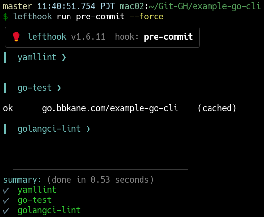
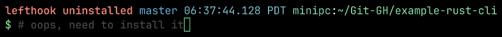
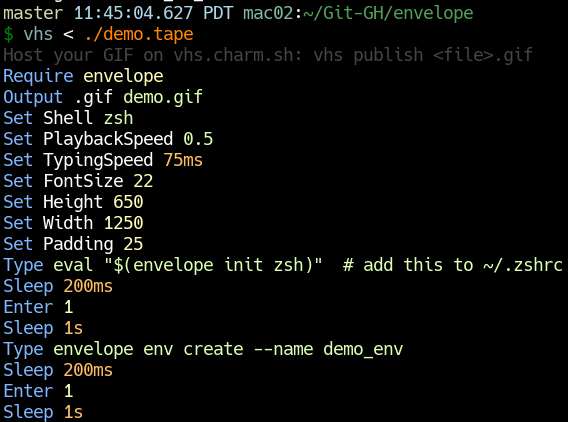

+++
title = "CLI Project Notes"
date = 2023-12-27
aliases = [ "/blog/go-project-notes/", "blog/go-notes/" ]
+++

> Engineering is programming integrated over time - [Titus Winters](https://abseil.io/blog/20171004-cppcon-plenary)

 # Motivation

I'm managing [enough side projects](https://github.com/bbkane/) now that they have "weight" - I'm duplicating and modifying config files for each repo, writing a buncha READMEs, and setting up dependency management. I need to keep my side projects maintainable (over years) and fun during my limited time and energy to hack on them, or I'm going to run out of steam.

In particular, I want the following qualities from my projects:

- A pleasure to use
  - good docs/READMEs
  - easy installation /uninstallation.
  - Minimal runtime dependencies
  - Does something I actually care about
- Easy to work on
  - Confident refactoring  - mostly accomplished with automatic tests. enabled automatic dependency updates
  - Similar code / config between projects. Accomplished with linters/formatters and scripted/manual changes
  - Quick iteration times!

A lot of the following is directly inspired by Simon Willerson's [How I build a feature](https://simonwillison.net/2022/Jan/12/how-i-build-a-feature/) blog post. That man manages like 100 open source projects, and I've learned a lot from his process. Also see [Checklists and Sayings](@/blog/Checklists-And-Sayings/index.md) for more exposition on codebases in general, and [Go Code Notes](@/blog/Go-Code-Notes/index.md) for more Go code-focused things.

For an up-to-date example of how I integrate the following code and tools into a project, see [example-go-cli](https://github.com/bbkane/example-go-cli).

# TL;DR I just checked out a repo, what do I do?

Install linting/testing tools from Homebrew:

```bash
brew install golangci-lint yamllint lefthook taplo
```

Install precommit:

```bash
lefthook install
```

Run pre-commit (lints + tests).

```bash
lefthook run pre-commit --force
```

Install GoReleaser's VS Code  [plugin](https://golangci-lint.run/welcome/integrations/#go-for-visual-studio-code).

# Creating a new project

## Is it necessary?

- Will I use this or will I learn a lot from it?
- Can I use someone else's work instead?
- Is Go/Rust the right language? For [small stuff](https://github.com/bbkane/dotfiles/tree/master/bin_common) Python works great!

## Steps

- Run `new_cli.py --lang go|rust` to copy either [example-go-cli](https://github.com/bbkane/example-go-cli) or  [example-rust-cli](https://github.com/bbkane/example-rust-cli) (`new_cli.py` source [here](https://github.com/bbkane/dotfiles/blob/master/bin_common/bin_common/new_cli.py))
- Add feature
- Update `CHANGELOG.md`
- Update `README.md`, particularly with a GIF: make `demo.tape` and update `demo.gif` with [vhs](https://github.com/charmbracelet/vhs): `vhs < ./demo.tape`
- Make the repo public if possible
- Update [bbkane/bbkane](https://github.com/bbkane/bbkane).

If the project is Go:

- Update [go.bbkane.com](https://github.com/bbkane/go.bbkane.com) to include the new project
- `go install go.bbkane.com/cli@latest` to test (CLIs only)

If the project is a library, not a CLI:

- Delete the `.goreleasor.yml` file

If a the project is a CLI, not a library:

- Add `KEY_GITHUB_GORELEASER_TO_HOMEBREW_TAP` to GitHub repo secrets - the URL is `https://github.com/bbkane/<name>/settings/secrets/actions`
- Push a tag to build with `git tagit` (see "Releasing a new version" below)
- `brew install bbkane/tap/cli`

# Releasing a new version

> TL;DR: Run `git-tagit` in the repo root.

Using [`git-tagit`](https://github.com/bbkane/dotfiles/blob/master/bin_common/bin_common/git-tagit), releasing a new version of a CLI does the following:

- Updates `Cargo.toml`/`Cargo.lock` and commits (Rust only)
- Adds git tag naming the version `vX.X.X` - these side projects favor learning over backwards compatibility so this usually means `v0.0.n+1`
- `git push`

At this point, CI/CD via GitHub actions takes over:

- Runs tests / lints
- Calls GoReleaser

GoReleaser:

- builds for all architectures I care about
- Cuts a release
- Updates [homebrew-tap](https://github.com/bbkane/homebrew-tap) and [scoop-bucket](https://github.com/bbkane/scoop-bucket)

Finally, users (i.e. me on my other computer) can install using Homebrew or Scoop.

# Multi-repo maintenance

Most of the time I'm updating code, not creating new projects, so I'm putting this section before the "creation"  notes.

I occasionally need to update something across all the [Go projects](https://github.com/search?q=owner%3Abbkane+topic%3Ago&type=repositories) I maintain. I track most of these in my [Go Project Update Tracker Spreadsheet](https://docs.google.com/spreadsheets/d/1R0c6VFFU_vLC45zgs_53rcWDHWRxt4S6UxdxBkFgPpo/edit#gid=0), because the grid format makes it easy to see which changes are applied to which projects.

TODO: 2026-07-10: I should make a Rust Project Update Tracker Spreadsheet as well...

## Dependency updates

Once a project has enough tests for my satisfaction, I set up [Dependabot](https://docs.github.com/en/code-security/dependabot) to make PRs with dependency updates.

## Scripting changes across repos

Some changes can be scripted - especially for config files. I try to keep similar `.gitignore`, `.golangci.yml`, `.goreleaser.yml` files in my projects (among others). I can fairly easily script changes to those with two amazing tools:

-  [`git-xargs`](https://github.com/gruntwork-io/git-xargs) lets you run a shell script against multiple repos and opens GitHub PRs with the results of the shell script
-  [`yq`](https://github.com/mikefarah/yq) lets you make targeted changes to YAML files. Something like, "change the property at this path to that"

For example,  I [recently](https://github.com/bbkane/git-xargs-tasks/tree/master/2023-10-29-format-yaml) added YAML formatting and linting to all the YAML files I'm using in each repo (sorted keys, comment formatting, etc.).

Another big win is I can keep the  change scripts around for inspiration later! I keep all my changes in my [git-xargs-tasks](https://github.com/bbkane/git-xargs-tasks) and I refer back to previous changes for examples/inspiration when writing new changes.

## Manual changes

Some changes are impossible or aren't worth the effort to script across repos. For example: a backwards incompatible library change that requires callers to update. The process I'm trying to stick to for these changes is:

- update [Go Project Update Tracker Spreadsheet](https://docs.google.com/spreadsheets/d/1R0c6VFFU_vLC45zgs_53rcWDHWRxt4S6UxdxBkFgPpo/edit#gid=0)
- update [example-go-cli](https://github.com/bbkane/example-go-cli) with the change and test. Update the CHANGELOG.md
- write a detailed issue that describes how to do the change
- add that issue to all repos (perhaps with a label)
- make the change to different projects as I get time/motivation and close the issue. Maybe before I add a feature to a project I close the change issue or before I start another manual change.

# Useful Tooling Requirements

I use several tools to keep my code working and maintainable. Requirements for this tooling are:

- Must have:
  - Easy installation and updates:
    - Preferably packaged in Homebrew for Mac/Linux installation and updates
    - A single binary with no runtime dependencies is the easiest to work with
    -  Preferably wrapped in a fancy [GitHub Action](https://github.com/bbkane/example-go-cli/tree/master/.github/workflows)
  - Easy usage:
    - from editor
    - from CLI and pre-commit (via [lefthook](https://github.com/evilmartians/lefthook))
    - in CI with GitHub Actions
- Should have:
  - Automatic fixes for any problems found
  - Quick runtime

# Useful Tooling for all projects

## Lint/format TOML with [taplo](https://taplo.tamasfe.dev/)

As of 2026-07-10, I'm quite new to taplo, so while I'm currently only enforcing sorted keys for Rust projects (Go projects don't currently use TOML), I'm sure my usage will grow over time.

MacOS install:

```bash
brew install taplo
```

Run locally:

```bash
taplo fmt --check
```

Automatic fix:

```bash
taplo fmt
```

## Lint YAML with [yamllint](https://github.com/adrienverge/yamllint)

Most of my configs are YAML, and many of them are very similar from repo to repo. I find it super useful to ensure all my YAML is formatted similarly (in particular I enforce sorted keys) to make diffing the YAML easy. 


MacOS Install (yamllint is a Python tool, so it does have some dependencies to keep track of):

```bash
brew install yamllint
```

Run locally:

```bash
yamllint .
```

Automatic fix (mostly for formatting issues):

```bash
yq -i -P 'sort_keys(..)' <file>.yaml
```

No VS Code integration that I'm aware of.

## Run CI locally with [Lefthook](https://github.com/evilmartians/lefthook)

Install/Run/Uninstall pre-commit hooks that mimic CI. It's much faster to run these locally than to wait the minute or so for GitHub actions to run.



MacOS Install

```bash
brew install lefthook
```

Run locally:

- install pre-commit hook: `lefthook install`
- uninstall pre-commit hook: `lefthook uninstall`
- Run pre-commit without committing: `lefthook run pre-commit --force`

No VS Code integration, but I do set my prompt so it warns me if it's available but not installed:



## Script demo GIFs with [VHS](https://github.com/charmbracelet/vhs)

Script demo GIF creation! These really make my READMEs pop.



MacOS Install:

```bash
brew install vhs
```

Run locally:

```bash
vhs < demo.tape
```

## Distribute CLIs with [GoReleaser](https://goreleaser.com/)

Build platform-specific executables, upload to GitHub releases, and auto-update both Homebrew taps and Scoop buckets. This is probably the tool that locks me most into Go. It's incredibly smooth to use, especially as a GitHub action when a tag is pushed.


MacOS Install:

```bash
brew install goreleaser
```

Run locally:

```bash
goreleaser release --snapshot --fail-fast --clean
```

# Useful Go Tooling

## Lint Go code with [golangci-lint](https://golangci-lint.run/)

Run various correctness checks on source code. I love it because it's a binary distribution of a lot of other lints

MacOS [Install](https://golangci-lint.run/usage/install/#macos):

```bash
brew install golangci-lint
```

Run [locally](https://golangci-lint.run/usage/quick-start/):

```bash
golangci-lint run
```

Automatic fix:

```bash
golangci-lint run --fix
```

VS Code integration is with a [plugin](https://golangci-lint.run/welcome/integrations/#go-for-visual-studio-code) .

Note that with the `lintTool` set to `golangci-lint`, the `Go` VS Code extension will `go install` golangci-lint, despite the fact that this is [explicitly recommended against](https://golangci-lint.run/usage/install/#install-from-source). ¯\_(ツ)_/¯

## Format `go.mod` with [go-modtool](https://github.com/shoenig/go-modtool)

Organically, my `go.mod` file seems to end up with multiple random `require` stanzas... So I found [go-modtool](https://github.com/shoenig/go-modtool), which organizes them much better.

MacOS Install:

```bash
go install github.com/shoenig/go-modtool@latest
```

Run locally:

```bash
# group stanzas
go-modtool -w fmt go.mod
# sort lines in stanzas
go mod tidy
```

Slightly unfortunately, it doesn't sort lines in each stanza, so I have to run a `go mod tidy` to do that. I probably won't put this in CI, and instead just run it occasionally.
