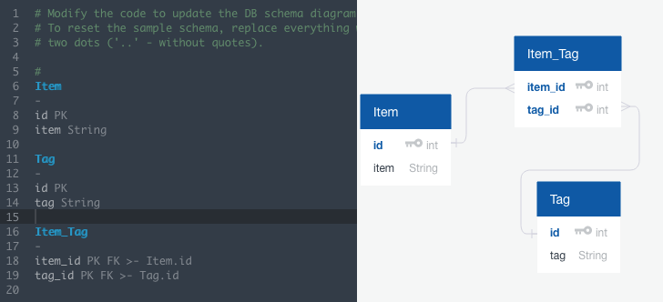
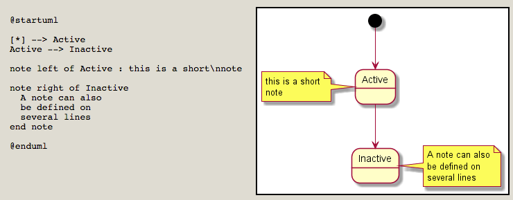
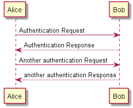
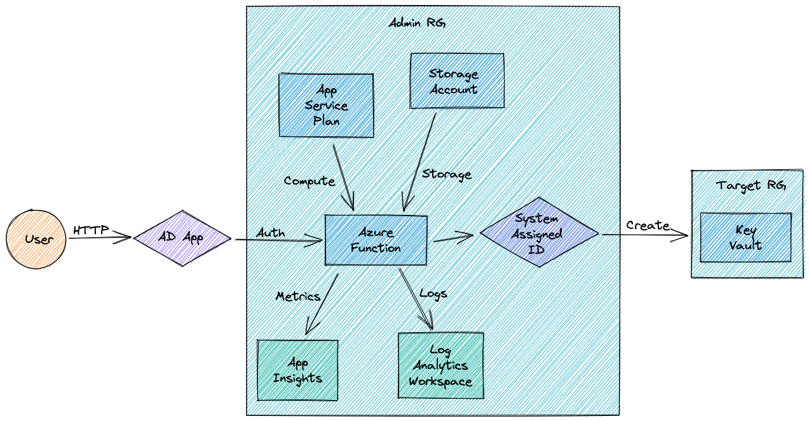
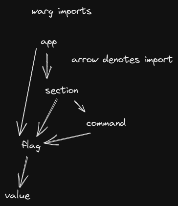

+++
title = "Diagram Tools"
date = 2018-08-20
updated = 2019-04-08
aliases = [ "2018/08/20/My-Favorite-Text-Diagram-Tools.html", "blog/my-favorite-text-diagram-tools/" ]
+++

I love that diagrams can make difficult concepts intuitive. Here are some of my
favorite diagram tools. When possible, I prefer open source tools and text -> image diagram makers.

## [Quick Database Diagrams](https://www.quickdatabasediagrams.com/)

[Quick Database Diagrams](https://www.quickdatabasediagrams.com/) lets you
quickly prototype schemas for SQL databases. It's really helped me out at times.



## [PlantUML](http://plantuml.com/)

PlantUML is a textual description to diagram generator that features several
types of diagrams. My favorites right now are the state diagram and the sequence
diagram (both images here sourced from plantuml.com).





### Using PlantUML with Visual Studio Code

There is a really nice [plugin](https://github.com/qjebbs/vscode-plantuml) for
PlantUML for VSCode. Install it with:

```
ext install plantuml
```

Use it by creating a `.wsd` file to get syntax highlighting and
(not so great, but stil useful) auto-completion.

See the commands it provides with `Cmd+P`, then typing `> PlantUML`. One very
useful command I've found is `PlantUML: Preview Current Diagram`. Just keep in
mind that it can take a few seconds to turn a change into a live preview.

### Exporting PlantUML diagrams to Confluence

This method even preserves clickable links

1. Export to SVG: `plantuml -tsvg <name>`.
2. Paste text into *HTML* macro in Confluence.

As an altarnative, also consider [Mermaid](https://mermaid-js.github.io/mermaid/#/). It has [Typora](https://typora.io/) support as well as [VS Code plugins](https://marketplace.visualstudio.com/items?itemName=bierner.markdown-mermaid). I don't personally use it because PlantUML covers most of my needs, but it looks super nice!

## graphviz

[graphviz](https://www.graphviz.org/) and its associated layout tools dot and
neato are tools to generate graph images from text input files. So I don't
really use them like I use the previous tools, but I figure they're worth a
mention.

## Excalidraw

[Excalidraw](https://excalidraw.com/) is a WYSIWYG open source diagram tool
that's suuper simple to use (seriously, Excalidraw nails the UI for this tool)
and produces good looking hand-drawn diagram. I really love it for quickly
sketching out an idea. As a PWA, it can be "installed" locally for offline use
from a Chrome browser. Here are a few diagrams I've made with it, and also
check their [Twitter](https://twitter.com/excalidraw?lang=en) for even better
examples.





## Draw.io VS Code

[Diagrams.net](https://www.diagrams.net/) (also known as draw.io) is a more
Visio-like diagramming tool. There's an unofficial [VS Code
plugin](https://marketplace.visualstudio.com/items?itemName=hediet.vscode-drawio)
that brings this functionality offline to your editor!! It's useful when I need
more professional-looking architecture diagrams than Excalidraw. It looks like
it can also import GraphViz diagrams, and also has a PWA app. Unfortunately, I
don't have any publicly available diagrams I've made with diagrams.net, but do
check [their blog](https://www.diagrams.net/blog) for some great examples.
