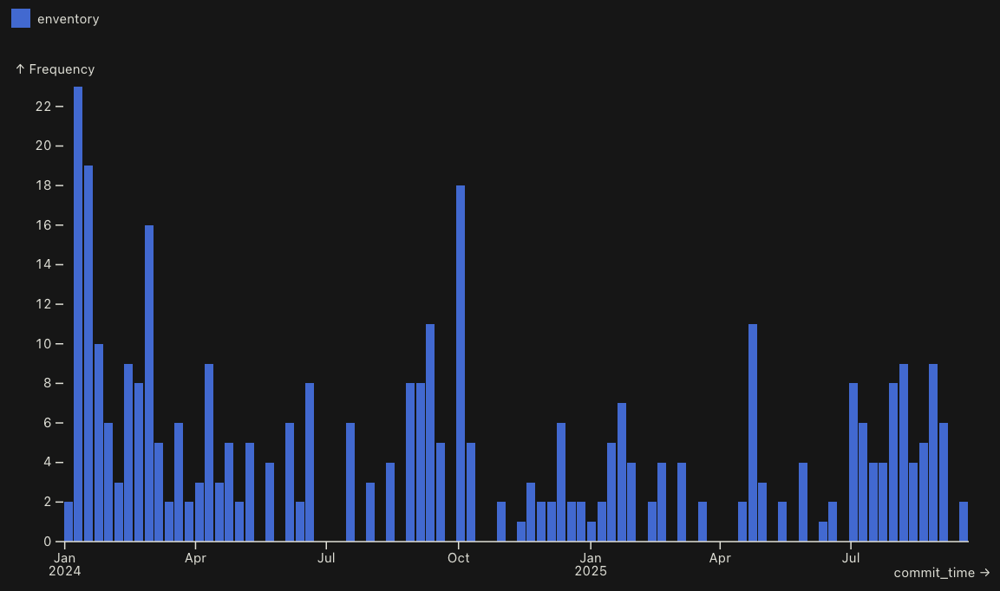

+++
title = "Enventory Retrospective"
date = 2025-08-26
draft = true
+++

I've had a lot of fun writing [enventory](https://github.com/bbkane/enventory), and here on some notes of what I've learned (mostly about architecture and Go)! I'm writing this post as an alternative to slides for a talk to give a few friends.

# What is enventory?

> Centrally manage environment variables with SQLite
>
> - Automatically export/unexport environments when entering/leaving directories
> - Keep a global view of which variables apply to which projects (as well as date created/updated, optional comments).
> - Filter environments to keep your view manageable:
>
> ```
> enventory env list --expr 'filter(Envs, hasPrefix(.Name, "test") and .UpdateTime > now() - duration("90d"))'
> ```
>
> - Share variables between environments with variable references
> - Advanced tab completion! Autocomplete commands, flags, env names, var/ref names
> - Currently only supports `zsh`


# Motivation

- Solve a small problem I have 

- Learning - I've modified CRUD apps at work and I've never been particularly happy with their architectures
- Fun (and exercise [my CLI library](https://github.com/bbkane/warg))

# Commit Stats



- ~360 commits over 1.75 years
- Side project schedule: mornings, evenings, weekends
- Most commits around 5PM Sundays 🤷‍♂️


# Architecture

A "layered architecture" inspired by the [WTF Dial blog posts](https://www.gobeyond.dev/wtf-dial/) (I deviated where I thought convenient)


This is viewable in the import graph:

- Top level "presentation" layer - `cli` package
- Business layer in the middle - `app` package
- Generate DB layer with [sqlc](https://sqlc.dev/) - `sqlcgen` package
- `cli` and `app` packages share types via a `models` package

# Layered Architecture Thoughts

Advantages:

- easy to add/enforce things within a layer (i.e., adding observability to a layer is as simple as wrapping the layer's interface with one that logged the method and called the layer )
- It's generally pretty easy to know where to put things

Disadvantages

- Lots of translating between the layers
- Adding a feature means updating all the layers
- Layers can get thick with lots of methods

Other:

- I tried to break this up even further (hexagonal architecture), but all my things refer to each other so I didn't find a good place.

# CLI Design Notes

- Make CLIs you'll actually use. You'll quickly discover what features they need
- Read a few CLI design guides and pick a favorite (like [this](https://m.youtube.com/watch?v=eMz0vni6PAw) (REALLY good Cobra talk) or [this](https://fuchsia.dev/fuchsia-src/development/api/cli#ux-guidelines) or [this](https://rust-cli-recommendations.sunshowers.io/index.html))
  - I picked the "subcommand subcommand verb flags" way inspired by [`azure-cli`](https://learn.microsoft.com/en-us/cli/azure/?view=azure-cli-latest)
- Iterate on your app's CLI design (any subcommands, flags, etc) in a text file before coding it up to make sure everything is nicely  organized

```
enventory
  version
  completion
    zsh
  env
    create
    delete
    list
    show
    update
  shell
    zsh
      chdir
      export
      init
      unexport
  var
    create
    delete
    show
    update
    ref
      create
      delete
      show
      update
```

# CLI Implementation

- 6 sections (used to group commands)
- 19 commands total (so far)

Command nesting is [pretty declarative](https://github.com/bbkane/enventory/blob/d8eb5315cb6784ed9473a77fd50633475f978787/main.go#L12):

```go
app := warg.New(
  "enventory",
  version,
  warg.NewSection(
    "Manage Environmental secrets centrally",
    warg.NewSubSection(
      "completion",
      "Print completion scripts",
      warg.SubCmd("zsh", cli.CompletionZshCmd()),
    ),
    warg.NewSubSection(
      "env",
      "Environment commands",
      warg.SubCmd("create", cli.EnvCreateCmd()),
      warg.SubCmd("delete", cli.EnvDeleteCmd()),
      warg.SubCmd("list", cli.EnvListCmd()),
      warg.SubCmd("update", cli.EnvUpdateCmd()),
      warg.SubCmd("show", cli.EnvShowCmd()),
    ),
    // more sections / commands
```

 Setting up a command is also not bad (using helper functions as some of these flags are re-used)

```go
func EnvDeleteCmd() warg.Cmd {
  return warg.NewCmd(
    "Delete an environment and associated vars",
    withConfirm(withSetup(envDelete)),
    warg.CmdFlag("--name", envNameFlag()),
    warg.CmdFlagMap(confirmFlag()),
    warg.CmdFlagMap(timeoutFlagMap()),
    warg.CmdFlagMap(sqliteDSNFlagMap()),
  )
}
```

Piping the parsed flags into the business layer is a bit annoying, as is dealing with errors:

```go
func envDelete(ctx context.Context, es models.Service, cmdCtx warg.CmdContext) error {
  name := mustGetNameArg(cmdCtx.Flags)
  err := es.WithTx(ctx, func(ctx context.Context, es models.Service) error {
    err := es.EnvDelete(ctx, name)
    if err != nil {
      return fmt.Errorf("could not delete env: %s: %w", name, err)
    }
    return nil
  })
  if err != nil {
    return err
  }

  fmt.Fprintf(cmdCtx.Stdout, "deleted: %s\n", name)
  return nil
}
```

Use decorators like `withSetup` or `withConfirm` to reduce verbosity:

```go
// withConfirm wraps a cli.Action to ask for confirmation before running
func withConfirm(f func(cmdCtx warg.CmdContext) error) warg.Action {
  return func(cmdCtx warg.CmdContext) error {
    confirm := cmdCtx.Flags["--confirm"].(bool)
    if !confirm {
      return f(cmdCtx)
    }

    fmt.Print("Type 'yes' to continue: ")
    reader := bufio.NewReader(os.Stdin)
    confirmation, err := reader.ReadString('\n')
    if err != nil {
      return fmt.Errorf("confirmation ReadString error: %w", err)
    }
    confirmation = strings.TrimSpace(confirmation)
    if confirmation != "yes" {
      return fmt.Errorf("unconfirmed change")
    }
    return f(cmdCtx)
  }
}

```

# Deterministic CLI Testing

Allow deterministic output with either flags or a special app setup, so you can easily write snapshot tests.

- [`enventory`](https://github.com/bbkane/enventory) has a `--create-time` flag that defaults to the current time but can be passed a date so the output is deterministic. 
- [`shovel`](https://github.com/bbkane/shovel) allows the app to be constructed with an [injectable I/O function](https://github.com/bbkane/shovel/blob/fb7e91479b15e58a14f8969ff9366942ecbdf3b8/dig/dig.go#L38). Tests use a mock function, `main()` uses a real one

Enventory is small and self-contained enough that snapshot tests are fast and convenient!

- Why test one layer when you can test them all at once?
- Each test makes its own SQLite DB
- Tests are run in parallel (enforced by [`paralleltest`](https://golangci-lint.run/docs/linters/configuration/#paralleltest))

# CLI Test Example

- Most tests are a [sequence of enventory commands](https://github.com/bbkane/enventory/blob/d8eb5315cb6784ed9473a77fd50633475f978787/main_env_test.go#L29) with a small "Builder" DSL to get easy tab completion

```go
tests := []testcase{
  {
    name:            "01_envCreate",
    args:            envCreateTestCmd(dbName, envName01),
    expectActionErr: false,
  },
  {
    name: "02_envShow",
    args: new(testCmdBuilder).Strs("env", "show").
      Name(envName01).Tz().Mask(false).Finish(dbName),
    expectActionErr: false,
  },
  {
    name: "03_envList",
    args: new(testCmdBuilder).Strs("env", "list").
      Strs("--timezone", "utc").Finish(dbName),
    expectActionErr: false,
  },
}

```

`stderr` and `stdout` are compared [against files](https://github.com/bbkane/enventory/tree/master/testdata) and and the test fails if the output doesn't match.

Example file content:

```
╭────────────┬────────────────╮
│ Name       │ envName01      │
│ CreateTime │ Mon 0001-01-01 │
╰────────────┴────────────────╯
```

TODO: CLI Tab Completion


---

- LLMs and verbosity
- SQLC codegen + diagrams
- Transactions are messy, show article
- Observability 

  - Wrap the layers

  - OTEL
- Testing - snapshot tests. Requires determinism
- Packaging - goreleaser
- Dynamic tab completion with warg
- Expr to sort/filter
- Table output - too wide, switch to kvtable
- All writes from app, constraint enforcement from DB
  - Prevent same name with triggers
- Future plans

  - Env ref

  - Search?
- Other things to learn

  - Queues and other types of I/o (APIs, etc)

  - Auth

- Goreleaser

