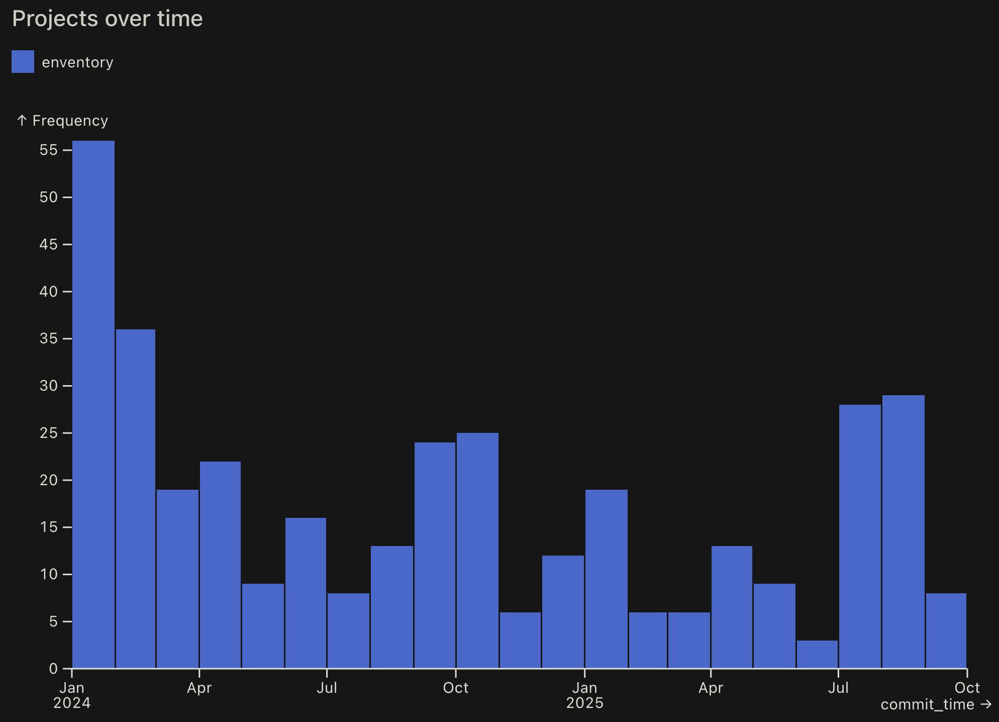
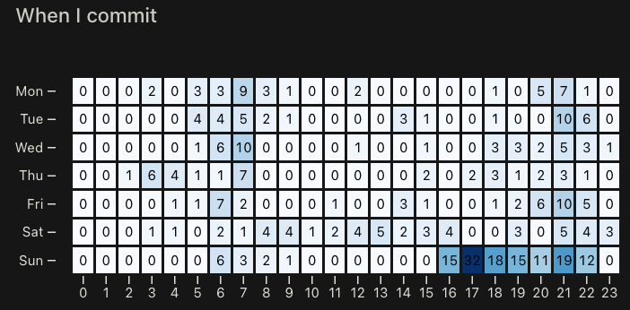
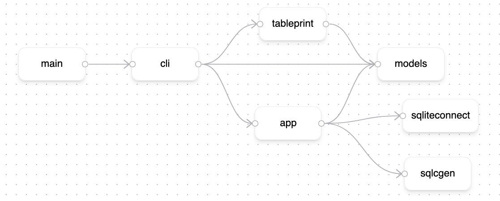
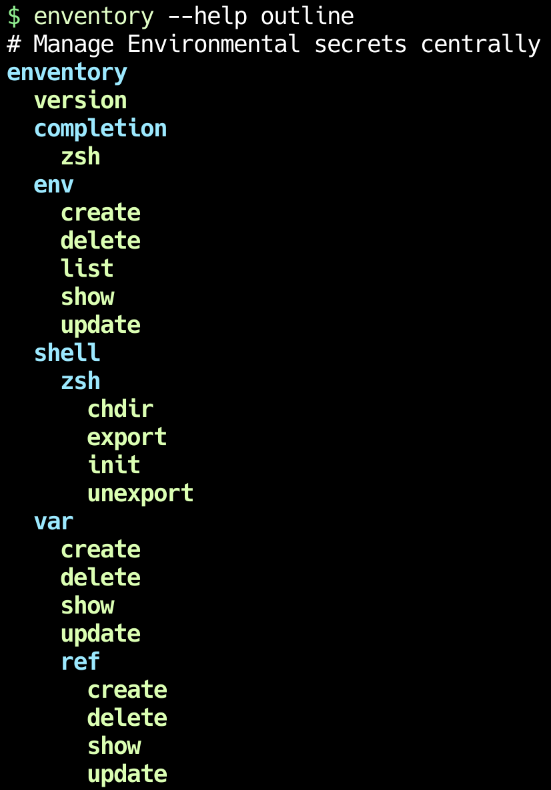
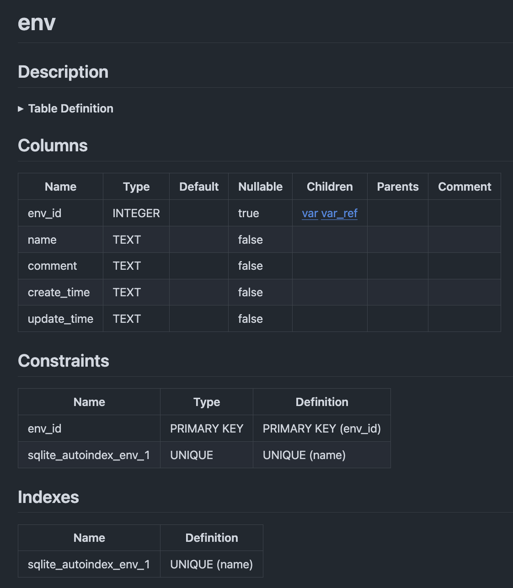
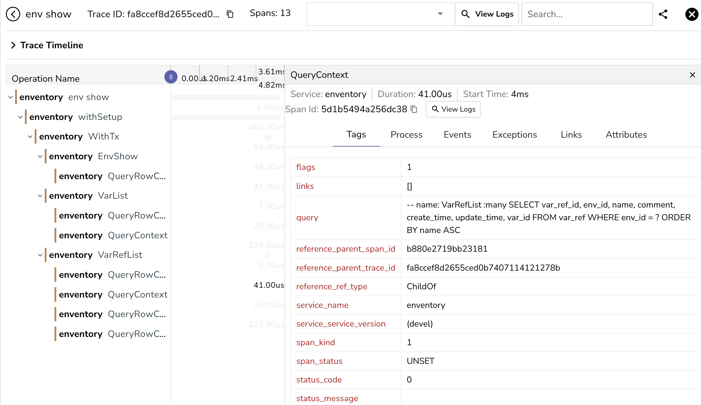

+++
title = "Enventory Retrospective"
date = 2025-10-10
draft = true

+++

I've had a lot of fun writing [enventory](https://github.com/bbkane/enventory), and here on some notes of what I've learned (mostly about architecture and Go)! I'm writing this post as an alternative to slides for a talk to give a few friends.

# Project

## What is enventory?

> Centrally manage environment variables with SQLite
>
> - Automatically export/unexport environments when entering/leaving directories
> - Keep a global view of which variables apply to which projects (as well as date created/updated, optional comments).
> - Filter environments to keep your view manageable:
>
> ```
> enventory env list --expr 'filter(Envs, hasPrefix(.Name, "test") and .UpdateTime > now() - duration("90d"))'
> ```
>
> - Share variables between environments with variable references
> - Advanced tab completion! Autocomplete commands, flags, env names, var/ref names
> - Currently only supports `zsh`

## Demo


## Motivation

- Solve a small problem I have 

- Learning
  - I've never been happy with CRUD architures in work projects
  - Take my time writing, learning, and rewriting my own CRUD architecture

- Fun! (and exercise [my CLI library](https://github.com/bbkane/warg))

## Lines Of Code

~4500 lines of code

```
$ tokei --compact
===============================================================================
 Language            Files        Lines         Code     Comments       Blanks
===============================================================================
 Go                     32         5426         4577          168          681
 JSON                    1            1            1            0            0
 Markdown               12          707            0          455          252
 SQL                     9          458          349           41           68
 SVG                     8          711          658           53            0
 Plain Text            160          285            0          285            0
 YAML                    3           39           32            6            1
 Zsh                     2           95           64           13           18
===============================================================================
 Total                 227         7722         5681         1021         1020
===============================================================================
```

## Project Length

~360 commits over 1.75 years



## Active hours per week

Side project schedule: mornings, evenings, weekends

Most commits around 5PM Sundays 🤷‍♂️



# Architecture

A "layered architecture" inspired by the [WTF Dial blog posts](https://www.gobeyond.dev/wtf-dial/)



This is viewable in the import graph:

- Top level "presentation" layer - `cli` package
- Business layer in the middle - `app` package
- Generate DB layer with [sqlc](https://sqlc.dev/) - `sqlcgen` package
- `cli` and `app` packages share types via a `models` package

## Layered Architecture Thoughts

Advantages:

- easy to add/enforce things within a layer (i.e., adding observability to a layer is as simple as wrapping the layer's interface with one that logged the method and called the layer )
- It's generally pretty easy to know where to put things (sometimes hard between CLI and business layer)

Disadvantages

- Lots of translating between the layers
- Adding a feature means updating all the layers
- Layers can get thick with lots of methods

Other:

- I tried to break this up even further (hexagonal architecture), but all my things refer to each other so I didn't find a good place.

# CLI Design

## Design Notes

- Make CLIs you'll actually use. You'll quickly discover what features they need
- Read a few CLI design guides and pick a favorite (like [this](https://m.youtube.com/watch?v=eMz0vni6PAw) (REALLY good Cobra talk) or [this](https://fuchsia.dev/fuchsia-src/development/api/cli#ux-guidelines) or [this](https://rust-cli-recommendations.sunshowers.io/index.html))
  - I picked the "subcommand subcommand verb flags" way inspired by [`azure-cli`](https://learn.microsoft.com/en-us/cli/azure/?view=azure-cli-latest)
- Iterate on your app's CLI design (any subcommands, flags, etc) in a text file before coding it up to make sure everything is nicely  organized



- 6 sections (used to group commands)
- 19 commands total (so far)

## Tab Completion

CLI commands that are painfully long to type

```bash
enventory var ref create \
    --env /path/to/project \
    --name example_com_API_KEY \
    --ref-env example_com_env \
    --ref-var example_com_API_KEY
```

Most of these can be tab completed!

Added **REALLY GOOD** tab completion to autocomplete basically anything already in the database (i.e., `--env`, `--ref-env`, `--ref-var`), scoped by previous passed flags. Example: limits `--ref-var` suggestions to  variables that exist in `--ref-env`.

## Readable Output

I use "Key/value" tables (quite similar to MySQL's "vertical ouput" mode )

```
$ go run . env list
╭────────────┬───────────────────────────────────────╮
│ Name       │ /Users/jennykane/Apps/openobserve-... │
│ CreateTime │ Fri 2025-08-22                        │
├────────────┼───────────────────────────────────────┤
│ Name       │ /Users/jennykane/Git-GH/enventory     │
│ CreateTime │ Mon 2024-06-24                        │
│ UpdateTime │ Tue 2025-08-26                        │
├────────────┼───────────────────────────────────────┤
│ Name       │ /Users/jennykane/Git-GH/git-xargs-... │
│ CreateTime │ Tue 2025-05-13                        │
├────────────┼───────────────────────────────────────┤
│ Name       │ /Users/jennykane/Git-GH/shovel_ans... │
│ CreateTime │ Sat 2024-05-04                        │
├────────────┼───────────────────────────────────────┤
│ Name       │ openobserve                           │
│ CreateTime │ Fri 2025-08-22                        │
├────────────┼───────────────────────────────────────┤
│ Name       │ otel_otlp_local_openobserve           │
│ CreateTime │ Fri 2025-10-10                        │
╰────────────┴───────────────────────────────────────╯
```

- Balance readability with information density
- Value truncation if screen width is too small
- Omit "uninteresting" key/value pairs (omit `UpdateTime` if it's the same as `CreateTime`)

## Filter/sort `env list` with [`expr`](https://expr-lang.org/) query language

Find the environments I care about.

```
$ enventory env list \
    --expr 'filter(Envs, not pathExists(.Name) or .UpdateTime > now() - duration("90d"))'
╭────────────┬────────────────────────────────────────────────────────────╮
│ Name       │ /Users/jennykane/Apps/openobserve-v0.15.0-rc5-darwin-arm64 │
│ CreateTime │ Fri 2025-08-22                                             │
├────────────┼────────────────────────────────────────────────────────────┤
│ Name       │ /Users/jennykane/Git-GH/enventory                          │
│ CreateTime │ Mon 2024-06-24                                             │
│ UpdateTime │ Tue 2025-08-26                                             │
├────────────┼────────────────────────────────────────────────────────────┤
│ Name       │ openobserve                                                │
│ CreateTime │ Fri 2025-08-22                                             │
├────────────┼────────────────────────────────────────────────────────────┤
│ Name       │ otel_otlp_local_openobserve                                │
│ CreateTime │ Fri 2025-10-10                                             │
╰────────────┴────────────────────────────────────────────────────────────╯
```

# CLI Implementation

## Command Nesting

Command nesting is [pretty declarative](https://github.com/bbkane/enventory/blob/d8eb5315cb6784ed9473a77fd50633475f978787/main.go#L12):

```go
app := warg.New(
  "enventory",
  version,
  warg.NewSection(
    "Manage Environmental secrets centrally",
    warg.NewSubSection(
      "completion",
      "Print completion scripts",
      warg.SubCmd("zsh", cli.CompletionZshCmd()),
    ),
    warg.NewSubSection(
      "env",
      "Environment commands",
      warg.SubCmd("create", cli.EnvCreateCmd()),
      warg.SubCmd("delete", cli.EnvDeleteCmd()),
      warg.SubCmd("list", cli.EnvListCmd()),
      warg.SubCmd("update", cli.EnvUpdateCmd()),
      warg.SubCmd("show", cli.EnvShowCmd()),
    ),
    // more sections / commands
```

## Setting up a Command 

Setting up a command is also not bad (using helper functions as some of these flags are re-used)

```go
func EnvDeleteCmd() warg.Cmd {
  return warg.NewCmd(
    "Delete an environment and associated vars",
    withConfirm(withSetup(envDelete)),
    warg.CmdFlag("--name", envNameFlag()),
    warg.CmdFlagMap(confirmFlag()),
    warg.CmdFlagMap(timeoutFlagMap()),
    warg.CmdFlagMap(sqliteDSNFlagMap()),
  )
}
```

## Running a Command

Piping the parsed flags into the business layer is a bit annoying, as is dealing with errors:

```go
func envDelete(ctx context.Context, es models.Service, cmdCtx warg.CmdContext) error {
  name := mustGetNameArg(cmdCtx.Flags)
  err := es.WithTx(ctx, func(ctx context.Context, es models.Service) error {
    err := es.EnvDelete(ctx, name)
    if err != nil {
      return fmt.Errorf("could not delete env: %s: %w", name, err)
    }
    return nil
  })
  if err != nil {
    return err
  }

  fmt.Fprintf(cmdCtx.Stdout, "deleted: %s\n", name)
  return nil
}
```

## Command Decorator Pattern

Use decorators like `withSetup` or `withConfirm` to reduce verbosity:

```go
// withConfirm wraps a cli.Action to ask for confirmation before running
func withConfirm(f func(cmdCtx warg.CmdContext) error) warg.Action {
  return func(cmdCtx warg.CmdContext) error {
    confirm := cmdCtx.Flags["--confirm"].(bool)
    if !confirm {
      return f(cmdCtx)
    }

    fmt.Print("Type 'yes' to continue: ")
    reader := bufio.NewReader(os.Stdin)
    confirmation, err := reader.ReadString('\n')
    if err != nil {
      return fmt.Errorf("confirmation ReadString error: %w", err)
    }
    confirmation = strings.TrimSpace(confirmation)
    if confirmation != "yes" {
      return fmt.Errorf("unconfirmed change")
    }
    return f(cmdCtx)
  }
}

```

## CLI Snapshot Testing

Allow deterministic output with either flags or a special app setup, so you can easily write snapshot tests.

- [`enventory`](https://github.com/bbkane/enventory) has a `--create-time` flag that defaults to the current time but can be passed a date so the output is deterministic. 
- [`shovel`](https://github.com/bbkane/shovel) allows the app to be constructed with an [injectable I/O function](https://github.com/bbkane/shovel/blob/fb7e91479b15e58a14f8969ff9366942ecbdf3b8/dig/dig.go#L38). Tests use a mock function, `main()` uses a real one

Enventory is small and self-contained enough that snapshot tests are fast and convenient!

- Why test one layer when you can test them all at once?
- Each test makes its own SQLite DB
- Tests are run in parallel (enforced by [`paralleltest`](https://golangci-lint.run/docs/linters/configuration/#paralleltest))

## CLI Test Example

- Most tests are a [sequence of enventory commands](https://github.com/bbkane/enventory/blob/d8eb5315cb6784ed9473a77fd50633475f978787/main_env_test.go#L29) with a small "Builder" DSL to get easy tab completion

```go
tests := []testcase{
  {
    name:            "01_envCreate",
    args:            envCreateTestCmd(dbName, envName01),
    expectActionErr: false,
  },
  {
    name: "02_envShow",
    args: new(testCmdBuilder).Strs("env", "show").
      Name(envName01).Tz().Mask(false).Finish(dbName),
    expectActionErr: false,
  },
  {
    name: "03_envList",
    args: new(testCmdBuilder).Strs("env", "list").
      Strs("--timezone", "utc").Finish(dbName),
    expectActionErr: false,
  },
}

```

`stderr` and `stdout` are compared [against files](https://github.com/bbkane/enventory/tree/master/testdata) and and the test fails if the output doesn't match.

Example file content:

```
╭────────────┬────────────────╮
│ Name       │ envName01      │
│ CreateTime │ Mon 0001-01-01 │
╰────────────┴────────────────╯
```

# App Layer

## Service interface

Implements interface from `models` package, handles transactions to database layer.

I couldn't figure out a meaningful way to isolate functionality, so it's one big interface...

```go
type Service interface {
  EnvCreate(ctx context.Context, args EnvCreateArgs) (*Env, error)
  EnvDelete(ctx context.Context, name string) error
  EnvList(ctx context.Context, args EnvListArgs) ([]Env, error)
  EnvUpdate(ctx context.Context, name string, args EnvUpdateArgs) error
  EnvShow(ctx context.Context, name string) (*Env, error)

  VarCreate(ctx context.Context, args VarCreateArgs) (*Var, error)
  VarDelete(ctx context.Context, envName string, name string) error
  VarList(ctx context.Context, envName string) ([]Var, error)
  VarUpdate(ctx context.Context, envName string, name string, args VarUpdateArgs) error
  VarShow(ctx context.Context, envName string, name string) (*Var, []VarRef, error)

  VarRefCreate(ctx context.Context, args VarRefCreateArgs) (*VarRef, error)
  VarRefDelete(ctx context.Context, envName string, name string) error
  VarRefList(ctx context.Context, envName string) ([]VarRef, []Var, error)
  VarRefShow(ctx context.Context, envName string, name string) (*VarRef, *Var, error)
  VarRefUpdate(ctx context.Context, envName string, name string, args VarRefUpdateArgs) error

  WithTx(ctx context.Context, fn func(ctx context.Context, es Service) error) error
}
```

## Transactions

Allows callers to run arbitrary code in the callback `fn`. Try to keep transactions at the top level, since they can't be nested

```go
WithTx(ctx context.Context, fn func(ctx context.Context, es Service) error) error
```

Inspiration: [Transactions in Go Hexagonal Architecture | by Khaled Karam | The Qonto Way | Medium](https://medium.com/qonto-way/transactions-in-go-hexagonal-architecture-f12c7a817a61)

Usage:

```go
err := es.WithTx(ctx, func(ctx context.Context, es models.Service) error {
  var err error
  env, err = es.EnvCreate(ctx, createArgs)
  if err != nil {
    return err
  }
  return nil
})
if err != nil {
  return fmt.Errorf("could not create env: %w", err)
}
```

# DB Layer

- Shove data into the database
- Where to write and validate?
  - App layer does all writes
  - DB layer rejects writes that that violate constraints
- Migrate with SQL files
- Generate Go -> SQL functions with [sqlc.dev](https://sqlc.dev)
- Generate markdown docs with [k1LoW/tbls: tbls is a CI-Friendly tool to document a database, written in Go.](https://github.com/k1LoW/tbls)

## Main Tables


- All tables have `comment`, `create_time`, `update_time`
- Tables use `<tablename>_id` integer primary keys
  - Makes renames easy

## Cross-table UNIQUE Constraints

`var`s and `var ref`s are in different tables, yet must have unique names in the environment so exports work correctly.

Use views + triggers!

- Create a view with all the names in the env
- Use triggers to FAIL the insert/update if we can find the name in the view

```sqlite
CREATE TRIGGER tr_var_insert_check_unique_name
BEFORE INSERT ON var
FOR EACH ROW
  BEGIN
    SELECT RAISE(FAIL, 'name already exists in env')
  FROM
    vw_env_var_var_ref_unique_name
  WHERE env_id = NEW.env_id AND name = NEW.name;
END
```

Thoughts

- I like that this is the "bottom layer" - upper layers don't need to validate this
- SQL is hard to write (limited autocomplete), debug and test

## SQL Migrations

- Plain SQL files - alter table, add tables, update views, etc.
- Embedded into the app binary
- Checked against migrations table on app startup to prevent running twice
- Migrations manually tested for now

```
sqlite> SELECT * FROM migration_v2;
┌─────────────────┬───────────────────────────────────────┬──────────────────────┐
│ migration_v2_id │               file_name               │     migrate_time     │
├─────────────────┼───────────────────────────────────────┼──────────────────────┤
│ 1               │ 001_create.sql                        │ 2024-09-04T04:04:33Z │
│ 2               │ 002_env_ref.sql                       │ 2024-09-04T04:04:33Z │
│ 3               │ 003_refactor.sql                      │ 2024-09-04T04:04:33Z │
│ 4               │ 004_allow_env_var_env_ref_updates.sql │ 2024-09-04T04:04:33Z │
│ 5               │ 005_drop_keyring_entry.sql            │ 2024-09-14T22:43:46Z │
│ 6               │ 006_var_and_ref_renames.sql           │ 2024-10-03T22:32:31Z │
└─────────────────┴───────────────────────────────────────┴──────────────────────┘
```

## Generate Type Safe Go -> SQL

[`sqlc`](https://sqlc.dev) is amazing! It generates so much finicky boilerplate.

Write:

```sqlite
-- name: EnvCreate :one
INSERT INTO env (
    name, comment, create_time, update_time
) VALUES (
    ?   , ?      , ?          , ?
)
RETURNING name, comment, create_time, update_time;
```

Generate:

```go
func (q *Queries) EnvCreate(ctx context.Context, arg EnvCreateParams) (EnvCreateRow, error) {
  row := q.db.QueryRowContext(ctx, envCreate,
    arg.Name,
    arg.Comment,
    arg.CreateTime,
    arg.UpdateTime,
  )
  var i EnvCreateRow
  err := row.Scan(
    &i.Name,
    &i.Comment,
    &i.CreateTime,
    &i.UpdateTime,
  )
  return i, err
}
```

## Generate [SQL Docs](https://github.com/bbkane/enventory/tree/master/dbdoc) with [tbls](https://github.com/k1LoW/tbls)



# Misc

## OTEL Traces



- tree view of calls
- timestamps and how long each call took
- structured data (for example, the exact SQL query here)

## OTEL Trace Implementation

Can do pretty well simply by wrapping the interfaces

```go
func (t *TracedService) EnvCreate(ctx context.Context, args EnvCreateArgs) (*Env, error) {
  ctx, span := t.tracer.Start(
    ctx,
    "EnvCreate",
    trace.WithAttributes(
      attribute.String("args.Name", args.Name),
      attribute.String("args.Comment", args.Comment),
      attribute.String("args.CreateTime", TimeToString(args.CreateTime)),
      attribute.String("args.UpdateTime", TimeToString(args.UpdateTime)),
    ),
  )
  defer span.End()

  env, err := t.Service.EnvCreate(ctx, args)
  if err != nil {
    span.RecordError(err)
    span.SetStatus(codes.Error, err.Error())
  }

  return env, err
}
```

## New commands are tedious

Updates:

- DB schema (sometimes)
- SQL queries
- Generate DB code
- Update `models.Service` interface
- Update `models.TracedService` implementation
- Update `app.Service` implementation 
- Update CLI layer
- Update output functions
- Add snapshot tests

## AI Agents excel at tedium!

`enventory var ref update` prompt (and codegen needed to be slightly modified)

> \---
> mode: agent
> tools: ['codebase']
> \---
>
> Add a `var ref update` command. It should look like:
>
> ```bash
> enventory var ref update \
>     --comment 'newcomment' \
>     --confirm true \
>     --create-time <time> \
>     --db-path <path> \
>     --env <env> \
>     --name myrefid \
>     --new-env <another env> \
>     --new-name myrefidnewname \
>     --ref-env <env> \
>     --ref-var <ref var name> \
>     --timeout <timeout> \
>     --update-time <time>
> ```
>
> This should be very similar to `var update` or `env update` commands
>
> - Add a `VarRefUpdate` method to `EnvService` in `models/env.go` that calls the `sqlcgen.VarRefUpdate` method
> - Implement it in `app/var_ref.go`
> - create `VarRefUpdateCmd` and `varRefUpdateRun` in `cli/var_ref.go`
> - Add a test in `main_var_ref_test.go`

## Package with [GoReleaser](https://goreleaser.com/)

- Configure [YAML file](https://github.com/bbkane/enventory/blob/master/.goreleaser.yml)
- Package architecture-specific binaries for:
  - GitHub releases
  - Homebrew
  - Scoop (Windows package manager)

## Lint with [Golangci-lint](https://golangci-lint.run/)

Package individual linters in one binary in pre-commit and CI

- Another [YAML file](https://github.com/bbkane/enventory/blob/master/.golangci.yml)
- check formatting
- check common mistakes
- Currently using 14 linters (easy to add more)

## Naming is hard

Went through several names I didn't like or were already taken... (some examples)

| envporium | Envtopia | Enviary | Envana |
|------------|-----------|----------|---------|
| envisible  | enviscerate | envdb | envision |
| switchenv  | envosaur | envinity | envvardb |
| envcentral | envdepot | Enviator | Envoke |
| Envsource | Envelope | chenv | envirodb |

## Things I didn't learn with `enventory`

- Queues / Async I/O
- Auth
- GUI implementation

## Future Feature Ideas

As time/interest allows...

- Safer migrations (pre-req to most of these)
  - backup before migrating
  - testing
- `env ref` - just `#include` an environment instead of reference each var separately 
  - issues with recursive references
  - issues preventing duplicate names in one environment
  - All of these can be handled at SQL level with some complicated triggers, but haven't gotten annoyed enough yet to implement this
- Search functionality
  - easy to add with SQLite, but haven't needed it
- Undo/redo commands
  - Inspired by [Poor man's bitemporal data system in SQLite and Clojure](https://www.evalapply.org/posts/poor-mans-time-oriented-data-system/index.html)
  - More triggers + backup tables + making sure every operation is undoable/redoable?
- GUI/TUI

# Thank you!

Thanks for reading!
