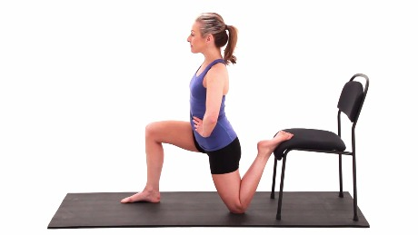
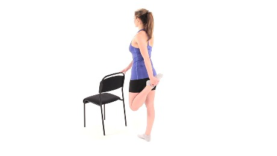
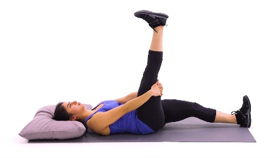
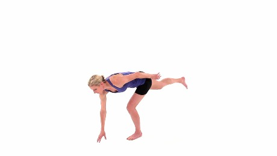
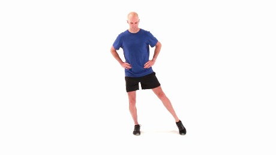

+++
title = "Exercises For Knee Pain"
date = 2023-08-08
updated = 2023-08-18

+++

I started going to the gym a lot more Dec 2022 to lower my A1c, and in April, I got some persistent knee pain, especially when doing squats and lunges. I got a lot of advice, and, as of Aug 2023, a couple things have helped:

- learning how to squat correctly
- doing stretches to improve my overall lower body flexibility, reducing stress on the knee when exercising.

# Stretches from Daniel

Mini band side lateral walk,2 to 15 steps, knees follow tes, feet straight, small squat, glut medial

Glute bridge with Band, like a regular bridge with Band, glute maximus, with abduction (spread apart knees, close)

Side line leg raise with band

Clamshell

- Foot ball thing,
  - Straight leg, flex toes,
  - Go across foot
  - Roll down

Foam roll before and after

Dynamic stretch before, static stretch after

Practice 2 or 3 stretches/foam rolls each day

# Stretches From Karen, the web, and Christian

Some of these are from [12 Stretches to Improve Flexibility](https://www.webmd.com/fitness-exercise/ss/slideshow-stretches-to-get-loose).

I'm trying to hold them from 20-30s

- Toe touches
- Downward dog with foot shuffle
- Calf stretch
- Standing quad stretch
- Butterfly stretch
- Sideways lunge
- Frog pose
- table-top diagonal stretch into the hip Christian showed me

# Christian's Pre-workout Warmup

- 30 second jump rope
- 10 Shoulder rotations w/ rope
- 10 Overhead squats w/ rope
- 10 Hip hinges 
- 3 Roll Outs to Plank (a push up is optional)
- 3 Lunges while pushing your knee away and looking the opposite direction
- 10 Lateral lunges 

# Medbridge Stretches

Half Kneeling Hip Flexor Stretch with Chair 

Quadricep Stretch with Chair 

Hook Active Hamstring Stretch 

Single Leg Balance with Alternating Floor REaches 

Single Leg Balance with Clock Reach 

