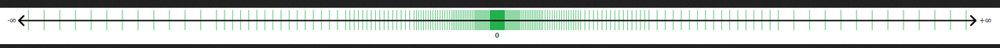

+++
title = "Floating Point Notes"
date = 2023-08-18

+++

Back on January 26, 2023, I presented [What Every Computer Scientist Should Know About Floating-Point Arithmetic](https://docs.oracle.com/cd/E19957-01/806-3568/ncg_goldberg.html) to a small book club I attend. Printing out that appendix turns it into like a 30 page paper. I had trouble understanding it at a deep level but I grabbed some highlights and I'll post them here so I can find them later :) I'm not putting a lot of work into editing these notes, ain't nobody got time for that!!

## Example program in appendix

https://go.dev/play/p/9X_uYpmtxgM

# Outline

## Rounding Error

Floating point representations are not necessarily unique - IEEE standard helps this

### Normalization

> Floating-point representations are not necessarily unique. For example, both 0.01 × 101 and 1.00 × 10-1 represent 0.1. If the leading digit is nonzero (*d*0  0 in equation [(1)](https://docs.oracle.com/cd/E19957-01/806-3568/ncg_goldberg.html#687) above), then the representation is said to be *normalized*. The floating-point number 1.00 × 10-1 is normalized, while 0.01 × 101 is not. When  = 2, *p* = 3, *e*min = -1 and *e*max = 2 there are 16 normalized floating-point numbers, as shown in [FIGURE D-1](https://docs.oracle.com/cd/E19957-01/806-3568/ncg_goldberg.html#1374). The bold hash marks correspond to numbers whose significand is 1.00.  Requiring that a floating-point representation be normalized makes the  representation unique. Unfortunately, this restriction makes it  impossible to represent zero! A natural way to represent 0 is with 1.0 ×  , since this preserves the fact that the numerical ordering  of nonnegative real numbers corresponds to the lexicographic ordering of their floating-point representations.[3](https://docs.oracle.com/cd/E19957-01/806-3568/ncg_goldberg.html#685) When the exponent is stored in a *k* bit field, that means that only 2*k* - 1 values are available for use as exponents, since one must be reserved to represent 0.

### Representation

- [Float Exposed](https://float.exposed/b0x3f27)
- [Floating Point Visually Explained](https://fabiensanglard.net/floating_point_visually_explained/)

### Measuring errror:

- ulps - units in last place - number of digits that aren't part of the real number
- relative error:  real number - float / real number

Use relative error when analyzing error intruduced by calculations

Guard digits help reduce error. Without a guard digit, the relative error committed when subtracting two nearby quantities can be very large - sometimes all the result digits can be incorrect!! 

This is called *catastrophic cancellation* . When subtracting exactly known quantities, there is less rounding error -called *benign cancellation*. Guard digits can help

A formula that exhibits catastrophic cancellation can sometimes be rearranged to eliminate the problem.

### Exactly Rounded Operations - how to round?

guard digits do not help accuracy as much as computing exactly and then rounding to the nearest floating point number.

How to round halfway cases like 12 and 1/2 ?

- Round up -> 12.5 rounds to 13 (DEC VAX works this way)
  - Allows computations to gradually drift upwards
- Round down -> 12.5 rounds to 12
- Round to even -> require least significant digit be even -> 12.5 rounds to 12 because 2 is even. This lets us round half of our calculations down and half up, which tends to stop computation drift.

Setting rounding mode  - [c++ - Change floating point rounding mode - Stack Overflow](https://stackoverflow.com/questions/6867693/change-floating-point-rounding-mode)

### Historical Problems with Floats

[Examples of floating point problems](https://jvns.ca/blog/2023/01/13/examples-of-floating-point-problems/)

## IEEE Floating Point Standard

two IEEE standards

- IEEE 754 - base = 2, mantissa = 24 or 53
- IEEE 854 - base = 2 or 10, no specific way to encode into bytes

A base of two is good because it introduces less error and is more precise

IEEE 754 single precision:

- 32 bits
  - 1 sign bit
  - 8 bits for the exponent
  - 23 bits for significand (using hiden bit to represent 24 bits)

### Representation

- [Float Exposed](https://float.exposed/b0x3f27)
- [Floating Point Visually Explained](https://fabiensanglard.net/floating_point_visually_explained/)

### Operations

Specifying bit exact operations improves portability of software - NOTE: see appendix

Functions specified by IEEE 754:

- +
- -
- x
- /
- sqrt
- remainder
- conversion between int and float must be correctly rounded

Not specified

- transcendental functions - because of table maker's dilemma - can be rounded and computed in different ways with equally good but different results

### Special Quantities

| Exponent                                                     | Fraction                                                     | Represents                                                   |
| ------------------------------------------------------------ | ------------------------------------------------------------ | ------------------------------------------------------------ |
| *e* = *e*min - 1                                             | *f* =  0                                                     | ±0                                                           |
| *e* = *e*min - 1                                             | *f*  0 |  |
| *e*min    *e*  *e*max | --                                                           | 1.*f* × 2*e*                                                 |
| *e* = *e*max + 1                                             | *f* =  0                                                     | ± |
| *e* = *e*max + 1                                             | *f*  0 | ` `NaN                                                       |

There's an interesting table here too.

| Operation                                                    | `NaN` Produced By                                            |
| ------------------------------------------------------------ | ------------------------------------------------------------ |
| *+*                                                          |  + (- ) |
| ×                                                            | 0 ×  |
| /                                                            | 0/0, / |
| `REM `                                                       | *x* `REM` 0,  `REM` *y* |
|  |  (when *x <* 0) |

- NaN
  - Nan != NaN
    - sqrt(-4) == NaN
    - 0/0 == NaN
    - multiple representations!! System-dependent info in the significand
  - `+- inf`
    - nonzero num / 0 == +-inf
    - rule for determining f(inf, ...) . Replace inf with x and take the limit as x approaches inf.
    - Formulas should be inspected for behaviour at inf - like x/(x**2 + 1)
  - `+- 0`
    - sign bit, emin-1 exponent, zero significand
    - +0 == -0 
    - +0 * +3 = +0
    - +0 / -3 = -0

### Denormalized Numbers

Motivation:

when represented as "normal" floats, 6.87 * 10**-97 - 6.81 * 10-97 == 0 !!

This breaks the property that iff x == y implies x - y == 0

To preserve this property IEEE uses *denormalized numbers*. The most controversial part of the standard. Not supported by a lot of hardware at the time this paper was written.

idea: when exponent is emin, the significand does not have to be normalized. 

Honestly I don't understand much of this but I'm glad it seems to work.

### Exceptions , Flags, Trap Handlers

Exception Types

- overflow
- underflow
- division by zero
- invalid operation - produces or returns a NaN
- inexact - when rounding is involved

| Exception      | Result when traps disabled                                   | Argument to trap handler                                     |
| -------------- | ------------------------------------------------------------ | ------------------------------------------------------------ |
| overflow       | ± or ±*x*max | round(*x*2-) |
| underflow      | 0,  or denormal | round(*x*2) |
| divide by zero | ± | operands                                                     |
| invalid        | NaN                                                          | operands                                                     |
| inexact        | round(*x*)                                                   | round(*x*)                                                   |

When an exception happens:

- set flag
- call trap handler function

System dependendent - https://stackoverflow.com/q/33959697/2958070

check flags

Checking floating point errors: [FP Exceptions (The GNU C Library)](https://www.gnu.org/software/libc/manual/html_node/FP-Exceptions.html)

[_status87, _statusfp, _statusfp2 | Microsoft Learn](https://learn.microsoft.com/en-us/cpp/c-runtime-library/reference/status87-statusfp-statusfp2?view=msvc-170)

### More rounding?

> In the IEEE standard, rounding occurs whenever an operation has a result that is not exact,  since (with the exception of binary decimal conversion) each operation  is computed exactly and then rounded. By default, rounding means round  toward nearest. The standard requires that three other rounding modes be provided, namely round toward 0, round toward +, and round toward -. When used with the convert to integer operation, round toward - causes the convert to become the floor function, while round toward + is ceiling. The rounding mode affects overflow, because when round toward 0 or round toward - is in effect, an overflow of positive magnitude causes the default result to be the largest representable number, not +. Similarly, overflows of negative magnitude will produce the largest negative number when round toward + or round toward 0 is in effect. 

## Systems Aspects

Out of time....

TODO: Python 2.7 issue about floating point numbers, Arian 5 rocket failure

https://www.truenorthfloatingpoint.com/problem

Update: 2023-08-18 - I'm just going to copy my highlights from the rest of the appendix here..

>  Thus, hardware to compute a double precision product from single precision operands will normally be only a little more expensive than a single precision multiplier, and much cheaper than a double precision multiplier. Despite this, modern instruction sets tend to provide only instructions that produce a result of the same precision as the operands.[23](https://docs.oracle.com/cd/E19957-01/806-3568/ncg_goldberg.html#12039)

> Remarkably enough, some languages don't clearly specify that if `x` is a floating-point variable (with say a value of `3.0/10.0`), then every occurrence of (say) `10.0*x` must have the same value.

> A language definition that does not require parentheses to be honored is useless for floating-point calculations.

> For example, most computer languages specify at most two floating-point types, while the IEEE standard has four different precisions (although the recommended configurations are single plus single-extended or single, double, and double-extended).

> However, there is a much more efficient method which dramatically improves the accuracy of sums, namely - Theorem 8 (Kahan Summation Formula)
>

> The IEEE standard strongly recommends that users be able to specify a trap handler for each of the five classes of exceptions, and the section [Trap Handlers](https://docs.oracle.com/cd/E19957-01/806-3568/ncg_goldberg.html#979), gave some applications of user defined trap handlers.

> Unfortunately, the IEEE standard does not guarantee that the same program will deliver identical results on all conforming systems. Most programs will actually produce different results on different systems for a variety of reasons. For one, most programs involve the conversion of numbers between decimal and binary formats, and the IEEE standard does not completely specify the accuracy with which such conversions must be performed. For another, many programs use elementary functions supplied by a system library, and the standard doesn't specify these functions at all. Of course, most programmers know that these features lie beyond the scope of the IEEE standard.

---

And... that's it. I can finally get this paper off my desk!
