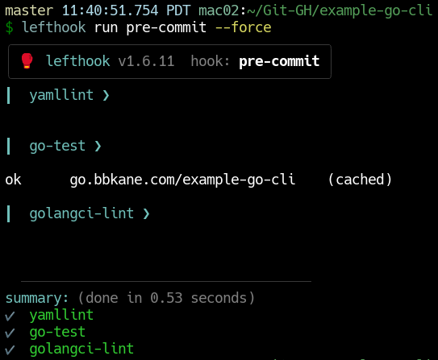
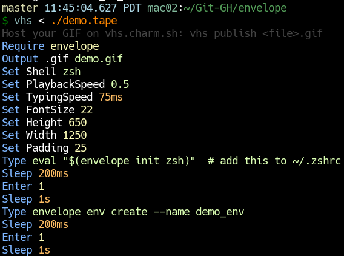

+++
title = "Go Project Notes"
date = 2023-12-27
aliases = [ "blog/go-notes/"]
+++

These are things I want to remember in Go. Also see [Go Developer Tooling](@/blog/Go-Developer-Tooling/index.md). and [Go Code Notes](@/blog/Go-Code-Notes/index.md).

 # Motivation

Simon Willison has a lot of projects - more than 100 of them I think. To manage them, he uses some custom tooling, custom libraries, and  a maintenance strategy he calls "[the perfect commit](https://simonwillison.net/2022/Jan/12/how-i-build-a-feature/)"  - each commit contains code changes, docs, and tests.

I don't have Simon's number of side projects, but I DO have a wife and toddler and I'm not as smart as him anyway. I've started adopting similar techniques (though using Go, not Python) to keep my side projects maintainable and fun during my limited time and energy to hack on them.

In particular, I want the following qualities from my Go projects:

- A pleasure to use
  - good docs/READMEs
  - easy installation /uninstallation.
  - Minimal runtime dependencies
  - Does something I actually care about
- Easy to work on
  - Confident refactoring (especially automatic dependency upgrades). Mostly accomplished with automatic tests
  - Similar code / config between projects. Accomplished with linters/formatters and scripted/manual changes
  - Quick iteration times!
  - Good tooling (see below)

See [Checklists and Sayings](@/blog/Checklists-And-Sayings/index.md) for more exposition on codebases in general.

# Creating a new Go project

Before starting, ask these questions:

- Will I use this or will I learn a lot from it?
- Is Go the right language? For small stuff Python works great!

Steps to take for new projects. I could use [cookiecutter](https://github.com/cookiecutter/cookiecutter) or similar tools to make this faster, but I find maintaining cookiecutter code difficult, so (at least for now) I prefer to manully copy example-go-cli and update the right thing by hand.

- Copy [example-go-cli](https://github.com/bbkane/example-go-cli)
- Erase the git history
- Commit
- Replace all references to it with the new name
- Update README
- Create repo on GitHub and push the code.
- Add the `go` topic to the repo
- Update [go.bbkane.com](https://github.com/bbkane/go.bbkane.com)
- Update CHANGELOG.md
- Add feature
- update demo.tape and update demo.gif with [vhs](https://github.com/charmbracelet/vhs) (`vhs < ./demo.tape`)
- Update [bbkane/bbkane](https://github.com/bbkane/bbkane).

If a the project is a CLI, not a library:

- `go install go.bbkane.com/cli@latest` to test
- Add `KEY_GITHUB_GORELEASER_TO_HOMEBREW_TAP` to GitHub repo secrets
- Push a tag to build with `git tagit`
- `brew install bbkane/tap/cli`

If the project is a library, not a CLI:

- Delete the `.goreleasor.yml` file

# Multi-repo changes

I occasionally need to update something across all the [Go projects](https://github.com/search?q=owner%3Abbkane+topic%3Ago&type=repositories) I maintain. I track most of these in my [Go Project Update Tracker Spreadsheet](https://docs.google.com/spreadsheets/d/1R0c6VFFU_vLC45zgs_53rcWDHWRxt4S6UxdxBkFgPpo/edit#gid=0), because the grid format makes it easy to see which changes are applied to which projects.

## Dependency updates

Once a project has enough tests for my satisfaction, let [Dependabot](https://docs.github.com/en/code-security/dependabot) make PRs with dependency updates.

## Scripted changes

Some changes can be scripted - especially for config files. I try to keep similar `.gitignore`, `.golangci.yml`, `.goreleaser.yml` files in my projects (among others), and I can (fairly) easily script changes to those with two amazing tools:

-  [`git-xargs`](https://github.com/gruntwork-io/git-xargs) lets you run a shell script against multiple repos and opens GitHub PRs with the results of the shell script
- [`yq`](https://github.com/mikefarah/yq) lets you make targeted changes to YAML files. Something like, "change the property at this path to this"

For example,  I recently used added YAML formatting and linting to all the YAML files I'm using in each repo (sorted keys, comment formatting, etc.). Note that for this to work well, I also need to keep my config files similarly formatted for easy diffs.

Another big win is I can keep the  change scripts around for inspiration later! I keep all my changes in my [git-xargs-tasks](https://github.com/bbkane/git-xargs-tasks) and I refer back to previous changes for examples/inspiration when writing new changes.

## Manual changes

Some changes are impossible or aren't worth the effort to script. For example: a backwards incompatible library change that requires callers to update. The process I'm trying to stick to for these changes is:

- update [Go Project Update Tracker Spreadsheet](https://docs.google.com/spreadsheets/d/1R0c6VFFU_vLC45zgs_53rcWDHWRxt4S6UxdxBkFgPpo/edit#gid=0)
- update [example-go-cli](https://github.com/bbkane/example-go-cli) with the change and test. Update the CHANGELOG.md
- write a detailed issue that describes how to do the change
- add that issue to all repos (perhaps with a label)
- make the change to different projects as I get time/motivation and close the issue. Maybe before I add a feature to a project I close the change issue or before I start another manual change.

# Quality / Release tooling

I use several tools to keep my code working and maintainable. Requirements for this tooling are:

- Must have:
  - Easy installation / usage:
    - from editor
    - from CLI and pre-commit (via [lefthook](https://github.com/evilmartians/lefthook)). A single binary is preferred
    - on [GitHub Action files](https://github.com/bbkane/example-go-cli/tree/master/.github/workflows)

- Should have:
  - Automatic fixes for any problems found
  - Quick runtime

## [golangci-lint](https://golangci-lint.run/)

Run various correctness checks on source code. I love it because it's a binary distribution of a lot of other lints


MacOS [Install](https://golangci-lint.run/usage/install/#macos):

```bash
brew install golangci-lint
```

Run [locally](https://golangci-lint.run/usage/quick-start/):

```bash
golangci-lint run
```

Automatic fix:

```bash
golangci-lint run --fix
```

VS Code integration is with a [plugin](https://golangci-lint.run/usage/integrations/#go-for-visual-studio-code) .

Note that with the `lintTool` set to `golangci-lint`, the `Go` VS Code extension will `go install` golangci-lint, despite the fact that this is [explicitly recommended against](https://golangci-lint.run/usage/install/#install-from-source). ¯\_(ツ)_/¯

## go test

Not much to say here, `go test` comes with the compiler, is easy to run, and integrates with VS Code.


## [GoReleaser](https://goreleaser.com/)

Build platform-specific executables and auto-update Homebrew taps and Scoop buckets. This is probably the tool that locks me most into Go. It's incredibly smooth to use.


MacOS Install:

```bash
brew install goreleaser
```

Run locally:

```bash
goreleaser release --snapshot --fail-fast --clean
```

## [Lefthook](https://github.com/evilmartians/lefthook)

Install/Run/Uninstall pre-commit hooks that mimic CI.



MacOS Install

```bash
brew install lefthook
```

Run locally:

- install pre-commit hook: `lefthook install`
- uninstall pre-commit hook: `lefthook uninstall`
- Run pre-commit without committing: `lefthook run pre-commit --force`

No VS Code integration.

## [VHS](https://github.com/charmbracelet/vhs)

Script demo GIF creation!



MacOS Install:

```bash
brew install vhs
```

Run locally:

```bash
vhs < demo.tape
```

## [yamllint](https://github.com/adrienverge/yamllint)

Most of my configs are YAML, and many of them are very similar from repo to repo, so I find it super useful to ensure they're all formatted similarly.


MacOS Install:

```bash
brew install yamllint
```

Run locally:

```bash
yamllint .
```

Automatic fix (mostly for formatting issues):

```bash
yq -i -P 'sort_keys(..)' <file>.yaml
```

No VS Code integration that I'm aware of.