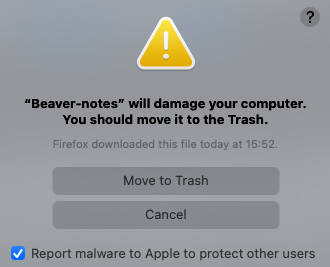

+++
title = "How I Take Notes"
date = 2022-02-11
+++

## Background

This section is a little wordy... feel free to skip to
[Requirements](#requirements) for the meat of this post.

As an SRE, I work with a number of protocols, systems, and languages, but also
get interrupted quite frequently to fix things, answer questions, fulfull
requests, etc. This is fine, in fact generally I really enjoy helping people,
but it does make me lose context frequently. In addition, I don't have the
greatest memory. Sometimes even when I am concentrating on one thing, some
odd idea  will pop into my head that I MUST consider more. For example, the
other day I was working on something and suddenly started to wonder if I could
store my browser's bookmarks (of which I have a few thousand) into LDAP and
query them easily...

Anyway, when I started my current job and moved to California in 2018, I
figured I better get some good notes so I didn't have to ask people things
twice. Since then, I've grown to rely heavily on these notes, and I've gotten
some benefits I didn't expect as well. During an oncall incident, I find I'm
able to keep "the big picture" in my head more easily by writing my findings in
my notes - I can record my current questions as I look at the evidence, forget
about them and come back to them later if my most promising suspicion doesn't
yeild results. During normal work, when I get a random wacky idea I don't have
time to play with, I write it down and (most of the time) my brain lets me
return to the task at hand. I also make my notes available to my colleagues for
their searching too, which has helped a few of them out over the years.

For these notes to be as effective as they are for me, I have the following needs:

## Requirements

- I need to own my personal notes and LinkedIn needs to own my work notes. No
  "just keep your data in our cloud" services.
- export to plain text - especially needed for migration from one app to another
- easy sync between my Mac and my Android
- easy editing on my Mac and Android phone
- searchable
- quick startup time, especially on Mac
- paste to save image support.
- image export
- inline image support in the editor

In particular, inline image support within editors that also support plain text
export is hard to find, but super helpful for several of my use cases. Fairly
often, I need to save screenshots of different graphs and infer what to do or
ask next from how they look. Inline images can also be nice for embedding
diagrams or app screenshots. So many markdown apps don't support this, with
some using a preview pane instead. A preview pane takes too much space when I
need the majority of my monitors' real estate to frantically click through code
bases, portals, graphs, wikis, Google searches, emails, and instant messages.

## Nice-to-haves

- simple
- browsable (i.e., find stuff easily on a rainy day)
- open source writing apps
- usable with Vim for quick edits
- easy to learn markup language
- viewable online
- (Feb 2024) - it'd be super nice to to be able to collapse headers or code blocks

## My system

The system I've landed on is:

- Format: plain markdown files in a folder. I'm used to writing markdown for GitHub READMEs and my blog anyway and it's easy to read and write in a simple text editor.
- Sync: Git and GitHub to sync between Mac and Android. GitHub also provides a web interface to read my notes.
- Editor: Vim or [Typora](https://typora.io/) on Mac. Pasting an image into Typora automatically saves the image as a file, types an image markdown link, and shows the inline image below the link.
- Android: [GitJournal](https://gitjournal.io/) on my phone. I really love this app because it slots so nicely with the rest of my system, works quite well, allows note searching, is [open source](https://gitjournal.io/), and has a very nice maintainer.
- Mac Search: [ripgrep](https://github.com/BurntSushi/ripgrep) to search my notes on my Mac. It auto-colors results and is super fast.

I use the following Bash function to add some options to ripgrep:

```bash
# recursively search markdown files
rgmd() { rg --type md --ignore-case "$@" }
```

As for note organization, I have a gigantic `notes.md` file for notes that don't belong to any category. When something grows enough, I add it to `<category>.md`. I don't generally think to hard about this because it's so easy to search or change later if I don't like how it looks.

I've used this system for the past couple of years at this point, trying new alternatives occasionally (I found Typora less than a year ago). The only feature I wish I had was better browsing capability, maybe with tags or something.

## Things to try

- It might be fun to convert my notes into a static site similar to this blog. [Zola](https://www.getzola.org/) offers [search](https://www.getzola.org/documentation/content/search/), which might be fun to play with.

## Things I have tried

I took a few hours and tried a buncha note apps I found online (Dec 2023). Here are my notes on that... I was crunching through these so these are VERY fast, incomplete, and qute possibly incorrect notes.

I want something that can collapse headers since Typora can't

Sources:

- [Selfhosted obsidian alternative : selfhosted](https://www.reddit.com/r/selfhosted/comments/12zm2ba/selfhosted_obsidian_alternative/).
- [Open Source Obsidian Alternatives: 25+ Note-taking Tools | AlternativeTo](https://alternativeto.net/software/obsidian/?license=opensource)

### NO - [Beaver Notes](https://alternativeto.net/software/beaver-notes/about/)

not in Homebrew and I get this message:



So... I'm scared of this app

### NO - [cherrytree](https://alternativeto.net/software/cherrytree/about/)

uses db and It hink it's building it... have to run it from the CLI, can't open my markdown folder I don't think. Default font size really small. It Does open images inline

### NO - Foam

Foam doesnt' allow me to paste images in WYSIWYG

### NO - Logseq

I didnt' really like Logseq because it feels a bit sluggish and was based on blocks, not paragraphs of text. - also not sure how to collapse stuff - I should give it a try and use it like it wants to be used

### MAYBE - [MarkText](https://github.com/marktext/marktext)

looks really good and I intend to play more with it when I have times. Looks like it doesn't support folding but is otherwise similar to Typora **AND OPEN SOURCE**

### NO - Obsidian

I really like Obsidian (in the few min I've tried it) but I'm wary of the annual license fee and not sure you can control how you paste images, though that's not a dealbreaker. I REALLY LIKE the editor and can deal with the images. Would also work with Readwise

### NO - [Outline](https://github.com/outline/outline)

Looks neat but they want me to log in with and don't let me make an email or anything so I don't want to do that.

### NO - [QOwnNotes](https://github.com/pbek/QOwnNotes)

 I don't think this showes images inline - it doesn't - [Show inline image preview in editor · Issue #1254 · pbek/QOwnNotes](https://github.com/pbek/QOwnNotes/issues/1254)

### NO - Roam

Roam costs money to even try

### NO - Silverbullet

Let's try Silverbullet - not sure what's going on with images, but can't  fold text, so not really better than Typora other than being open source

### NO - [SiYuan](https://github.com/siyuan-note/siyuan)

also works with blocks and I can't seem to figure out how to open my folder? 

### NO - [standardnotes](https://github.com/standardnotes/app)

Can't paste images, at least in the web demo

### NO - Trilium

Let's try open source Trilium - can't colllapse stuff and sems complicated, but I don't hate it - it also stores stuff in a sqlite DB, so there's some lockin I don't like

### NO - [VNote](https://github.com/vnotex/vnote)

works, but doesn't seem better than Typora - can't collapse headers.it also adds a whole buncha `vs.json` files and a `conf` dir and other stuff.. that's just too much man. It also opens really slowly

### MAYBE - Zettlr

Zettlr - I think I tried this... ooh it let's me paste images in and collapse stuff... trying to open bkane_notes... ok, it took forever and I can't really filter notes either. I think mabye becasue it's turnnign headers into outline items - I turned that off , but it does seem slow on large bodies of text - [Zettlr crashing upon opening new Workspace for the first time · Issue #4646 · Zettlr/Zettlr](https://github.com/Zettlr/Zettlr/issues/4646). The sidebar at the right is nice. So it's really slow but might work

