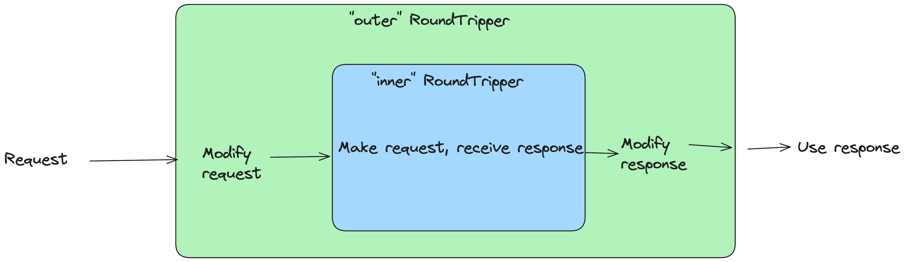

+++
title = "Layering HTTP Transports in Go"
date = 2026-05-12
+++

Fairly recently, I worked on a project that makes a fair of different HTTP requests to different endpoints. This blog post covers techniques to make these HTTP requests easier and testable, in particular:

- Using the [earthboundkid/requests](https://github.com/earthboundkid/requests) library to make constructing the requests and getting the responses as easy as possible
- HTTP RoundTrippers to add base configuration, testing, and other customization for HTTP requests.
- Retries with exponential backoff using [cenkalti/backoff](https://github.com/cenkalti/backoff)

# Ergonomic requests with [earthboundkid/requests](https://github.com/earthboundkid/requests)

Standard Go wisdom is to NOT use a 3rd party library when Go's stdlib contains the needed functionality. Generally I agree with this, but I make an exception for `requests` because it's SO MUCH MORE ERGONOMIC than the stdlib and the core functionality of this app was to make HTTP requests. See [the README](https://github.com/earthboundkid/requests) and [wiki](https://github.com/earthboundkid/requests/wiki) for more details, but here's an example:

```go
req := requests.
  URL(baseURL).
  Path("/somePath").
  BodyJSON(&payload).
  Method(http.MethodPost).
  ContentType("application/json").
  Accept("application/json").
  Header("Connection", "keep-alive").
  Param("start", start).
  Param("end", end).
  ToJSON(&response).
  Client(&c.client).
  AddValidator(retry.WrapRetriableStatuses)
```

This is.. a lot harder to write, read, and keep error free with `net/http`'s interface.

# [`http.RoundTripper`](https://pkg.go.dev/net/http#RoundTripper) Refresher

the `http.RoundTripper` interface is the primary way Go allows devs to modify HTTP requests:

```go
type RoundTripper interface {
  // snip: doc comments (see the link above)
	RoundTrip(*Request) (*Response, error)
}
```

The default `http.Client` implements `RoundTripper`, and by default code just uses that. However, you can **nest** these to modify requests before they're sent and responses after they arrive.



These things can be nested without limit as long as each `RoundTripper`'s implementation allows an innter `RoundTripper` to delegate to. 

For example, the [`golang.org/x/oauth2`](https://pkg.go.dev/golang.org/x/oauth2) package [provides](https://pkg.go.dev/golang.org/x/oauth2#Transport) a `RoundTripper` that can be used on top of another `RoundTripper` (the default `http.Client` is a good option) to allow oath authentication.

Also, a note on terminology:  `http.RoundTripper` is an **interface** defining how a request is executed, while `http.Transport` is a concrete **struct** that implements that interface with low-level network capabilities. I find it a bit confusing because the `http.Client` struct has a field called `Transport` that has type `http.RoundTripper` (why didn't they call that field `RoundTripper`?). In any case I'll use the terms `RoundTripper` and `Transport` interchangeably.

# Common settings in a "base" `RoundTripper`


# Retrying requests with [cenkalti/backoff](https://github.com/cenkalti/backoff)

# Tying it all together

