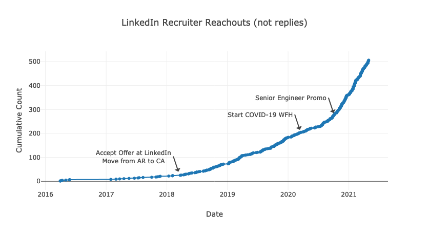
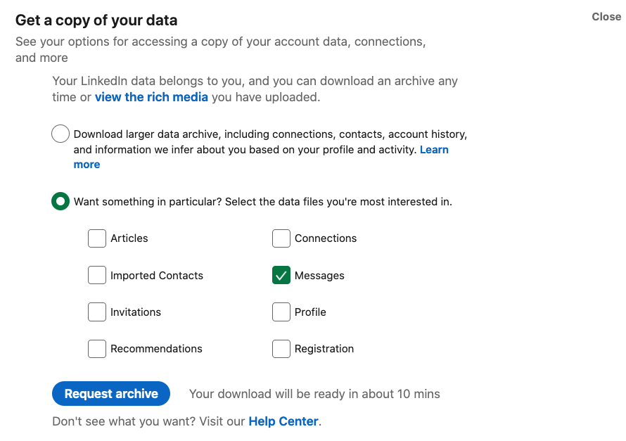

+++
title = "LinkedIn Recruiters Over Time"
date = 2021-05-30
+++

I try to reply to every message I get on LinkedIn, and, every week, it seems like more messages appear. Recently, I downloaded all messages every sent from my [Member Data Page](https://www.linkedin.com/psettings/member-data) and used SQLite to poke around the data. I ended up building the following chart of the reachouts (ignoring replies) over time and annotating significant career events



## Build your own chart

I'm sure many people can create far more interesting charts than mine. Here's how to chart your own LinkedIn messages over time.

- Make sure you have [Python3](https://www.python.org) and [SQLite3](https://www.sqlite.org/index.html) installed to create the chart. They'll need to be accessible from your terminal. On MacOS, I installed recent versions from [Homebrew](https://brew.sh) with `brew install python3 sqlite`. You'll also need a browser to view the chart.
- Download your messages from your [Member Data Page](https://www.linkedin.com/psettings/member-data), this [SQL Script](./aggregate_reachouts.sql) to aggregate the data, and this [Python Script](https://github.com/bbkane/dotfiles/blob/master/bin_common/bin_common/chart.py) to create the chart. Put all of these (`messages.csv`, `aggregate_reachouts.sql`, and `chart.py`) into the same directory.



- Aggregate the data on the terminal: `sqlite3 messages.db '.read aggregate_reachouts.sql'`. This will create a SQLite3 database (`messages.db`) to explore later and a TSV file (`aggregated_reachouts.tsv`) we'll turn into a chart.
- Plot your reachouts over time! The following command works great on MacOS, but on Windows you'll probably need to scrunch all the lines together into one line and remove the `\` characters.

```python
python3 ./chart.py \
    --firstline \
    --title "LinkedIn Recruiter Reachouts (not replies)" \
    --output aggregated_reachouts.html \
    --xaxis_title Date \
    --yaxis_title "Cumulative Count" \
    ./aggregated_reachouts.tsv \
    timechart
```

- Open aggregated_reachouts.html in your browser. On the first load, the browser needs to download the marvelous [Plotly.js](TODO) library so loading will take a few seconds. If you decide to post your reachout chart on LinkedIn, please send me [a message](https://www.linkedin.com/in/benjamin-kane/) or tag me (@Benjamin Kane) so I can check out your graph too.

## Add custom annotations

If you recall dates you'd like to annotate on your chart, you'll need to take a few more steps:

- First, change the chart command to output JSON instead of HTML:

```python
python3 ./chart.py \
    --firstline \
    --title "LinkedIn Recruiter Reachouts (not replies)" \
    --output aggregated_reachouts.json \
    --xaxis_title Date \
    --yaxis_title "Cumulative Count" \
    ./aggregated_reachouts.tsv \
    timechart
```

- Open that JSON file in a text editor and add your custom annotations under the `"layout"` key. Use the [Plotly JavaScript docs](https://plotly.com/javascript/reference/layout/annotations/) for reference. For example, my JSON looks like the following:

```json
{
  "data": [ "TODO" ],
  "layout": {
    "annotations": [
      {
        "text": "Accept Offer at LinkedIn<br>Move from AR to CA",
        "showarrow": true,
        "x": "2018-03-12",
        "y": 40,
        "xanchor": "right"
      },
      {
        "text": "Start COVID-19 WFH",
        "showarrow": true,
        "x": "2020-03-12",
        "y": 215,
        "xanchor": "right"
      },
      {
        "text": "Senior Engineer Promo",
        "showarrow": true,
        "x": "2020-10-01",
        "y": 285,
        "xanchor": "right"
      }
    ],
    "title": "LinkedIn Recruiter Reachouts (not replies)",
    "xaxis": {
      "title": "Date"
    },
    "yaxis": {
      "title": "Cumulative Count"
    }
  }
}
```

- Finally, turn the JSON into HTML with [this script](https://github.com/bbkane/dotfiles/blob/master/bin_common/bin_common/plotly_json_to_html.py) and re-open the browser:

```bash
plotly_json_to_html.py -o aggregated_reachouts_annotated.html aggregated_reachouts.json
```

## Other things I want to know

Of course, now that all messages are in a database, it's possible to run other SQL queries to find other information. For interactively working with SQL, the `sqlite3` shell is a little bare-boned. I prefer [litecli](https://litecli.com/)(here's the [config](https://github.com/bbkane/dotfiles/blob/master/litecli/.config/litecli/config) I use for it) or [Beekeeper Studio](https://www.beekeeperstudio.io/). They both offer autocomplete and nice colors

### How many messages are there?

```sql
SELECT COUNT(*) FROM messages;
```

I've received and replied 2236 messages! This is also a good check to ensure I read from the spreadsheet correctly- it also has 2236 rows.

### Who sends the most messages?

```sql
SELECT
  [FROM],
  COUNT(*)
FROM
  messages
GROUP BY
  [FROM]
ORDER BY
  COUNT(*) DESC;
```

I send the most messages (976), followed by "LinkedIn Member" (129), an empty name (74), then some friends and colleagues. The most talkative recruiter I don't know outside of LinkedIn sent 9 messages.

### What's the timespan of all these messages?

```sql
SELECT
  MIN(sqlite_date),
  MAX(sqlite_date)
FROM
  messages;
```

The first message was sent in March 2016, and the last one was sent yesterday (April 2021). This is also visible from the chart of course.

### Get some stats by recruiter name

```sql
SELECT
  [FROM] as recruiter,
  MIN(sqlite_date) AS first_message_date,
  SUM(COUNT([FROM])) OVER (PARTITION BY [FROM]) AS total_messages,
  ROW_NUMBER() OVER (
    ORDER BY
      sqlite_date
  ) AS running_count
FROM
  messages
GROUP BY
  [FROM]
ORDER BY
  sqlite_date ASC;
```

I had to learn more about analytic functions for this query - the following links helped:

- [SQL: How To Select Earliest Row](https://stackoverflow.com/a/5736854/2958070)
- [How to use ROW_NUMBER in sqlite](https://stackoverflow.com/a/51863033/2958070)
- [Analytic function concepts in Standard SQL](https://cloud.google.com/bigquery/docs/reference/standard-sql/analytic-function-concepts)

## Other ways to process CSV files

Of course, SQLite3 is but one of many ways to query CSV files. I chose it because I wanted to practice/learn more SQL and I didn't want to deal with installing Pandas/Jupyter Notebook. Other ways include [Pandas](https://pandas.pydata.org/), pure Python code, and Excel/Google Sheets.
