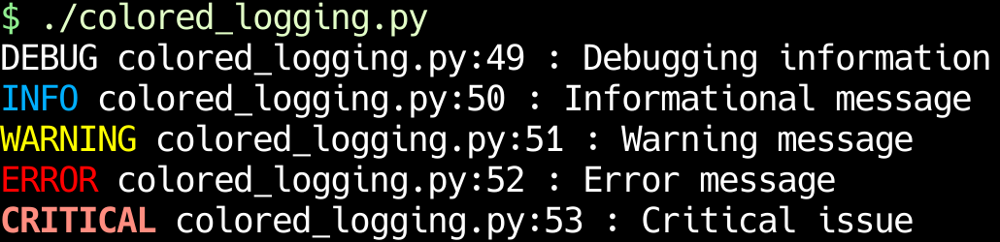

+++
title = "Logging in Python"
date = 2018-09-05
updated = 2025-06-24
aliases = [ "2018/09/05/Logging-in-Python.html" ]
+++

## Setup: Colors + Minimal metadata

This is useful for quick scripts where you want pretty logs, but probably not module information or timestamps...



```python
#!/usr/bin/env python3
# -*- coding: utf-8 -*-

import logging
import sys

logger = logging.getLogger(__name__)


class Color:
    reset = '\x1b[0m'
    grey = '\x1b[38;21m'
    blue = '\x1b[38;5;39m'
    yellow = '\x1b[38;5;226m'
    red = '\x1b[38;5;196m'
    bold_red = '\x1b[31;1m'


# logic from https://stackoverflow.com/a/75339761
class ColorLevelFormatter(logging.Formatter):

    _color_levelname = {
        'DEBUG': f"{Color.grey}DEBUG{Color.reset}",
        'INFO': f"{Color.blue}INFO{Color.reset}",
        'WARNING': f"{Color.yellow}WARNING{Color.reset}",
        'ERROR': f"{Color.red}ERROR{Color.reset}",
        'CRITICAL': f"{Color.bold_red}CRITICAL{Color.reset}",
    }

    def __init__(
            self,
            fmt: str = "%(levelname)s %(filename)s:%(lineno)s : %(message)s",
            *args,
            **kwargs,
    ):
        super().__init__(fmt, *args, **kwargs)

    def format(self, record):
        record.levelname = self._color_levelname[record.levelname]
        return super().format(record)


root_logger = logging.getLogger()
root_logger.setLevel(logging.DEBUG)
stdout_handler = logging.StreamHandler(sys.stdout)
stdout_handler.setFormatter(ColorLevelFormatter())
root_logger.addHandler(stdout_handler)

logger.debug("Debugging information")
logger.info("Informational message")
logger.warning("Warning message")
logger.error("Error message")
logger.critical("Critical issue")
```

## Setup: Log to file + stderr

This is the code driving the program - `main.py` for me usually.

This sets the format for all loggers and turns on debug output for just the
loggers we care about.

```python
#!/usr/bin/env python
# -*- coding: utf-8 -*-

from datetime import datetime
from pathlib import Path
import logging

__author__ = "Benjamin Kane"
__version__ = "0.1.0"

logger = logging.getLogger(__name__)


def setup_global_logging(
    log_dir: str = "logs",
    loggers=[logging.getLogger("__main__"), logging.getLogger(__package__)],
    level=logging.INFO,
    global_level=None,
    stream_level=logging.INFO,
):
    """Set up basic logging to stderr and a log directory

    loggers: defaults to this module's logger and this module's package's logger
    level: set log level for `loggers` (above parameter). Defaults to logging.INFO
    global_level: let log level for loggers in in `loggers` (like 3rd party libs) Defaults to logging.ERROR.
    stream_level: set log level of stderr specifically. Defaults to `level`'s value

    See `logging.Logger.manager.loggerDict` for a list of all loggers
    """
    log_dir = Path(log_dir)
    log_dir.mkdir(parents=True, exist_ok=True)
    logname = log_dir / datetime.datetime.now().strftime("%Y-%m-%d.%H.%M.%S.log")

    stream_handler = logging.StreamHandler()
    stream_handler.setLevel(stream_level or level)

    logging.basicConfig(
        format="# %(asctime)s %(levelname)s %(name)s %(filename)s:%(lineno)s\n%(message)s\n",
        level=global_level,  # logging package sets to logging.ERROR if it's None here
        handlers=(stream_handler, logging.FileHandler(logname)),
    )

    if loggers is not None:
        for l in loggers:
            if l is not logging.getLogger():
                l.setLevel(level)


def main():
    setup_global_logging(level=logging.DEBUG)

    # ...do actual work, and be content that it will be logged appropriately
    logger.debug("I'm too loggy for my tree")
    logger.info("I'm too loggy for my tree")
    logger.warning("I'm too loggy for my tree")
    logger.error("I'm too loggy for my tree")
    logger.critical("I'm too loggy for my tree")


if __name__ == "__main__":
    main()
```

## How to use a logger

In each file, make a new module level logger at the top 

```python
# filename: mymodule.py

# create a logger for module mymodule
logger = logging.getLogger(__name__)
```

When you actually want to log something, use one of the following:

```python
logger.debug(msg)
logger.info(msg)
logger.warning(msg)
logger.error(msg)
logger.critical(msg)
```

Oddly, these methods don't take `print` style variable arguments. They have their own odd C-style format arguments, but it's probably easier just to use a single f-string.

If you need stack trace, add the `stack_info=True` argument.

Example:

```python
# this logs the message and the call stack
logger.info(f'{thing.value}, {random_var}', stack_info=True)
```

If logging in an an exception handler, use
[`logger.exception(msg)`](https://docs.python.org/3/library/logging.html#logging.Logger.exception). It automatically logs at ERROR level and adds exception trace info for you.

```python
try:
    foo(arg)
except MyError as e:
    # the exception stuff will be logged after the message
    logger.exception(f'arg: {arg}')
    raise
```

## Logging Function Calls

Sometimes when debugging, it can be helpful to log all calls, arguments, and results of a function. I have a little decorator to do this. Just decorate the function at definition, and all of that will be logged. This function was inspired by David Beazley's talk [The Fun of Reinvention](https://youtu.be/5nXmq1PsoJ0). As a side note, David Beazley is a mad genius and this talk is a brilliant testament to that.

```python
from inspect import signature
from functools import wraps


def log_calls(logger, message='', sep=' '):
    """Decorator to log calls with an optional message

    @log_calls(logger, 'wtf?')
    def f(a, b):
        ...
    """

    if message:
        message = message + sep

    def wrap(func):
        sig = signature(func)

        @wraps(func)
        def wrapper(*args, **kwargs):

            bound = sig.bind(*args, **kwargs)

            argstr = [f'{arg}={value!r}' for arg, value in
                      bound.arguments.items()]
            argstr = ', '.join(argstr)

            ret = func(*args, **kwargs)

            logger.debug(f'{message}{func.__name__}({argstr}) -> {ret!r}')
            return ret
        return wrapper
    return wrap
```

## Formatting [requests](http://docs.python-requests.org/en/master/) calls

I love the `requests` library, but oddly, it doesn't offer a nice way to print most parts of requests and responses. See my [pocket_backup](https://github.com/bbkane/Random-Scripts/blob/master/pocket_backup.py) for a decent set of functions to deal with this. I need to turn my experiences with `requests` into their own blog post...

## Opening the last log file

This alias automatically opens the last log.

```bash
alias view_last_log='vim -R -c "set syn=config" $(ls -t logs/*log | head -n1)'
```

## Turn up Azure Logging

This turns up logging enough that you can see the details for each HTTP request/response.

Information from [Usage patterns with the Azure libraries for Python | Microsoft Learn](https://learn.microsoft.com/en-us/azure/developer/python/sdk/azure-sdk-library-usage-patterns?tabs=pip) and [Configure logging in the Azure libraries for Python | Microsoft Learn](https://learn.microsoft.com/en-us/azure/developer/python/sdk/azure-sdk-logging).  

```python
#!/usr/bin/env python

from azure import identity
from azure.mgmt.dns import DnsManagementClient
import azure.mgmt.dns.models as dm
import logging
import logging.handlers
import os

logging.basicConfig(
    level=logging.DEBUG,
    handlers=(
        logging.StreamHandler(),
        # overwrite log file each time
        logging.handlers.RotatingFileHandler("tmplog.log", mode="w"),
    )
)
logger = logging.getLogger(__name__)


def main():
    logger.debug("starting run")
    cred = identity.ClientSecretCredential(
        client_id=os.environ["AZURE_CLIENT_ID"],
        client_secret=os.environ["AZURE_CLIENT_SECRET"],
        tenant_id=os.environ["AZURE_TENANT_ID"],
    )

    subscription_id = "sub-uuid-here"
    resource_group = "rg-name-here"

    # https://learn.microsoft.com/en-us/azure/developer/python/sdk/azure-sdk-library-usage-patterns?view=azure-python&tabs=pip#arguments-for-libraries-based-on-azurecore
    dns_client = DnsManagementClient(
        credential=cred,
        subscription_id=subscription_id,
        logger=logger,
        logging_enable=True,
        connection_timeout=100,
        read_timeout=100,
        retry_total=3,
    )

    created_zone = dns_client.zones.create_or_update(
        resource_group_name=resource_group,
        zone_name="example.com",
        parameters=dm.Zone(
            location="global",
        ),
    )
    logger.info("created zone: %r", created_zone)


if __name__ == "__main__":
    main()

```

## Structured Logging!

This also demos setting the log level from an argparse CLI switch:

```python
#!/usr/bin/env python3
# -*- coding: utf-8 -*-

import argparse
import logging

import structlog

logger = structlog.get_logger()


def parse_args(*args, **kwargs):
    parser = argparse.ArgumentParser(
        description=__doc__,
        formatter_class=argparse.RawDescriptionHelpFormatter,
    )
    parser.add_argument(
        "--log-level",
        choices=["NOTSET", "DEBUG", "INFO", "WARNING", "ERROR", "CRITICAL"],
        default="NOTSET",
    )
    return parser.parse_args(*args, **kwargs)


def main():
    args = parse_args()

    # Default config + file/func/line numbers:
    # - https://stackoverflow.com/a/72320473/2958070
    # - https://www.structlog.org/en/stable/getting-started.html#your-first-log-entry
    structlog.configure(
        processors=[
            structlog.contextvars.merge_contextvars,
            structlog.processors.add_log_level,
            structlog.processors.CallsiteParameterAdder(
                {
                    structlog.processors.CallsiteParameter.FILENAME,
                    structlog.processors.CallsiteParameter.FUNC_NAME,
                    structlog.processors.CallsiteParameter.LINENO,
                }
            ),
            structlog.processors.StackInfoRenderer(),
            structlog.dev.set_exc_info,
            structlog.processors.TimeStamper(),
            structlog.dev.ConsoleRenderer(),
        ],
        wrapper_class=structlog.make_filtering_bound_logger(
            logging.getLevelName(args.log_level),
        ),
        context_class=dict,
        logger_factory=structlog.PrintLoggerFactory(),
        cache_logger_on_first_use=False,
    )

    logger.info("hello, %s!", "world", key="value!", more_than_strings=[1, 2, 3])


if __name__ == "__main__":
    main()

```

