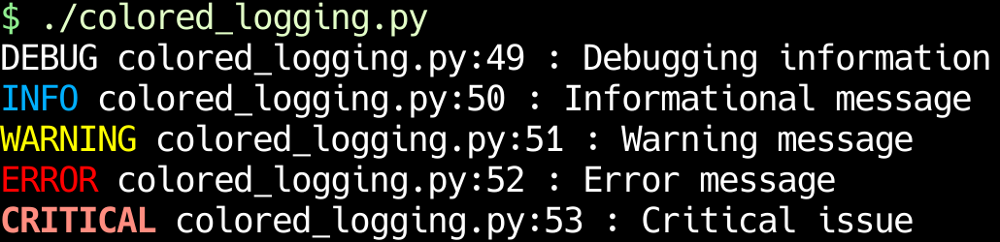

+++
title = "Logging in Python"
date = 2018-09-05
updated = 2025-06-24
aliases = [ "2018/09/05/Logging-in-Python.html" ]
+++

## Setup: Colors + Minimal metadata

This is useful for quick scripts where you want pretty logs, but probably not module information or timestamps...



```python
#!/usr/bin/env python3
# -*- coding: utf-8 -*-

import logging
import sys

logger = logging.getLogger(__name__)


class Color:
    reset = '\x1b[0m'
    grey = '\x1b[38;21m'
    blue = '\x1b[38;5;39m'
    yellow = '\x1b[38;5;226m'
    red = '\x1b[38;5;196m'
    bold_red = '\x1b[31;1m'


# logic from https://stackoverflow.com/a/75339761
class ColorLevelFormatter(logging.Formatter):

    _color_levelname = {
        'DEBUG': f"{Color.grey}DEBUG{Color.reset}",
        'INFO': f"{Color.blue}INFO{Color.reset}",
        'WARNING': f"{Color.yellow}WARNING{Color.reset}",
        'ERROR': f"{Color.red}ERROR{Color.reset}",
        'CRITICAL': f"{Color.bold_red}CRITICAL{Color.reset}",
    }

    def __init__(
            self,
            fmt: str = "%(levelname)s %(filename)s:%(lineno)s : %(message)s",
            *args,
            **kwargs,
    ):
        super().__init__(fmt, *args, **kwargs)

    def format(self, record):
        record.levelname = self._color_levelname[record.levelname]
        return super().format(record)


root_logger = logging.getLogger()
root_logger.setLevel(logging.DEBUG)
stdout_handler = logging.StreamHandler(sys.stdout)
stdout_handler.setFormatter(ColorLevelFormatter())
root_logger.addHandler(stdout_handler)

logger.debug("Debugging information")
logger.info("Informational message")
logger.warning("Warning message")
logger.error("Error message")
logger.critical("Critical issue")
```

## Setup: Log to file + stderr

This is the code driving the program - `main.py` for me usually.

This sets the format for all loggers and turns on debug output for just the
loggers we care about.

```python
#!/usr/bin/env python
# -*- coding: utf-8 -*-

from datetime import datetime
from pathlib import Path
import logging

__author__ = "Benjamin Kane"
__version__ = "0.1.0"

logger = logging.getLogger(__name__)


def setup_global_logging(
    log_dir: str = "logs",
    loggers=[logging.getLogger("__main__"), logging.getLogger(__package__)],
    level=logging.INFO,
    global_level=None,
    stream_level=logging.INFO,
):
    """Set up basic logging to stderr and a log directory

    loggers: defaults to this module's logger and this module's package's logger
    level: set log level for `loggers` (above parameter). Defaults to logging.INFO
    global_level: let log level for loggers in in `loggers` (like 3rd party libs) Defaults to logging.ERROR.
    stream_level: set log level of stderr specifically. Defaults to `level`'s value

    See `logging.Logger.manager.loggerDict` for a list of all loggers
    """
    log_dir = Path(log_dir)
    log_dir.mkdir(parents=True, exist_ok=True)
    logname = log_dir / datetime.datetime.now().strftime("%Y-%m-%d.%H.%M.%S.log")

    stream_handler = logging.StreamHandler()
    stream_handler.setLevel(stream_level or level)

    logging.basicConfig(
        format="# %(asctime)s %(levelname)s %(name)s %(filename)s:%(lineno)s\n%(message)s\n",
        level=global_level,  # logging package sets to logging.ERROR if it's None here
        handlers=(stream_handler, logging.FileHandler(logname)),
    )

    if loggers is not None:
        for l in loggers:
            if l is not logging.getLogger():
                l.setLevel(level)


def main():
    setup_global_logging(level=logging.DEBUG)

    # ...do actual work, and be content that it will be logged appropriately
    logger.debug("I'm too loggy for my tree")
    logger.info("I'm too loggy for my tree")
    logger.warning("I'm too loggy for my tree")
    logger.error("I'm too loggy for my tree")
    logger.critical("I'm too loggy for my tree")


if __name__ == "__main__":
    main()
```

## How to use a logger

In each file, make a new module level logger at the top 

```python
# filename: mymodule.py

# create a logger for module mymodule
logger = logging.getLogger(__name__)
```

When you actually want to log something, use one of the following:

```python
logger.debug(msg)
logger.info(msg)
logger.warning(msg)
logger.error(msg)
logger.critical(msg)
```

Oddly, these methods don't take `print` style variable arguments. They have their own odd C-style format arguments, but it's probably easier just to use a single f-string.

If you need stack trace, add the `stack_info=True` argument.

Example:

```python
# this logs the message and the call stack
logger.info(f'{thing.value}, {random_var}', stack_info=True)
```

If logging in an an exception handler, use
[`logger.exception(msg)`](https://docs.python.org/3/library/logging.html#logging.Logger.exception). It automatically logs at ERROR level and adds exception trace info for you.

```python
try:
    foo(arg)
except MyError as e:
    # the exception stuff will be logged after the message
    logger.exception(f'arg: {arg}')
    raise
```

## Logging Function Calls

Sometimes when debugging, it can be helpful to log all calls, arguments, and results of a function. I have a little decorator to do this. Just decorate the function at definition, and all of that will be logged. This function was inspired by David Beazley's talk [The Fun of Reinvention](https://youtu.be/5nXmq1PsoJ0). As a side note, David Beazley is a mad genius and this talk is a brilliant testament to that.

```python
from inspect import signature
from functools import wraps


def log_calls(logger, message='', sep=' '):
    """Decorator to log calls with an optional message

    @log_calls(logger, 'wtf?')
    def f(a, b):
        ...
    """

    if message:
        message = message + sep

    def wrap(func):
        sig = signature(func)

        @wraps(func)
        def wrapper(*args, **kwargs):

            bound = sig.bind(*args, **kwargs)

            argstr = [f'{arg}={value!r}' for arg, value in
                      bound.arguments.items()]
            argstr = ', '.join(argstr)

            ret = func(*args, **kwargs)

            logger.debug(f'{message}{func.__name__}({argstr}) -> {ret!r}')
            return ret
        return wrapper
    return wrap
```

## Formatting [requests](http://docs.python-requests.org/en/master/) calls

I love the `requests` library, but oddly, it doesn't offer a nice way to print most parts of requests and responses. See my [pocket_backup](https://github.com/bbkane/Random-Scripts/blob/master/pocket_backup.py) for a decent set of functions to deal with this. I need to turn my experiences with `requests` into their own blog post...

## Opening the last log file

This alias automatically opens the last log.

```bash
alias view_last_log='vim -R -c "set syn=config" $(ls -t logs/*log | head -n1)'
```

## Turn up Azure Logging

This turns up logging enough that you can see the details for each HTTP request/response.

Information from [Usage patterns with the Azure libraries for Python | Microsoft Learn](https://learn.microsoft.com/en-us/azure/developer/python/sdk/azure-sdk-library-usage-patterns?tabs=pip) and [Configure logging in the Azure libraries for Python | Microsoft Learn](https://learn.microsoft.com/en-us/azure/developer/python/sdk/azure-sdk-logging).  

```python
#!/usr/bin/env python

from azure import identity
from azure.mgmt.dns import DnsManagementClient
import azure.mgmt.dns.models as dm
import logging
import logging.handlers
import os

logging.basicConfig(
    level=logging.DEBUG,
    handlers=(
        logging.StreamHandler(),
        # overwrite log file each time
        logging.handlers.RotatingFileHandler("tmplog.log", mode="w"),
    )
)
logger = logging.getLogger(__name__)


def main():
    logger.debug("starting run")
    cred = identity.ClientSecretCredential(
        client_id=os.environ["AZURE_CLIENT_ID"],
        client_secret=os.environ["AZURE_CLIENT_SECRET"],
        tenant_id=os.environ["AZURE_TENANT_ID"],
    )

    subscription_id = "sub-uuid-here"
    resource_group = "rg-name-here"

    # https://learn.microsoft.com/en-us/azure/developer/python/sdk/azure-sdk-library-usage-patterns?view=azure-python&tabs=pip#arguments-for-libraries-based-on-azurecore
    dns_client = DnsManagementClient(
        credential=cred,
        subscription_id=subscription_id,
        logger=logger,
        logging_enable=True,
        connection_timeout=100,
        read_timeout=100,
        retry_total=3,
    )

    created_zone = dns_client.zones.create_or_update(
        resource_group_name=resource_group,
        zone_name="example.com",
        parameters=dm.Zone(
            location="global",
        ),
    )
    logger.info("created zone: %r", created_zone)


if __name__ == "__main__":
    main()

```

## Structured Logging!

This also demos setting the log level from an argparse CLI switch:

```python
#!/usr/bin/env python3
# -*- coding: utf-8 -*-

import argparse
import logging

import structlog

logger = structlog.get_logger()


def parse_args(*args, **kwargs):
    parser = argparse.ArgumentParser(
        description=__doc__,
        formatter_class=argparse.RawDescriptionHelpFormatter,
    )
    parser.add_argument(
        "--log-level",
        choices=["NOTSET", "DEBUG", "INFO", "WARNING", "ERROR", "CRITICAL"],
        default="NOTSET",
    )
    return parser.parse_args(*args, **kwargs)


def main():
    args = parse_args()

    # Default config + file/func/line numbers:
    # - https://stackoverflow.com/a/72320473/2958070
    # - https://www.structlog.org/en/stable/getting-started.html#your-first-log-entry
    structlog.configure(
        processors=[
            structlog.contextvars.merge_contextvars,
            structlog.processors.add_log_level,
            structlog.processors.CallsiteParameterAdder(
                {
                    structlog.processors.CallsiteParameter.FILENAME,
                    structlog.processors.CallsiteParameter.FUNC_NAME,
                    structlog.processors.CallsiteParameter.LINENO,
                }
            ),
            structlog.processors.StackInfoRenderer(),
            structlog.dev.set_exc_info,
            structlog.processors.TimeStamper(),
            structlog.dev.ConsoleRenderer(),
        ],
        wrapper_class=structlog.make_filtering_bound_logger(
            logging.getLevelName(args.log_level),
        ),
        context_class=dict,
        logger_factory=structlog.PrintLoggerFactory(),
        cache_logger_on_first_use=False,
    )

    logger.info("hello, %s!", "world", key="value!", more_than_strings=[1, 2, 3])


if __name__ == "__main__":
    main()

```

# Logging Subprocesses

Useful if you're coordinating processes with python scripts instead of Bash scripts

```python
def run_cmd(*args: str) -> int:
    logger.info(f"Running command: {shlex.join(args)}")
    res = subprocess.run(
        args,
        encoding="utf-8",
        capture_output=True,
        text=True,
    )
    level = logging.DEBUG
    if res.returncode != 0:
        level = logging.ERROR
        logger.error(f"Command failed with return code: {res.returncode}")
    if res.stdout:
        logger.log(level, f"stdout:\n{res.stdout}")

    if res.stderr:
        logger.log(level, f"stderr:\n{res.stderr}")

    return res.returncode
```

# Replacing Shell Scripts

Example to replace a shell script with good logs. This gets long because it supports streaming commands as well as the fancy logging

```python
#!/usr/bin/env python3
# -*- coding: utf-8 -*-
"""examplecli.py — template for a logged, subprocess-driven CLI.

A small, self-contained starting point for local ops/automation scripts. It
shows the patterns worth reusing:

  * structured logging — colorized terminal output plus a full file log;
  * ``run_cmd`` — a subprocess wrapper that logs every command and captures its
    output, with optional confirm prompt, live streaming, timeout, and dry-run;
  * fail-fast helpers — ``run_or_abort`` / ``StepError`` to bail out of a
    subcommand cleanly after a failed or unsafe step;
  * argparse subcommands with a shared set of common flags.

Run the ``selftest`` subcommand to watch the ``run_cmd`` options behave. Copy
this file and add your own ``cmd_*`` functions to the ``COMMANDS`` table.
"""

from __future__ import annotations

import argparse
import copy
import logging
import os
import shlex
import subprocess
import sys
import threading
from pathlib import Path
from typing import NoReturn

logger = logging.getLogger(__name__)

script_dir = Path(__file__).parent.resolve()
os.chdir(script_dir)

# alternative for temporary logs
# now = datetime.datetime.now().isoformat(timespec="seconds")
# log_file = f"/tmp/{Path(__file__).stem}-{now}.log"

log_file = f"{script_dir.name}.{Path(__file__).stem}.log"


class Color:
    reset = "\x1b[0m"
    grey = "\x1b[38;21m"
    blue = "\x1b[38;5;39m"
    yellow = "\x1b[38;5;226m"
    red = "\x1b[38;5;196m"
    bold_red = "\x1b[31;1m"


# logic from https://stackoverflow.com/a/75339761
class ColorLevelFormatter(logging.Formatter):
    _color_levelname = {
        "DEBUG": f"{Color.grey}DEBUG{Color.reset}",
        "INFO": f"{Color.blue}INFO{Color.reset}",
        "WARNING": f"{Color.yellow}WARNING{Color.reset}",
        "ERROR": f"{Color.red}ERROR{Color.reset}",
        "CRITICAL": f"{Color.bold_red}CRITICAL{Color.reset}",
    }

    def __init__(
        self,
        fmt: str = "%(levelname)s %(filename)s:%(lineno)s: %(message)s",
        *args,
        **kwargs,
    ):
        super().__init__(fmt, *args, **kwargs)

    def format(self, record):
        record = copy.copy(record)
        record.levelname = self._color_levelname[record.levelname]
        return super().format(record)


def _as_text(data: object) -> str:
    """Coerce subprocess output (str/bytes/buffer/None) to str for logging.

    On a timeout, subprocess hands back raw bytes even in text mode, so the
    captured partial output needs decoding before it can be logged cleanly.
    """
    if isinstance(data, str):
        return data
    if isinstance(data, (bytes, bytearray, memoryview)):
        return bytes(data).decode("utf-8", "replace")
    return ""


def _log_streams(stdout: str, stderr: str, level: int) -> None:
    """Log captured stdout/stderr at `level`, skipping empty streams."""
    if stdout:
        logger.log(level, f"stdout:\n{stdout}")
    if stderr:
        logger.log(level, f"stderr:\n{stderr}")


def _tee(pipe, sink, buffer: list[str]) -> None:
    """Echo a pipe line-by-line to `sink` while buffering it for the log."""
    for line in iter(pipe.readline, ""):
        sink.write(line)
        sink.flush()
        buffer.append(line)
    pipe.close()


def _run_streaming(args: tuple, timeout: float | None = None) -> int:
    """Run a command, streaming stdout/stderr live and buffering for the log."""
    try:
        proc = subprocess.Popen(
            args,
            encoding="utf-8",
            text=True,
            stdout=subprocess.PIPE,
            stderr=subprocess.PIPE,
        )
    except OSError as exc:
        logger.error(f"Command could not be run: {shlex.join(args)} ({exc})")
        return 127
    out_buf: list[str] = []
    err_buf: list[str] = []
    t_out = threading.Thread(target=_tee, args=(proc.stdout, sys.stdout, out_buf))
    t_err = threading.Thread(target=_tee, args=(proc.stderr, sys.stderr, err_buf))
    t_out.start()
    t_err.start()
    timed_out = False
    try:
        proc.wait(timeout=timeout)
    except subprocess.TimeoutExpired:
        timed_out = True
        logger.error(f"Command timed out after {timeout}s, killing: {shlex.join(args)}")
        proc.kill()
        proc.wait()
    t_out.join()
    t_err.join()

    if timed_out:
        returncode = 124  # match the non-streaming path's convention
    else:
        returncode = proc.returncode
        if returncode != 0:
            logger.error(f"Command failed with return code: {returncode}")
    # Output was already echoed live, so log it at DEBUG (file only, since the
    # terminal handler is INFO+) to avoid showing it twice.
    _log_streams("".join(out_buf), "".join(err_buf), logging.DEBUG)
    return returncode


def run_cmd(
    *args: str,
    confirm: bool = False,
    stream: bool = False,
    timeout: float | None = None,
    dry_run: bool = False,
) -> int:
    """Run a command, log it, and return its exit code.

    The command is given as separate arguments (like a subprocess list). It is
    logged as it runs and its output captured to the log: by default output is
    buffered and written after the command finishes — stdout/stderr at DEBUG on
    success (so it only reaches the log file, not the INFO terminal) and at ERROR
    on failure (so failures surface on the terminal too).

    Returns the command's exit code, with these special cases:
      * 124 — the command hit ``timeout`` and was killed.
      * 127 — the command could not be launched (e.g. binary not found).
      * 0   — also returned when nothing actually ran (skipped via ``confirm`` or
              ``dry_run``).

    Optional flags:
      confirm: print the exact command and ask y/N before running; on anything but
               yes, log "Skipped by user" and return 0 without running. Mutating
               callers pass ``confirm=not yes`` so ``-y`` bypasses the prompt;
               read-only callers pass ``confirm=False``.
      stream:  stream stdout/stderr to the terminal live (via Popen) while still
               buffering for the log — use for long or hang-prone commands.
               Default buffers and logs after exit.
      timeout: seconds; if exceeded, kill the command and return 124. Applies to
               both the streamed and buffered paths. None = wait indefinitely.
      dry_run: log "[DRY-RUN] would run: <cmd>" and return 0 without executing,
               prompting, or streaming. Checked first, so it overrides the others.
    """
    cmd_str = shlex.join(args)
    if dry_run:
        logger.info(f"[DRY-RUN] would run: {cmd_str}")
        return 0

    if confirm:
        try:
            answer = input(f"Run this command? [y/N]\n  {cmd_str}\n> ").strip().lower()
        except EOFError:
            logger.error(
                f"cannot prompt for confirmation (no interactive input); re-run with -y: {cmd_str}"
            )
            return 1
        if answer not in ("y", "yes"):
            logger.warning(f"Skipped by user: {cmd_str}")
            return 0

    logger.info(f"Running command: {cmd_str}")
    if stream:
        return _run_streaming(args, timeout=timeout)

    try:
        res = subprocess.run(
            args, encoding="utf-8", capture_output=True, text=True, timeout=timeout
        )
    except subprocess.TimeoutExpired as exc:
        logger.error(f"Command timed out after {timeout}s: {cmd_str}")
        # Log any partial output captured before the kill (bytes -> str).
        _log_streams(_as_text(exc.stdout), _as_text(exc.stderr), logging.ERROR)
        return 124
    except OSError as exc:
        logger.error(f"Command could not be run: {cmd_str} ({exc})")
        return 127
    if res.returncode != 0:
        logger.error(f"Command failed with return code: {res.returncode}")
    _log_streams(
        res.stdout, res.stderr, logging.ERROR if res.returncode else logging.DEBUG
    )
    return res.returncode


# --- fail-fast helpers -----------------------------------------------------


class StepError(Exception):
    """Raised to abort a subcommand after a failed or unsafe step.

    main() turns it into a non-zero process exit; the message is already logged.
    """


def _abort(msg: str) -> NoReturn:
    logger.error(msg)
    raise StepError(msg)


def run_or_abort(*args: str, **kwargs) -> int:
    """Like run_cmd, but abort the whole subcommand if the command fails."""
    rc = run_cmd(*args, **kwargs)
    if rc != 0:
        _abort(f"aborting after failed step (exit {rc}): {shlex.join(args)}")
    return rc


def require_exists(path: Path) -> None:
    """Abort unless `path` exists — a pre-check before mv/cp."""
    if not path.exists():
        _abort(f"required file does not exist: {path}")


def safe_copy(src: Path, dst: Path, *, yes: bool, dry_run: bool) -> None:
    """cp src -> dst after checking src exists; aborts on missing src or failure."""
    require_exists(src)
    run_or_abort("cp", str(src), str(dst), confirm=not yes, dry_run=dry_run)


def safe_move(src: Path, dst: Path, *, yes: bool, dry_run: bool) -> None:
    """mv src -> dst after checking src exists; aborts on missing src or failure."""
    require_exists(src)
    run_or_abort("mv", str(src), str(dst), confirm=not yes, dry_run=dry_run)


# --- subcommands -----------------------------------------------------------


def cmd_selftest(yes: bool, dry_run: bool) -> None:
    """Exercise run_cmd with each option (harmless echo/sleep) to see its behavior."""
    logger.info("⭐️ selftest yes=%r dry_run=%r", yes, dry_run)

    logger.info(
        "[1] plain run — buffered; on success stdout goes to the log file (DEBUG), not the terminal"
    )
    logger.info(
        "    -> returned %d", run_cmd("echo", "hello from run_cmd", dry_run=dry_run)
    )

    logger.info("[2] failing command, buffered — stdout/stderr surface at ERROR")
    logger.info(
        "    -> returned %d",
        run_cmd("sh", "-c", "echo oops >&2; exit 3", dry_run=dry_run),
    )

    logger.info("[3] stream=True, success — output appears live, line by line")
    logger.info(
        "    -> returned %d",
        run_cmd(
            "sh",
            "-c",
            "for i in 1 2 3; do echo line $i; sleep 0.3; done",
            stream=True,
            dry_run=dry_run,
        ),
    )

    logger.info(
        "[4] stream=True, failure — live output + ERROR failure line (not shown twice)"
    )
    logger.info(
        "    -> returned %d",
        run_cmd(
            "sh", "-c", "echo streamed then fail; exit 5", stream=True, dry_run=dry_run
        ),
    )

    logger.info(
        "[5] timeout, buffered — prints then hangs, timeout=1 -> 124 + partial output"
    )
    logger.info(
        "    -> returned %d",
        run_cmd(
            "sh",
            "-c",
            "echo partial output before timeout; sleep 3",
            timeout=1,
            dry_run=dry_run,
        ),
    )

    logger.info(
        "[6] timeout, streamed — prints then hangs, timeout=1 -> 124 + partial output"
    )
    logger.info(
        "    -> returned %d",
        run_cmd(
            "sh", "-c", "echo working; sleep 3", stream=True, timeout=1, dry_run=dry_run
        ),
    )

    logger.info(
        "[7] confirm — prompts y/N unless -y/--yes was passed (answer n to see the skip path)"
    )
    logger.info(
        "    -> returned %d",
        run_cmd("echo", "you confirmed this", confirm=not yes, dry_run=dry_run),
    )

    logger.info("[8] forced dry_run=True — always previews, never executes")
    logger.info(
        "    -> returned %d", run_cmd("echo", "this should NOT execute", dry_run=True)
    )


# Map subcommand name -> handler. argparse preserves this insertion order in
# --help, so list commands in whatever order reads best. Add your own here.
COMMANDS = {
    "selftest": cmd_selftest,
}


def build_parser() -> argparse.ArgumentParser:
    parser = argparse.ArgumentParser(
        description=__doc__,
        formatter_class=argparse.RawDescriptionHelpFormatter,
    )

    parser.add_argument(
        "--log-level",
        choices=["NOTSET", "DEBUG", "INFO", "WARNING", "ERROR", "CRITICAL"],
        default="INFO",
        help="terminal log level",
    )
    parser.add_argument(
        "--log-file",
        default=log_file,
        help=f"log file path (default: {log_file})",
    )

    # -y/--yes is shared by every subcommand and passed in as an argument
    # (not a global), so mutating commands forward it as `confirm=not yes`.
    common = argparse.ArgumentParser(add_help=False)
    common.add_argument(
        "-y",
        "--yes",
        action="store_true",
        help="skip confirmation prompts for mutating commands",
    )
    common.add_argument(
        "-n",
        "--dry-run",
        action="store_true",
        help="preview commands without executing them",
    )

    subparsers = parser.add_subparsers(dest="command", required=True)
    for name, func in COMMANDS.items():
        sub = subparsers.add_parser(
            name, parents=[common], help=func.__doc__, description=func.__doc__
        )
        sub.set_defaults(func=func)

    return parser


def main():
    parser = build_parser()
    args = parser.parse_args()

    root_logger = logging.getLogger()
    root_logger.setLevel(logging.DEBUG)

    file_handler = logging.FileHandler(args.log_file, mode="a", encoding="utf-8")
    file_handler.setFormatter(
        logging.Formatter(
            "# %(asctime)s %(levelname)s %(name)s %(filename)s:%(lineno)s\n%(message)s"
        )
    )  # noqa: E501
    root_logger.addHandler(file_handler)

    stdout_handler = logging.StreamHandler(sys.stdout)
    stdout_handler.setLevel(logging.getLevelName(args.log_level))
    stdout_handler.setFormatter(ColorLevelFormatter())
    root_logger.addHandler(stdout_handler)

    logger.debug("args: %r", args)
    logger.debug("working directory: %s", os.getcwd())
    logger.info("log file: %s", Path(args.log_file).resolve())

    if args.dry_run:
        logger.warning("DRY-RUN mode: no commands will be executed")

    try:
        args.func(yes=args.yes, dry_run=args.dry_run)
    except StepError:
        sys.exit(1)  # already logged by _abort
    except Exception:
        logger.critical("unexpected error", exc_info=True)
        sys.exit(1)


if __name__ == "__main__":
    main()

```

