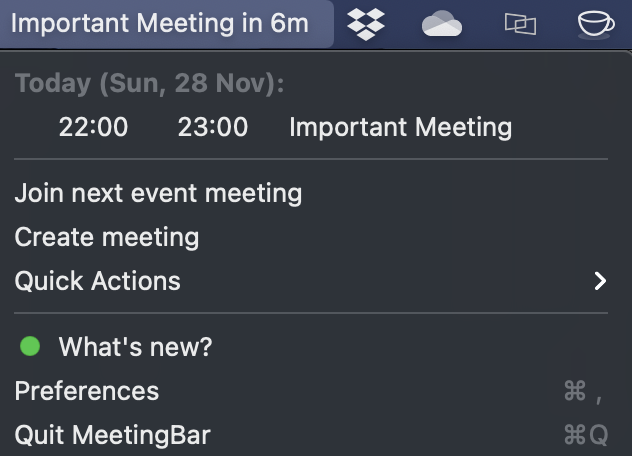
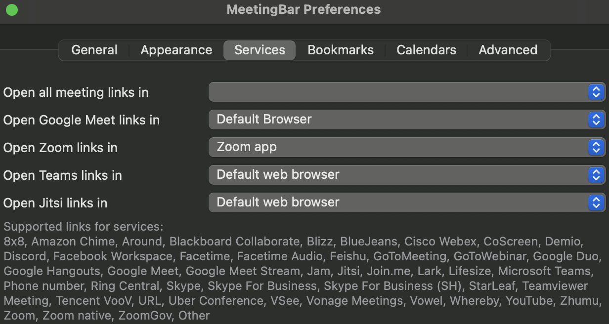
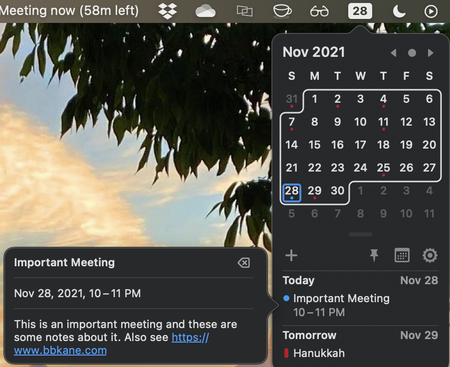

+++
title = "Mac Menu Bar Meeting Apps"
date = 2021-11-28
+++

At work, I go to a lot of virtual meetings and it seems like each one uses a different video calling app (in reality, there's only two or three, but this is my blog and I'll exaggerate if I want to).

It's a pain to have to open my calendar each time to get the right links to the meeting. Fortunately, I found two open-source apps that live in my Mac's Menu Bar, sync with my Mac's calendar, and show me upcoming meetings. Note that I'm writing this blog post on my personal Mac, so I've made a mock meeting called "Important Meeting" on my (much emptier) personal calendar to get screenshots for this post.

## [MeetingBar](https://github.com/leits/MeetingBar)

[MeetingBar](https://github.com/leits/MeetingBar) shows the title of your next meeting right in your menubar, and lets you auto-join it when you click the title in the dropdown. It integrates with several video apps too:

### Installation

- Homebrew: `brew install --cask meetingbar`
- [Mac App Store](https://apps.apple.com/us/app/meetingbar/id1532419400?mt=12)

# [Itsycal](https://www.mowglii.com/itsycal/)

I use [Itsycal](https://www.mowglii.com/itsycal/) to view *descriptions* of meetings and click any links I need to in order to join the meeting or prep for it (like agenda docs).

### Installation

- Homebrew: `brew install --cask itsycal`
- [Home Page](https://www.mowglii.com/itsycal/)
