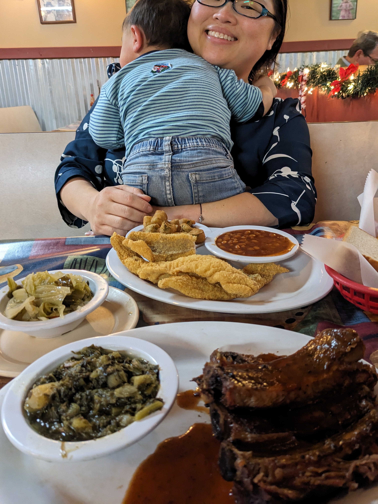

+++
title = "My Favorite things in Arkansas"
date = 2019-08-08
updated = 2020-02-09
aliases = [ "2019/08/08/My-Favorite-things-in-Arkansas.html" ]
+++

Some of my favorite things in Arkansas:

## Food

### [Maddie's Place](https://goo.gl/maps/tTdxBEg7daQG4q1WA)

Great steak

### [Lindsey's Hospitality House](https://www.lindseysbbqnmore.com/)

BBQ / Soul Food!

### [Corky's Ribs & BBQ](https://goo.gl/maps/VNqdW3eydJn3Xu4B9)

Love the dry ribs with extra dry rub

### [Eat My Catfish](https://goo.gl/maps/xxWbY7hpyLuiMTMc8)

Great for crawfish when in season

### [Whole Hog Cafe](https://goo.gl/maps/YSQT6rcXMUcNrjG38)

BBQ, great ribs

### [Moe's Southwest Grill](https://locations.moes.com/ar/north-little-rock/4834-north-hills-blvd)

Generic Southwest Burrito place that I really crave at times for some reason. I don't know why.

### [Santa Coyote](https://santo-coyote.com/)

I really like the Pollo Tropical!

### [Vinos](https://vinosbrewpub.com/)

I don't drink, but I love the pizza and calzones here!

### [Gus's Fried Chicken](https://www.gusfriedchicken.com/)

Not unique to Arkansas, but maybe the best fried chicken I've ever had...

## Parks

### [Big Dam Bridge](https://goo.gl/maps/6MtWDYdDvre6ydws6)

They light this up a night. It's a great place for a walk or run.

### [Emerald Park](https://goo.gl/maps/ETnkZhNiC9gnJyTP6)

See a quarry canyon from above.

### [Riverview Park](https://goo.gl/maps/mYYxk3WcEouypAze7)

Explore the bottom of the canyon at Emerald Park

### [Greer's Ferry](https://goo.gl/maps/3ivV3QCAeKEXnujK9)

Swimming, cliff jumping

### [Petit Jean State Park](https://goo.gl/maps/Snf2r8YA43zbSejJ9)

Waterfalls and hikes

### [Grinder's Ferry](https://goo.gl/maps/RZAXfwmCGbBWT29W9)

Swimming, floating down the Buffalo River

### [Hemmed-In Hollow Falls](https://goo.gl/maps/GkAu6kUryd1SxpPE7)

Quite a drive, quite a hike, and when there's water, quite a view!

