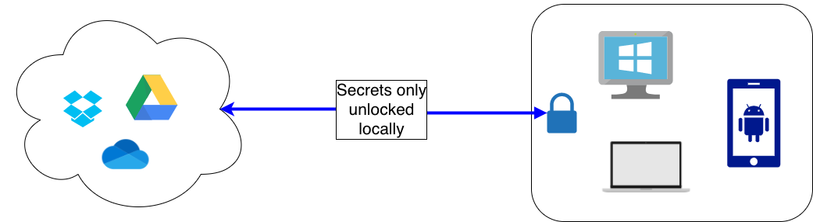

+++
title = "Password Management"
date = 2021-09-12
+++

I use a password manager to hold all my username/passwords and I love it. I used to try to reuse passwords and write them down on paper, but as everyone who does that knows, it doesn't work very well. You always have to worry about losing the list, forgetting the reused password, or some hacker guessing or stealing the shared password and accessing all of your accounts.

## Why I Use A Password Manager

A couple of years ago, I realized that, as an engineer, I couldn't even really plead ignorant if someone hacked me. I understood the risks if someone discovered my method or list and I really needed to apply the same thoughtfulness and care with my personal "infrastructure" that I do with the infrastructure I build and maintain for my job.

I didn't really understand then HOW much more convenient it is to use a password manager. It's not just more secure, it's easier!! Remember only one password instead of small permutations! Copy-paste instead of look for paper! Don't try to think of new passwords, just generate random crap in the manager and use that! Another benefit I hope I never need is that I die or [become incapacitated](https://www.yalemedicine.org/news/ventilators-covid-19), my wife can use the password manager to access my accounts.

Every time I use my password manager, I congratulate past Ben on his great life choice. Of course, using a password manager DOES come with some risks - don't forget that master password!! Read [Before You Use a Password Manager](https://stuartschechter.medium.com/before-you-use-a-password-manager-9f5949ccf168) and then continue this post.

## Which Password Manager?

The password managers I landed on are [KeePassXC](https://keepassxc.org/) for my desktop and [Keepass2Android](https://play.google.com/store/apps/details?id=keepass2android.keepass2android&hl=en_US&gl=US) for my Android phone. The encrypted list of passwords can be synced between phone and computer using any popular cloud service - DropBox, Google Drive, etc. These apps are also both open-source, so they're free and don't try to peddle more services at me. Both apps accept donations - see [here](https://keepassxc.org/donate/) and [here](http://philipp.crocoll.net/donate.php).

## Is It Safe?

Importantly, the KeePass encrypted file is always encrypted BEFORE it is saved, so the cloud provider NEVER sees the unencrypted password list.

