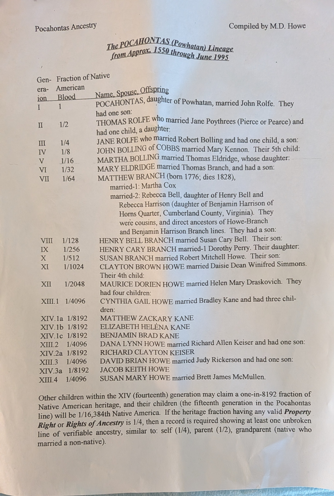

+++
title = "Pocahontas Ancestry"
date = 2026-08-08
+++

> I found this in some old papers. Maurice Howe is my grandfather. Rest in peace Grandpa!

Compiled by M. D. Howe

# The POCAHONTAS (Powhatan) Lineage from Approx. 1550 through June 1995

| Generation | Fraction of Native American Blood | Name, Spouse, Offspring                                      |
| ---------- | --------------------------------- | ------------------------------------------------------------ |
| I          | 1                                 | POCAHONTAS, daugher of Powhatan, married John Rolfe. They had one son: |
| II         | 1/2                               | THOMAS ROLFE who married Jane Poythrees (Pierce or Pearce) and had one child, a daughter: |
| III        | 1/4                               | JANE ROLFE who married Robert Bolling and had one child, a son: |
| IV         | 1/8                               | JOHN BOLLING of COBBS married Mary Kennon. Their 5th child:  |
| V          | 1/16                              | MARTHA BOLLING married Thomas Eldridge, who's daughter:      |
| VI         | 1/32                              | MARY ELDRIDGE married Thomas Branch, and had a son:          |
| VII        | 1/64                              | MATTHEW BRANCH (born 1776; dies 1828),  married-1: Martha Cox.  married-2: Rebecca Bell, daugher of Henry Bell and Rebecca Harrison (daughter of Benjamin Harrison of Horns Quarter, Cumberland County, Virginia). They were cousins, and direct ancestors of Howe-Branch and Benjamin Harrison Branch lines. They had a son: |
| VIII       | 1/128                             | HENRY BELL BRANCH married Susan Cary Bell. Their son:        |
| IX         | 1/256                             | HENRY CARY BRANCH married-1 Dorothy Perry. Their daughter:   |
| X          | 1/512                             | SUSAN BRANCH married Robert Mitchell Howe. Their son:        |
| XI         | 1/1024                            | CLAYTON BROWN HOWE married Daisie Dean Winifred Simmons. Their 4th child: |
| XII        | 1/2048                            | MAURICE DORIEN HOWE married Helen Mary Draskovich. They had four children: |
| XIII.1     | 1/4096                            | CYNTHIA GAIL HOWE married Bradley Kane and had three children: |
| XIV.1a     | 1/8192                            | MATTHEW ZACKARY KANE                                         |
| XIV.1b     | 1/8192                            | ELIZABETH HELENA KANE (note: ben: 2nd e has an accent, that I don't know how to type) |
| XIV.1c     | 1/8192                            | BENJAMIN BRAD KANE                                           |
| XIII.2     | 1/4096                            | DANA LYNN HOWE married Richard Allen Keiser and had one son: |
| XIV.2a     | 1/8192                            | RICHARD CLAYTON KEISER                                       |
| XIII.3     | 1/4096                            | DAVID BRIEN HOWE married Judy Rickerson and had one son:     |
| XIV.3a     | 1/8192                            | JACOB KEITH HOWE                                             |
| XIII.4     | 1/4096                            | SUSAN MARY HOWE married Brett James McMullen                 |

Other children within the XIV (fourteenth) generation may claim a one-in-8192 fraction of Native American heritage adn their children (the fifteenth generation in the Pocahontas line) will be 1/16,384th Native America. If the heritage fraction having any valid ***Property Right*** or ***Rights of Ancestry*** is 1/4, then a record is required showing at least one unbroken line of verifiable ancestry, similar to: self (1/4), parent (1/2), grandparent (native who married a non-native).

---

Photo of original doc:

