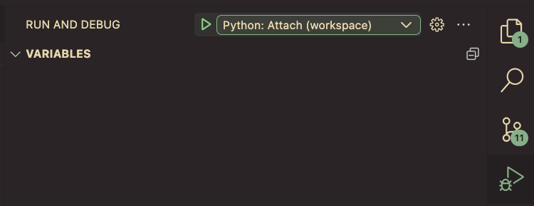

+++
title = "Short Python Snippets"
date = 2018-03-14
updated = 2021-01-29
aliases = [ "2018/03/14/Short-Python-Snippets.html" ]
+++

This is just a collection of Python snippits that are too small for their own
posts. All code is for Python 3.

Also see [Logging-in-Python](@/blog/Logging-in-Python/index.md)

## Inline Multiline Strings

This is a quick post on inline multiline strings. I like to use the following style:


```python
from textwrap import dedent


def main():
    query = dedent("""
    first line
    second line
    """).strip()

    print(repr(query))

if __name__ == '__main__':
    main()

# 'first line\nsecond line'
```

So it prints it without the preceding and trailing newlines and without the indentation to make it line up with the rest of the function

## Pretty-printing JSON

```python
json.dump(obj, sys.stdout, indent=2, sort_keys=True)
```

or

```python
print(json.dumps(obj, indent=2, sort_keys=True))
```

I kind of prefer the first version, even if it involves an extra `sys` import because it's easy to change the dump to a file (though it's not much harder to add the `file` argument to `print` either...).

```python
with open('file.json', 'w') as fp:
    json.dump(obj, fp, indent=2, sort_keys=True)
```

## Argparse template

Expanded and moved to [/blog/argparse-template/](@/blog/Argparse-Template/index.md)

## Zipping Files

The `shutil.make_archive` function is a bit hard to use. Here's my notes on it and some code to erase partially zipped files on exceptions. This function works well with `pathlib.Path`.

```python
try:
    # how params work:
    # change into root_dir
    # creating base_name.zip and adding base_dir to it
    # NOTE: not threadsafe! https://bugs.python.org/issue30511
    shutil.make_archive(
        base_name=base_name,
        format='zip',
        root_dir=root_dir,
        base_dir=base_dir.name,
        dry_run=False,
        logger=logger
    )
# KeyboardInterrupt doesn't inherit from Exception
except (Exception, KeyboardInterrupt):
    logger.exception(f'Exception! Deleting {dest_path_zip}')
    dest_path_zip.unlink()
    raise
```

## Creating Context Managers

Add the following two methods to create a context manager for a class:

This is useful when working with resources.

```python
    def __enter__(self):
        return self

    def __exit__(self, exc_type, exc_val, exc_tb):
        self.clean()
```


## Search and Replace with Named Groups in Python

Every once in a while (usually when making changes to config files or source code), a smart search and replace can save a lot of work. Python's [`re.sub`](https://docs.python.org/3/library/re.html#re.sub) method is useful, but can be confusing to understand. Here's a common use case for it:

```python
res = re.sub(r'bob was (?P<loc>\w+)',     # search pattern
             r'bob was seen at \g<loc>',  # replacement pattern
             r'bob was in bed')           # "target" string
```

This very contrived example has several useful concepts:

- The search pattern can have named patterns to find with the following schema: `(?P<name_of_group>pattern)`. In this example, the `name_of_group` is `loc` and the `pattern` is `\w+`. `\w` refers to a non-whitespace Unicode character.
- The replacement pattern can reference captured patterns (referred to as groups), with `\g<name>`. In this case the `name` is `loc` (which matches the search pattern we named `loc`).
- The "target" string is just the string to run through this regex machinery and `res` is what comes out of it.

`re.sub` is even more powerful (see the docs linked above), but I think this example covers the most common case for me.

## Interactive Console for dev

Sometimes when writing code, it's super helpful to just open an interpreter with the current variables so you can play with them. For example, say I have the following function:

```python
def get_my_age():
    birth_date = datetime.datetime(1990, 1, 1)
    today = datetime.datetime.now()
    difference = today - birth_date
    # now what? How do I want to format this?

get_my_age()
```

Date formatting can get complicated, and the format specifiers can be hard to remember ([tools](http://www.strfti.me/) can help)). However, you can open a console to figure it out by adding the following lines inside the function (underneath `# now what?` in the above).

```python
    import code
    code.interact(local=locals())
```

Then when you run the function, it opens an interactive console at that line and you can play with defined variables directly. Once you have something you like, you can remove that code and use what you made in it's place. This can also be handy when debugging and you want to inspect variables (though also check out `pdb`).

## HTTP GET with `urllib`

Sometimes you just want to `GET` a URL and you don't want to install `requests`. `urllib` is confusing, but here's how I do that for simple cases:

```python
import json
import urllib.request

headers = {"Content-Type": "application/json"}
req = urllib.request.Request("https://api.com/api", headers=headers)
with urllib.request.urlopen(req) as resp:
    # guess UTF-8 if no encoding found
    encoding = resp.info().get_content_charset("utf-8")
    content = resp.read()
    return_code = resp.getcode()
    headers = resp.info()

    if return_code != 200:
        raise ValueError(f"Error for fqdn: {fqdn}")

    json_data = json.loads(content.decode(encoding))
```


## Converting a list of namedtuples to .csv

Python's `collections.namedtuple / typing.NamedTuple` library interacts really
nicely with the `csv` module. Check this out:

```python
import csv
import sys
import typing

class Student(typing.NamedTuple):
    first_name: str
    last_name: str
    age: int


students = [
    Student("Bob", "Smith", 10),
    Student("Rachel", "Kilkenny", 14),
    Student("Martin", "Gonzalez", 16),
]

writer = csv.DictWriter(sys.stdout, fieldnames=Student._fields)
writer.writeheader()
writer.writerows([s._asdict() for s in students])
```

## Executing a subprocess and capturing the output as text

```python
from subprocess import run

result = subprocess.run(
    args=["echo", "hi"],
    check=True,
    encoding="utf-8",
    stdout=subprocess.PIPE,
    text=True,
)
print(result.stdout)
```

If you also need to capture `stderr`, you can replace `stdout=subprocess.PIPE` with `capture_output=True`.

## Useful debug f-strings

```python
a = "bob"

print(f"{a}")  # bob
print(f"{a!r}")  # 'bob'
print(f"{a=}")  # a='bob'
print(f"{a = }")  # a = 'bob'
```

## Debug Python CLI in VS Code

From [Debugging configurations for Python apps in Visual Studio Code](https://code.visualstudio.com/docs/python/debugging#_command-line-debugging)

First add the following debug configuration (this is in my workspace file, but can also place in other places):

```json
{
	"folders": [
		{
			"path": "..."
		},
	],
	"settings": {},
	"launch": {
		"version": "0.2.0",
		"configurations": [
			{
				"name": "Python: Attach",
				"type": "python",
				"request": "attach",
				"connect": {
				  "host": "localhost",
				  "port": 5678
				}
			  }
		]
	}
}
```

Once this is created, you'll be able to see the debug config in the debug tab:



Install debugpy in venv:

```bash
python -m pip install --upgrade debugpy
```

Then run the script using debugpy:

```bash
python -m debugpy --listen 5678 --wait-for-client ./main.py arg1 arg2
```

Nothing will happen because it's waiting for VS Code's debug client to connect. Connect by hitting the green "play" button you just configured.

