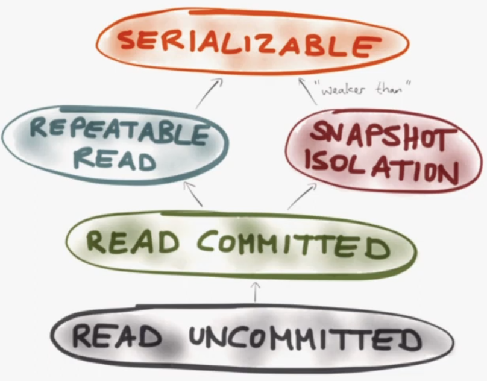

+++
title = "SQL Isolation Levels"
date = 2025-08-19
draft = true
+++

These are some notes on SQL Isolation levels - what are they, what are some examples of what happens at different isolation levels; hopefully some diagrams

Links:

- https://www.pingcap.com/article/what-are-sql-isolation-levels-and-how-to-choose/
- https://www.youtube.com/watch?v=5ZjhNTM8XU8
- [Jepsen 15: What Even Are Transactions? by Kyle Kingsbury - YouTube](https://www.youtube.com/watch?v=ecZp6cWhDjg)
- [Jepsen 18: Serializable Mom by Kyle Kingsbury - YouTube](https://www.youtube.com/watch?v=dpTxWePmW5Y)

Things to define:

- what is Snapshot isolation?

# [Jepsen 15: What Even Are Transactions? by Kyle Kingsbury - YouTube](https://www.youtube.com/watch?v=ecZp6cWhDjg)

7m55 - Snapshot isolation ??

8m17s - Concurrent cluster-wide transations are guaranteed  to appear as if they are run one at at time (serializable isolation level)

# [@xyuanlu's Isolation Notes](https://github.com/xyuanlu/LosGatosSeminar/blob/main/basics/Isolation)

The concept of database isolation provides programmers with the illusion of a single-threaded environment. The isolation guarantee states that transactions are executed as if there are no concurrent transactions (when in fact there ARE)

## Concurrent write/read errors

- **dirty write** - write based on uncommitted value, and commit before previous uncommitted value commit (which could be rolled back)
- **dirty read** - read uncommitted data
- **non-repeatable read** - Reading a row twice in the same transaction results in different data
- **phantom read** - When a transaction re-executes a query, rows in the later query read are not in the first read (TODO: how is this different than the non-repeatable read)
- **write skew** - 2 transactions read the same set of data and update disjoint subsets. TODO: understand this example better

## Different isolation levels

- **Read Uncommitted** - can read aything
- **Read Committed** - can read any data that has been committted at the moment of reading (not necessarily the start of the transaction)
- **Repeatable Read** - All reads withing a transaction see the same data (TODO: how does this affect data written within the transaction?)
- **Serializable** - complete isolation: the final result must be equivalent to a result that would have occurred without concurrency.

|                  | Dirty Write  | Ditry Read   | Non-Repeatable Read | Phantom Read |
| ---------------- | ------------ | ------------ | ------------------- | ------------ |
| Read Uncommitted | Not Possible | Possible     | Possible            | Possible     |
| Read Committed   | Not Possible | Not Possible | Possible            | Possible     |
| Repeatable Read  | Not Possible | Not Possible | Not Possible        | Possible     |
| Serializable     | Not Possible | Not Possible | Not Possible        | Not Possible |

NOTE: the SQL Standard did not accurately define database isolation levels and different vendors attach liberal and non-standard semantics to name their own isolation levels (TODO: where are these definitions from?)

- Snapshot Isolation - guarantees that all reads made in a transaction will see a consistent snapshot of a database. In practice it reads the last comitted values that existed at the same time it strted. It won't have dirty read/write and guarantees repeatabl reads. However, depending on different vendors and their definitions, some implementations are also vulnerable to the phantom read anomaly. Snapshot isolation is also vulnerable to the write skew anamoloy

TODO: find jepson isolation definitions

TODO: rename this database semantics

Links: TODO: read

- https://en.wikipedia.org/wiki/Snapshot_isolation
- https://dbmsmusings.blogspot.com/2019/05/introduction-to-transaction-isolation.html

# ["Transactions: myths, surprises and opportunities" by Martin Kleppmann - YouTube](https://www.youtube.com/watch?v=5ZjhNTM8XU8)

This talk is REALLY GOOD. Taking some notes...

3m - ACID - not a great acronym and the meaning has changed over time

 3m50s - Durability data is fsync'd to disk and/or replicated

 4m30s - Consistency - transactions move db from one consistent state to another - integrity constraints, etc. Vaguely defined. Rest of the talk.

6m30s -  Atomicity - not concurrency. how faults are handled. you get either ALL or NONE of the writes in the transaction. A better name would be "Abortability"

8m20s - Transactions - multi-object atomicity. Rollback writes on abort

9m50s - Isolation - different types. "Serializability" means all transactions act THE SAME as if they were executing on a single thread. This is the rest of the talk!

13m - race conditions at isolation levels. The rest of the talk talks about different errors and how moving "up" an isolation level prevents the error



13m10s - Read committed - default in Postgres, Oracle, SQL server

Prevents dirty reads and dirty writes

Dirty reads - one transaction reads data that another transaction has not yet committed

13m51s - Dirty writes 


If you have two transactions, A and B, and they both want to write their names to values x and y at the same time, the end result should be x=A,y=A or x=B,y=B . a mix of names is called a dirty write.


Read committed prevents this.

15m - Read skew can occur unde READ COMMITTED

 

If you have two accounts with balances of 500 each, and you start a transaction to transfer 100 from X to Y

```
X = X - 100
Y + Y = 100
```

16m - If another transaction reads X after the first operation, and Y after the second operation, they only see $900 total...


16m50s- The backup sees different parts of the database at different points in time. Occurs under READ COMMITTED isolation.

To prevent read skew, can use REPEATABLE READ or SNAPSHOT ISOLATION. Similar from users point of view but different from implementation level.

17m10s - REPEATABLE READ - locking. 

17m30s - Snapshot isolation/ MVCC - Postgres and MySQL calls this "REPEATABLE READ"

A snapshot sees the database at one point in time. MVCC (Multi-version concurrency control) keeps different versions of data and presents transactions with the version appropriate to its time.

18m40s - What's the difference between snapshot and serializable?

Imagine a doctor oncall system. the constraint is there must be at least one doctor oncall, but doctors can swap oncalls. A swap looks like this

19m36s - doctor swap transaction


20m10s - even under snapshot isolation, we ended up with a database where the "must be at least one doctor oncall" constraint failed


20m32s - This is because they both start with the same snapshot (where the constraint works), but update DIFFERENT values to fail the constraint.


This is prevented by SERIALIZABLE isolation

21m50s - SERIALIZABLE implementation strategies

2-Phase Locking (not the same as 2-Phase Commit) . Take a shared lock on all of the stuff that you've read. Hold that lock until the end of the transaction. Super slow, especially if a transaction reads all the rows - locks all the rows 


23m30s  - BoldDB (I think) implementation strategy - Literally serialize transactions. Only feasible if transaction is fast (ideally )


25m40s - Serializable Snapshot Isolation. detect conflicts and abort. Postgres

Implement locks like 2PL, but don't block. "this write from this transaction conflicts with this read transaction". Try to resolve this at commit time.

28m - end of db isolation levels, Moving on to what transactions might mean for distributed systems

29m50s - Serializable transactions across services require slow protocols such as 2PC, 3PC.


32m30s - Alternatives to serializability

Compensating transactions ( abort/rollback at application level). Saga pattern. Requires detecting and fixing constraint violations after the fact (apologizing to customers for selling them something that was sold out)

35m - compensating transactions are kind of like Atomicity and apologies are kind of like Consistency

36m - user issues with implicit relationships (posting message to unfriended friend)


37m30s - Can we do better than eventual consistency?


Probably can't do serializability - too slow. "Causality" can be maintained without global coordination. "Consistent snapshot". Can we make causality effiecient?


