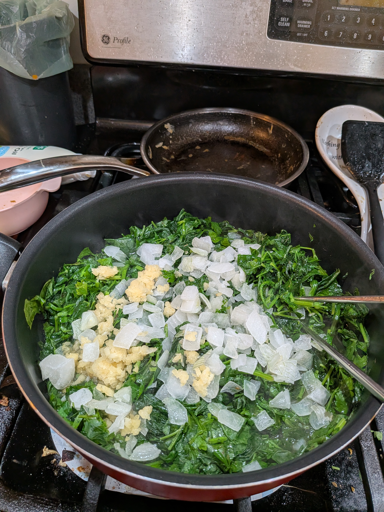
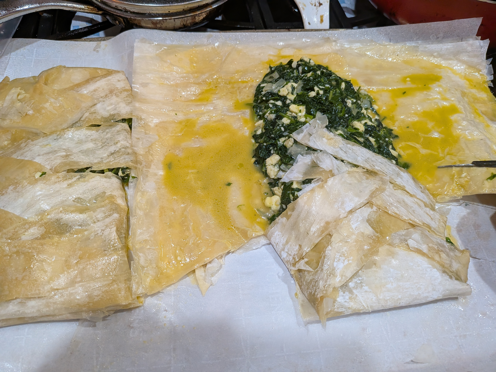
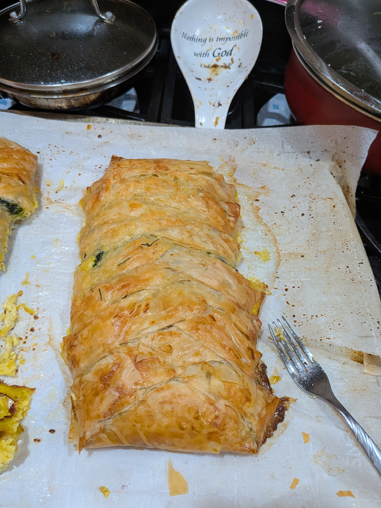

+++
title = "Braided Spanakopita"
date = 2026-04-04
+++

# Ingredients

- 16 oz spinach
- 2 bunches parsley
- dried dill to taste (maybe 2 tsp)
- 8 oz Feta cheese (crumbled)
- 1/2 diced onions
- 2 Tbsp garlic
- 4 eggs
- 1 sheet phyllo dough (or croissant dough for less work)

# Instructions

- Put dough out and let it defrost for a day
- Cook down spinach and parsley
- Drain it well and let cool
- Put in mixing bowl and mix in eggs, feta cheese, dill, salt and pepper to taste
- Put dough on flat pan and put filling in. If phyllo dough, oil every sheet.
- Cut diagonally to criss-cross over filling (see photo)
- Bake for 20 min at 360

# Pictures

