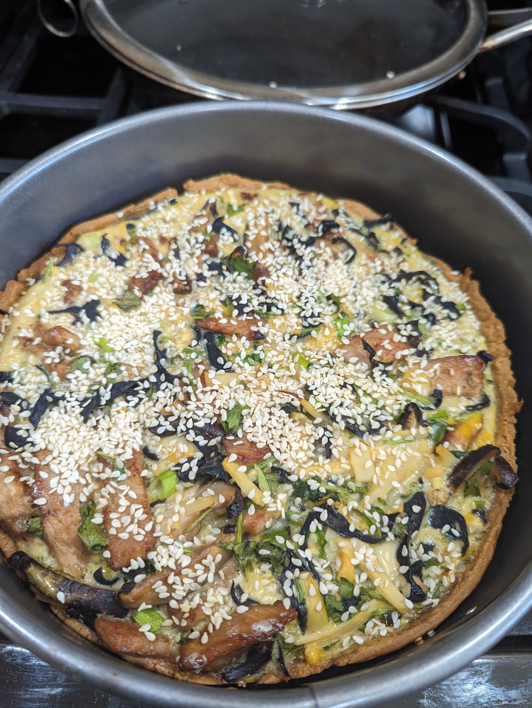

+++
title = "Jenny's Chinese Quiche"
date = 2024-05-02

+++

A wise man once said "A quiche is a canvas for the soul" (or maybe that was me). Anyway, we really love this Asian quiche, and we're pretty sure we invented it. At some point I also want to try a chile rellano quiche.

## Ingredients

- 1/2 lb pork loin + soy sauce and corn starch for marinade
- handful of wood ear mushrooms
- handful of shiitake mushrooms
- 1/4 can bamboo
- handful of fresh cilantro
- 1 green onion
- 2in x 1in ginger, grated
- spoonful of garlic confit
- 1 pie crust
- 6 - 8 eggs
- 1 -2 handfuls grated cheddar
- Roasted sesame seeds
- White pepper
- Soy sauce
- Sesame oil

## Instructions

- Par-bake at 450 degrees F until the pie crust is firm and lightly tan
  - Currently we prefer a spring-form pan lined with parchment paper
- While par-baking, cut pork into pinkie-sized strips and coat with soy sauce and corn starch
- Pan-fry pork till fully cooked and set aside
- If mushrooms are dried, reconstitute with hot water (preferably a half day before)
- Cut wood ear, shiitake mushrooms, and bamboo into thin long strips
- Mince cilantro and chop down green onions into small circlets. Grate ginger
- Combine all dry ingredients except sesame seeds and mix in eggs, white pepper, soy sauce, and sesame oil. Set a bit of cheese aside for topping
- Top with cheese and sesame seeds
- Bake at 350 for 35 min, covered with tinfoil.
- Remove foil and bake another 10 min, or until slightly browned at top

## Pictures

