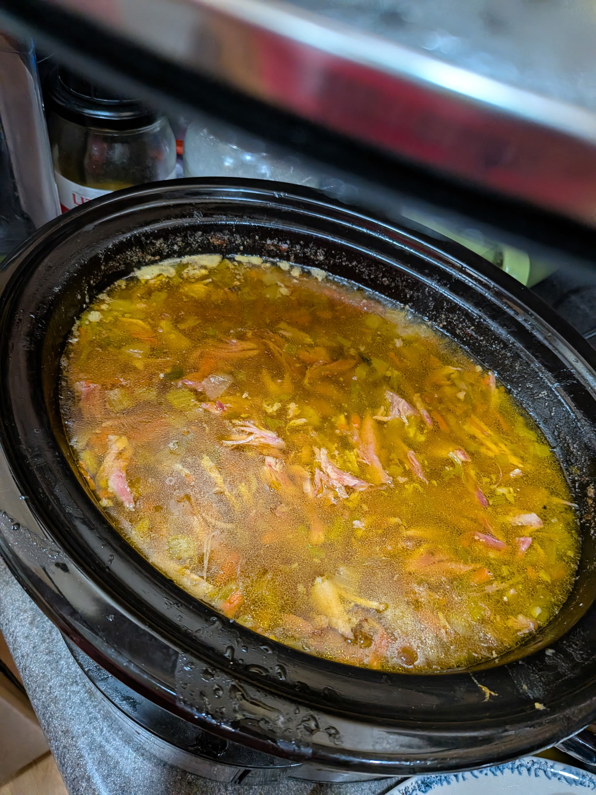

+++
title = "Jenny's Split Pea Soup"
date = 2025-12-07
+++

Very different from my mom's!

# Ingredients

- 1/2-1 stalk celery
- 3-4 carrots
- 1 onion
- 1/4 clove Minced garlic or garlic powder
- Ham bone with lots of meat on it
- small amount of seasoned salt (we use Cavenders)
- black pepper to taste (we use lots)
- 2 cups chicken stock or bone broth
- 1lb dried split green peas

# Instructions

- Dice up vegetables and lightly stir fry with seasoned salt and black pepper
- rince split peas
- Add veggies and all other ingredients to crock pot
- cook on low in the crock pot for 6-8 hours

# Photo

