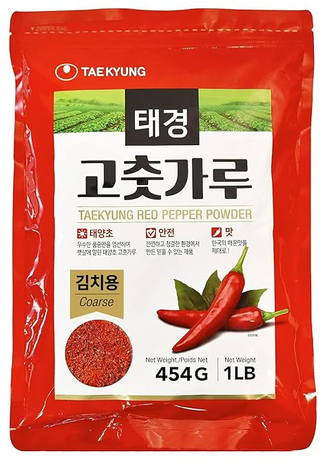

+++
title = "Momma Wang's Chinese Chili Sauce"
date = 2024-02-26
+++

## Main Ingredients

- [2 cups Korean  (Gochugaru) red chili flakes](https://www.amazon.com/dp/B005G8IDTQ) (picture below)
- 1 cup regular chili flakes
- 1 1/2 cups flax seed
- 1/4 cup minced garlic
- 1/4 cup minced onion
- 1/2 cup white sesame seeds
- 1/2 cup black sesame seeds
- 2 Tbsp salt
- 2 Tbsp sugar
- A lot of peanuts
- 1 cup fermented black soybeans
- A lot of oil

## Optional Ingredients

- 1/2 cup cayenne pepper
- 4 tsp ground Sichuan peppercorns

## Instructions

Put in all the dry ingredients

Add oil until everything is completely covered

Bring to a simmer

You likely will continue to need to add oil to keep cover the dry ingredients

Simmer until fragrant (30 - 60min)

Bottle it up!

## Pictures

