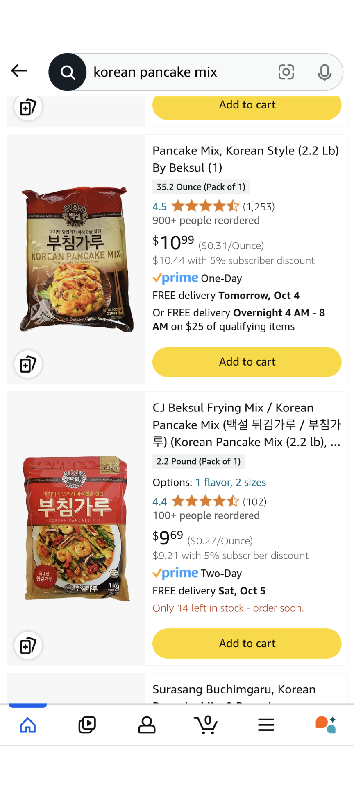

+++
title = "Momma Wang's Korean Pancakes"
date = 2024-10-03
+++

# Ingredients

Pancakes

- 1 cup Korean Pancake Mix (see photos below)
- 1 cup zucchini chopped 
- 1 cup onion chopped
- 3/4 cup water very cold
- 1 cup shrimp chopped
- Kimchi (optional)

Sauce

- 1 tablespoon Kikkoman Memmu Noodle Soup Base sauce OR 1 tablespoon Soba Soba sauce
- 1 tablespoon water

# Instructions

Make the batter according to instructions (mix with water)

Mix in vegetables

Pan fry on high heat

# Photos

