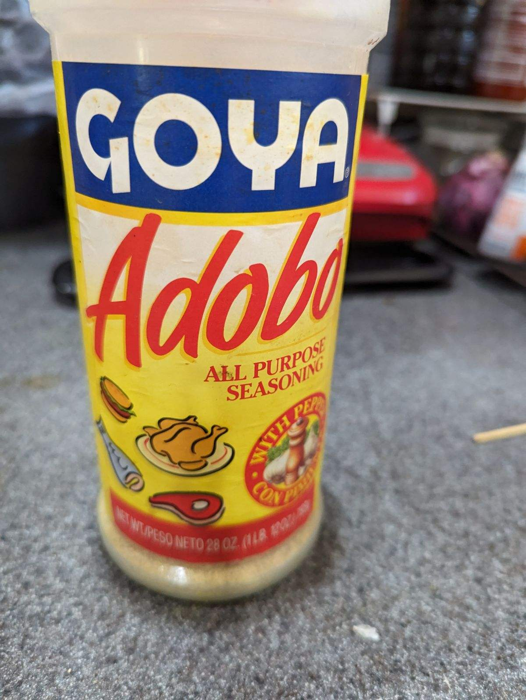
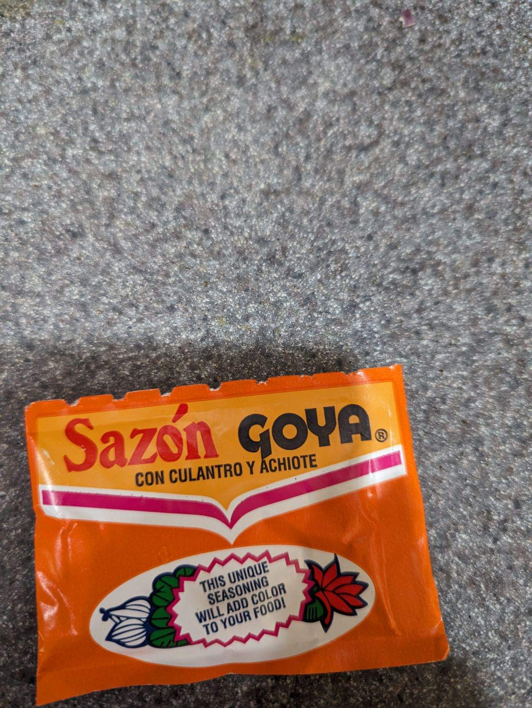

+++
title = "Nai Nai's Pork Shoulder"
date = 2024-02-18
+++

Jenny's mom Julie was taught this recipe from a Puerto-Rican friend.

## Sofrito

- 1 green bell pepper
- 1 onion
- 1 head of cilantro
- 1 whole head of garlic
- a whole bunch of olive oil

Emulsify everything with olive oil. You'll know it's enough when it's a beautiful bright green

## Pork

Stab pork, shoulder multiple times and insert cloves of garlic (a whole head, as much as you can).

Rub down with Adobo powder and rub down with Saizon and rub down with Sofrito from steps above.

Put in oven bag and bake for an hour at 350 in instant pot / oven.

