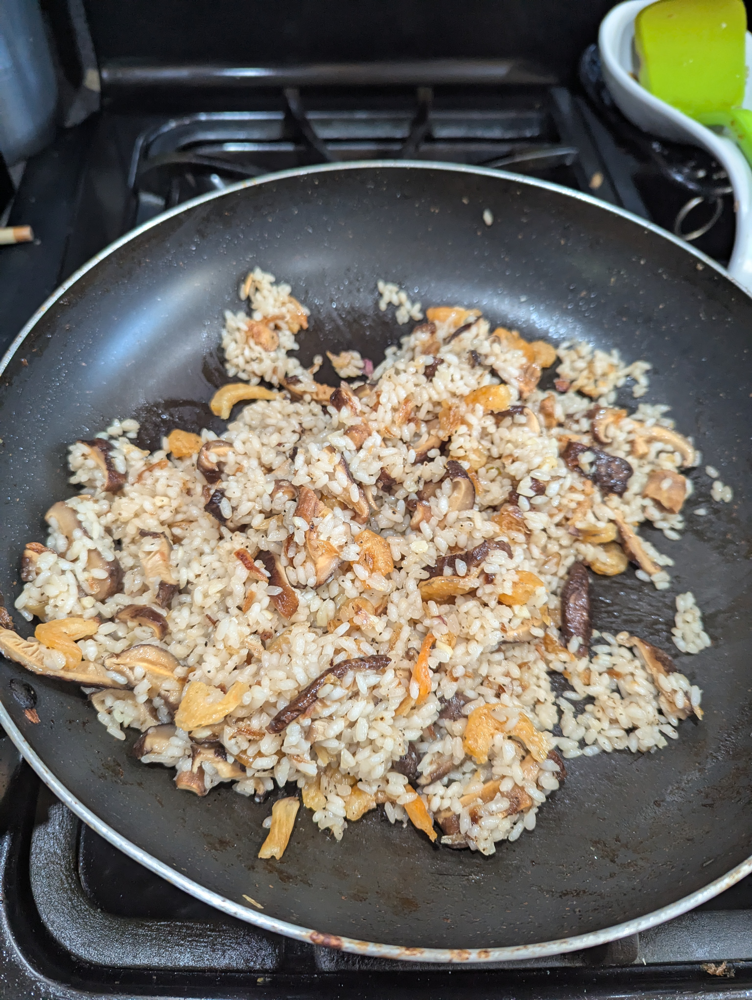

+++
title = "Nai Nai's Sticky Rice Turkey Stuffing"
date = 2024-11-28
+++

# Ingredients

- 1 1/2 handfuls sticky rice (enough to fill  1/2 to 3/4 turkey cavity)
- 8 Reconstituted (or fresh) Shitaake mushrooms, cut thin slices
- 1/4 cup small dried shrimp
- black pepper to taste
- handful deep fried dried shallots

# Instructions

- Soak sticky rice in warm water for 30m
- Remove rice from water and pan-fry with rest of ingredients, adding water as needed until rice is translucent on the outside, can still have some white on the inside

- Stuff turkey cavity to brim
- Bake turkey until cooked
