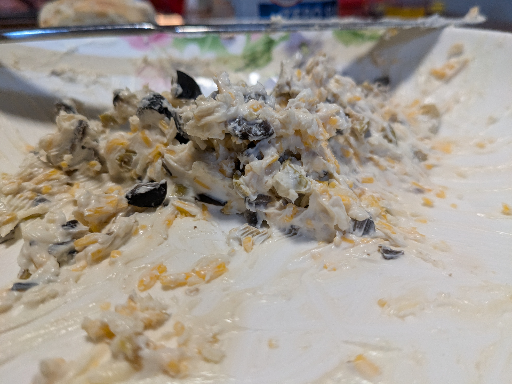

+++
title = "Patti's Cheese and Olive Dip"
date = 2024-11-28

+++

# Ingredients

- 16oz cream cheese, softened
- 1 cup shredded colby jack
- 1/2 teaspoon garlic powder
- 1/2 teaspoon Worcestershire sauce
- 1/2 cup chopped black olive
- 1/2 cup chopped green olives

# Instructions

Mix it all together!

Serve with baguette slices or Ritz crackers

