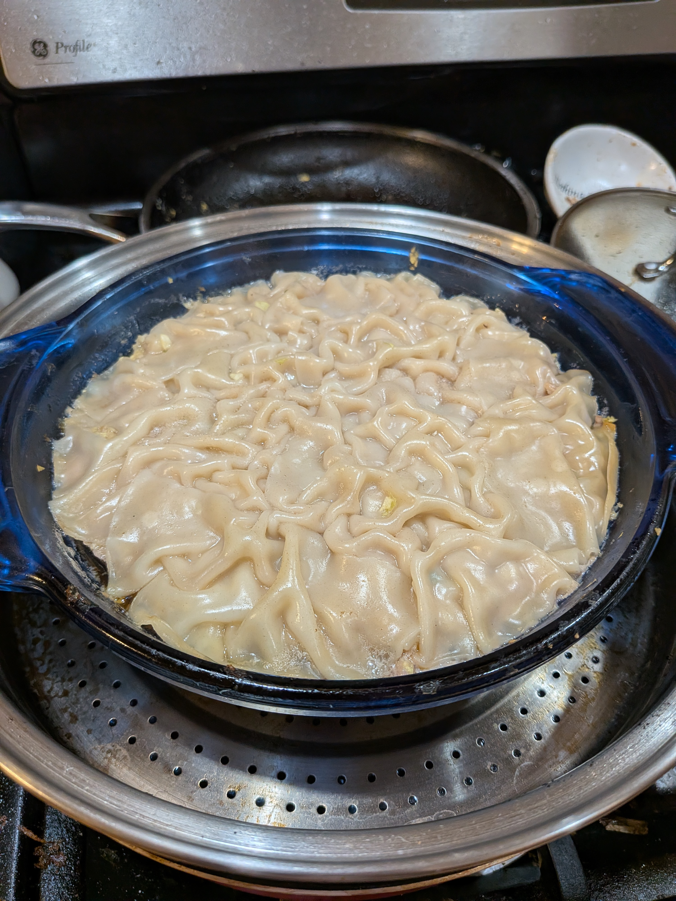
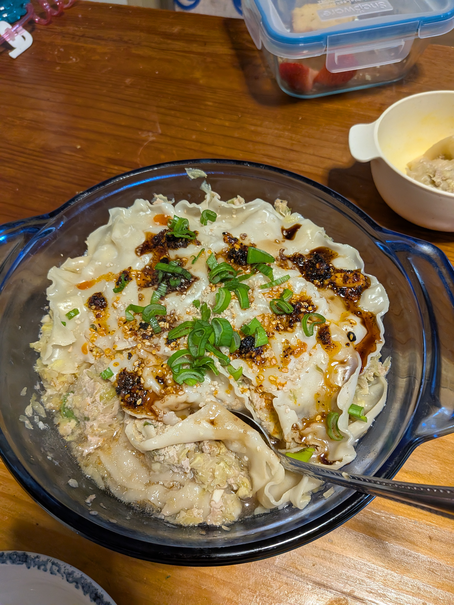

+++
title = "Soup Dumpling Casserole"
date = 2026-02-13
+++

# Ingredients

(other than the pork these are guesstimates)

- 1 lb ground pork
- 1/4 cup diced garlic
- 2 Tbsp diced ginger
- 2 cups chopped (really small- almost diced) cabbage
- 1/4 cup chopped scallions
- white pepper to taste
- 1/2 to 1 Tbsp soy sauce (to taste)
- 1 - 2 Tsp sesame oil
- 1 - 2 cups broth (we used leftover hot pot broth)
- 9-10 dumpling skins to put on top (can freeze unused ones)

# Instructions

- Combine all ingredients other than dumpling skins
- Put in glass or ceramic casserole container (needs to fit in steamer)
- Place two layers of dumpling skins on top
- Steam on medium to high heat for 30-50 min (until dumpling skins wrinkle up nicely and internal temp is at least 160)
- Top with scallions and more sauce, maybe some sesame seeds

# Photos

