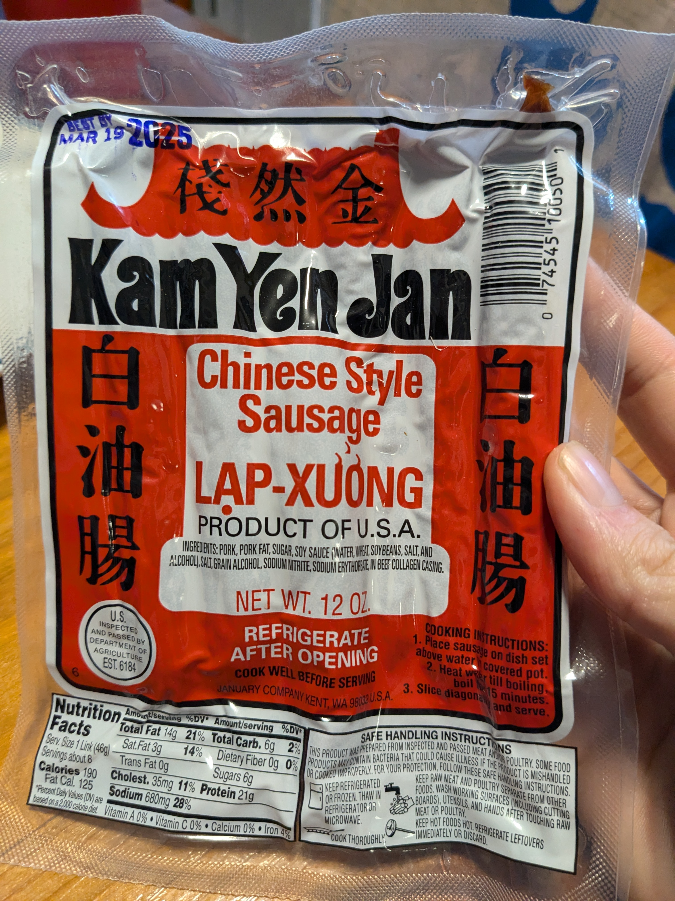
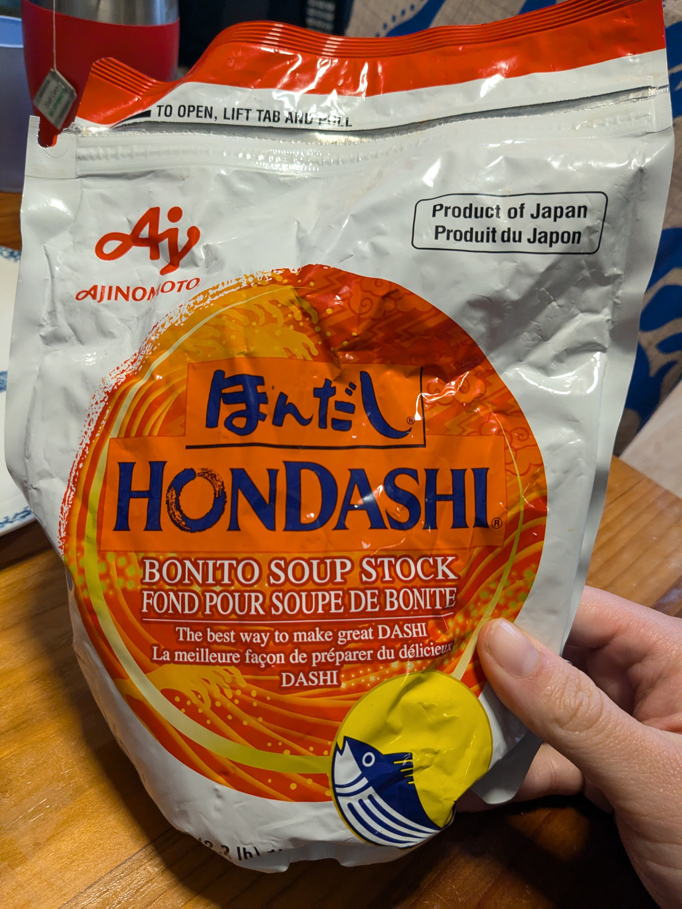

+++
title = "Stir Fried Cabbage"
date = 2024-12-01
+++

# Ingredients

- 1 cabbage
- 2 links Chinese sausage chopped into quarters
- Dashi powder (fish stock) to taste
- Black pepper to taste

Optional

- sichuan peppercorns to taste
- soy sauce
- Sriracha sauce
- Chili Oil
- Garlic

# Instructions

- Cook sausage and render out fat
- Chop cabbage into 2in/2in squares
- Stir fry cabbage and add seasonings

# Photos

x
