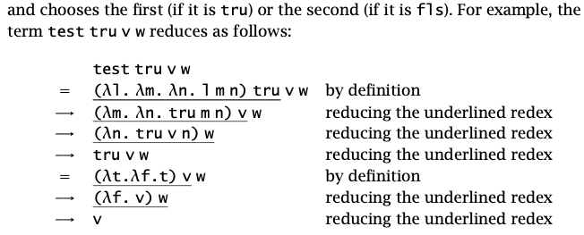

+++
title = "05 - The Untyped Lambda-Calculus"
date = 2024-05-03
+++

Lambda grammer:

```python
t ::==    # terms
	x       # variable
  λx.t    # abstraction
  t t     # application
```

Church Booleans

```python
tru = λt. λf. t;
fls = λt. λf. f;
```

``` python
test = λl. λm. λn. l m n;
```



```python
and = λb. λc. b c fls;
```

Ex 5.2.1: Define logical `or` and `not` functions


